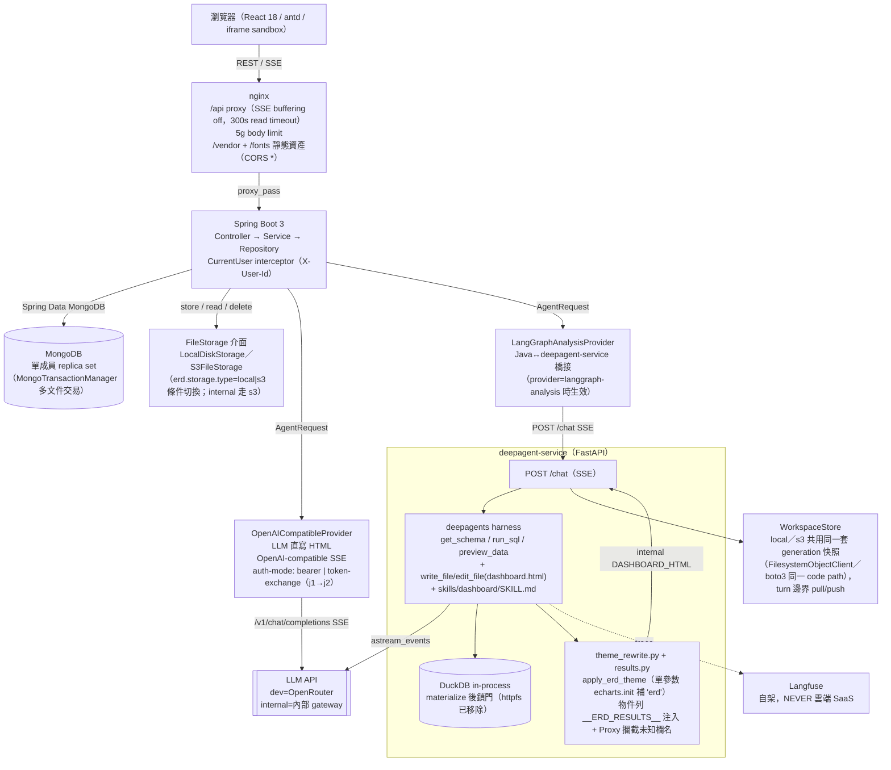
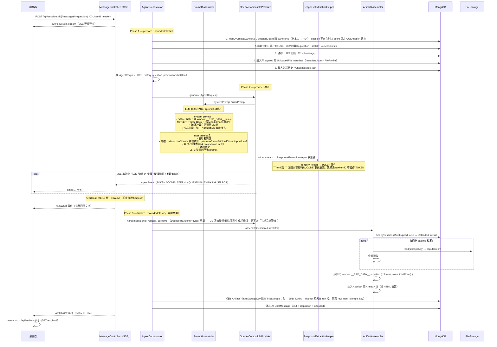
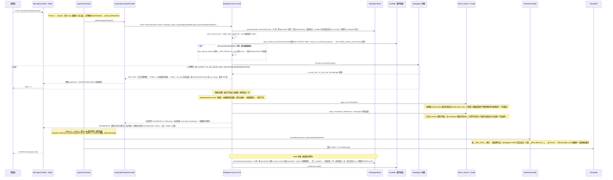
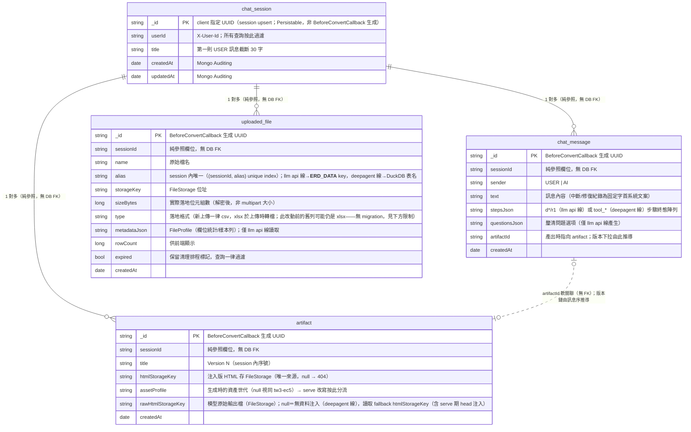

# Cowork · Data Studio — 架構說明

> 兩條 provider 線：`openai-compatible`（LLM 直寫 HTML）與
> `langgraph-analysis`（LLM 用 DuckDB 工具查資料、直寫 dashboard.html，經
> `deepagent-service`——FastAPI + deepagents harness + skills + DuckDB，analysis 主線）。

---

## 整體架構



設定切換方式：`ERD_AGENT_PROVIDER=openai-compatible|langgraph-analysis`（環境變數）。
`ERD_AGENT_PROVIDER` 未設時為 `openai-compatible`；本專案 localhost dev 以 `.env` 切至 `langgraph-analysis`。

token-exchange 流程（僅 llm api 線、internal 環境）：service account j1 → POST exchange
API → j2 token（快取 TTL 秒）→ 放入 env 指定的認證 header（header 名一律由環境變數提供，不寫死於
原始碼）；401 時自動 invalidate 並重試一次。

j1 service account key 來源：`service-account-key`（環境變數內聯）或 `service-account-key-file`（檔案路徑，K8s secret mount 用）——**檔案路徑優先**（兩者皆設時檔案值勝出）。每次 exchange 時才讀檔（非啟動時快取一次），因此檔案內容輪替（secret rotation）最慢在下一次 TTL 到期後的 exchange 即生效，不需重啟服務；本地測試與 internal K8s 環境共用同一套檔案路徑機制。讀檔在 `Mono.fromCallable(...).subscribeOn(Schedulers.boundedElastic())` 完成，不阻塞 reactive event loop。兩來源皆未設定時建構期即失敗（`TokenExchangeClient` constructor）；檔案路徑有設但檔案不存在則於實際 exchange 時失敗，錯誤訊息僅含檔案路徑、NEVER 含金鑰內容。

---

## Provider 檔案分類地圖

| 目錄 | 內容 | 說明 |
|---|---|---|
| `agent/model/` | `AgentRequest`、`AgentFileContext`、`HistoryMessage`、`ClarifyingQuestion` | orchestrator↔provider 共用的請求/上下文 model，全 record 無 Spring 註解 |
| `agent/provider/`（根） | `AgentProvider`（根 SPI，兩線 provider 皆實作）、`DashboardAgentProvider`（`extends AgentProvider`，只加 `harden()` 生成期修復 hook——只有「LLM 直寫 HTML」的模式才需要）、`ProviderResult`、`RepairResult`、`HardenedOutput` | 兩線共用的介面與結果型別；`OpenAICompatibleProvider` 實作 `DashboardAgentProvider`，`LangGraphAnalysisProvider` 只實作根介面 `AgentProvider`（renderer/deepagent 輸出不會有 JS-syntax/omission 這類 harden 要修的失敗） |
| `agent/provider/openai/` | `OpenAICompatibleProvider`、`PromptAssembler`、`TokenExchangeClient`、`GenerationRepairGuard`、`GenerationRepairer`、`JsSyntaxValidator`、`CodeOmissionValidator`、`RepairOutcome`、`JsSyntaxError`、`CodeOmissionFinding` | OpenAI-compatible SSE 路徑；所有生成品質工具（語法驗證、省略偵測、生成期修復）物理上全部集中於此目錄；template 在 `resources/templates/openai/system-prompt.vm` |
| `agent/provider/analysis/` | `LangGraphAnalysisProvider` | 橋接 deepagent-service 的 `POST /chat`（SSE）到 Java `AgentEvent` 流；`DASHBOARD_HTML`（內部訊號，未註冊進 `@JsonSubTypes`）與 `QUESTION` 皆被攔截、out-of-band 捕捉，不直接轉發——由 `AgentOrchestrator.finalize()` 統一重新發出，與 llm api 線同一套收尾邏輯 |
| `agent/extraction/` | `ResponseExtractionHelper`、`BareHtmlUtils` | **llm api 線專屬**——完整結構化模型回應抽取狀態機（fence 解析、`CodeEvent` 即時放流）；deepagent 線沒有對應物，因為模型從不把 HTML 直接吐進聊天串流，而是用 `write_file`/`edit_file` 工具寫進 workspace |
| `agent/repair/` | `ArtifactRepairer`、`BrowserRepairOutcome`、`BrowserJsError` | 瀏覽器確認制修復——**dashboard-only**：內部注入 `Optional<DashboardAgentProvider>`，`langgraph-analysis` 模式下該 bean 不存在，`isBrowserRepairSupported()` 回 `false`，呼叫 `repairWithBrowserErrors` 會拋 `BrowserRepairUnsupportedException`（見下方「瀏覽器錯誤修復」節） |

---

## Call LLM 序列圖 — llm api 線（POST /sessions/{id}/messages）



---

## Call LLM 序列圖 — deepagent 線（provider=langgraph-analysis）



執行期仍出錯（`ReferenceError`、綁錯欄名的 Proxy throw 等）不在這輪收尾內處理——那是瀏覽器渲染 dashboard 之後才會發生的事，由「瀏覽器錯誤修復」機制接手（見下方「deepagent-service 品質防線」節）。

---

## SSE 事件契約

| type | 欄位 | 來源線 | 說明 |
|---|---|---|---|
| `STEP` | `stepKey`, `title`, `description`, `status`（pending/running/success/error） | 兩線 | ThoughtChain 即時進度。llm api 線：`d*` 由 LLM 規劃動態產生，`r1` 為後端修復步驟；deepagent 線：`stepKey=tool_{name}_{runId}`，逐個工具呼叫；deepagent-service 未帶 `status` 時 `LangGraphAnalysisProvider` 正規化為 `RUNNING` |
| `TOKEN` | `delta` | 兩線 | 打字效果。llm api 線：fence 外的說明文字；deepagent 線：工具啟動**前**的開場思路（工具開跑後的中段 chatter 不上 wire，終局由 ANSWER 承載） |
| `TABLE` | `tableId`, `intent`, `columns`, `rows`, `truncated` | **deepagent 線專屬** | 每次 `run_sql` 成功送一個（`tableId=qN`）；live-only，從不持久化。前端**只把 answer 以 `[[table:id]]` marker 引用到的表 inline 渲染進答案氣泡**，未被引用的收到但不顯示；串流結束即丟棄，重載歷史不會再顯示 |
| `CODE` | `delta` | **llm api 線專屬** | ```` ```html ```` fence 內容的即時 delta，供前端「產生中的 HTML」收合面板。deepagent 線模型從不把 HTML 直接吐進聊天串流（用 `write_file`/`edit_file` 寫進 workspace），沒有對應事件 |
| `THINKING` | `delta` | **llm api 線專屬** | 模型內部推理串流（qwen `delta.reasoning`）；前端可展開的思考面板；不持久化 |
| `QUESTION` | `questions`（`{ key, label }[]`） | 契約兩線通用，**目前僅 llm api 線實際產出** | 模型釐清問題選項卡；`AgentOrchestrator.finalize()` 是唯一發送端（兩線 provider 各自把捕捉到的 questions 放進 `AgentOutcome`，由 finalize 統一重新 emit）。llm api 線來自 ```` ```questions ```` fence；deepagent-service 目前的 `/chat` 從不送 `type=QUESTION`，`LangGraphAnalysisProvider` 已備好捕捉轉發邏輯但尚無實際觸發路徑 |
| `ANSWER` | `text` | 兩線 | 完整回覆文字定稿 |
| `ARTIFACT` | `artifactId`, `title` | 兩線 | 右欄載入 dashboard |
| `ERROR` | `code`, `message` | 兩線 | 錯誤氣泡。deepagent 線額外碼：`ANALYSIS_TIMEOUT`（`erd.agent.analysis.request-timeout-seconds`，預設 180s，事件間閒置逾時）、`ANALYSIS_STREAM_FAILURE`、`ANALYSIS_EVENT_PARSE`（不可解析的 payload） |
| `:ka` | —（SSE 註解行） | 兩線 | heartbeat，防代理逾時（見下節） |

（`DASHBOARD_HTML` 不是對前端的 wire type——它是 deepagent-service → `LangGraphAnalysisProvider` 之間的內部訊號，刻意未註冊進 `AgentEvent` 的 `@JsonSubTypes`，被攔截後轉為 `ArtifactEvent` 走正常 finalize 流程。）

### Heartbeat（`:ka`）

`MessageController` 以 `Flux.interval(15s)` 產生 SSE 註解行 `:ka`，與資料事件 `Flux.merge` 後輸出：

- **開始／結束**：串流被訂閱即起算；`takeUntilOther(done)` 讓 agent 事件流完成的瞬間停止，連線正常關閉
- **固定節奏**：因為是 merge 而非「閒置才發」，即使 TOKEN 正在串流，每 15 秒仍照發——實作簡單且行為可預期
- **對前端不可見**：SSE 協定規定 `:` 開頭的行必須被 client 忽略，事件 parser 不受影響；唯一作用是讓 TCP 連線持續有位元組流動
- **防護對象**：nginx（`proxy_read_timeout` 300s）、internal gateway（K8s prod）等中間層的 idle timeout。需要覆蓋的天然長靜默期：deepagent-service 的 SQL 查詢／LLM 思考期間（該服務同樣以 15 秒 `HEARTBEAT_INTERVAL_SECONDS` 重發 active step 作內部 heartbeat，見 `_stream_agent_turn`）、生成期修復的 LLM 重呼叫（`harden()` 內約 30 秒，僅 llm api 線）、模型長思考的首 token 前空窗
- **15 秒的理由**：保守小於常見 60 秒 idle 門檻，成本每次僅數 bytes

### 回覆持久化語意

- **provider/agent 錯誤**：捕捉到例外後，後端在 DB 儲存一筆 AI ChatMessage，text 為錯誤文字，stepsJson 為 `[]`。
- **客戶端斷線（SSE cancel）**：Flux 取消時後端偵測到下游 cancel，儲存一筆 AI ChatMessage，text 為「回應已中斷，請重新送出以繼續」；前端以灰色小字系統樣式渲染（`INTERRUPTED_TEXTS` 常數比對，相容舊資料的全形括號版本）。
- **修復紀錄**：瀏覽器錯誤修復完成後儲存一筆 AI ChatMessage（「已修復儀表板執行錯誤（N 個）：…」／「儀表板執行錯誤自動修復未成功…」固定字首），前端同樣渲染為灰字系統訊息（`REPAIR_RECORD_PREFIXES`）。
- 所有情形皆保證 USER 訊息有配對的 AI row，歷史紀錄不出現孤立 USER 訊息（finalize 的單一持久化點（HTML／無 HTML 兩出口）與 doOnCancel 以 `aiPersisted` CAS 互斥防 double-write；兩線共用同一套 `AgentOrchestrator`/`AgentConversationWriter`）。

---

## 資料量處理

### llm api 線（四階段）

| 階段 | 作業 | 帶什麼資料 |
|---|---|---|
| **上傳** | multipart 串流直接落地 FileStorage | 原始檔案全量，不經記憶體累積 |
| **Profile** | 解析時單趟串流計算統計（commons-csv / excel-streaming-reader） | 全量單趟；輸出 FileProfile（rowCount / colCount / 欄位統計） |
| **Prompt** | PromptAssembler 組 user prompt | 僅 schema + 統計摘要 + **樣本列**（`erd.upload.sample-rows`，預設 20）；完整資料不進 LLM |
| **Artifact 注入** | ArtifactAssembler 全量讀取 | 全量注入（抽樣機制已移除——目前資料量級不需要）；entry 為 `{columns, rows, totalRows}` |

### deepagent 線：資料從不進 prompt，模型直接查

deepagent-service 不做「樣本列進 prompt」這一步——資料來源以本地掛載路徑（`LangGraphAnalysisProvider.resolveSourcePath` 恆為 `sourceRoot + storageKey`）交給 DuckDB，模型透過 `get_schema`/`preview_data`/`run_sql` 工具自行探索與查詢：

1. **掛資料鎖門**：`open_locked_connection` 先對每個 `alias` `CREATE TABLE ... AS SELECT * FROM read_csv_auto/read_parquet(path)`（materialize），再 `SET enable_external_access = false` 鎖門——鎖門後連線上任何 SQL 都碰不到檔案系統/網路
2. **查詢結果落檔**：`run_sql` 成功時把結果寫入 workspace 的 `queries/{qN}.sql` + `results/{qN}.json`（單一 `qN` 編號空間，跨 turn 遞增，`STORE_MAX_ROWS=5000` 截斷）；模型看到的 markdown 表格另截到 `LLM_VIEW_MAX_ROWS=200`
3. **HTML 引用、不內嵌**：dashboard.html 只讀 `window.__ERD_RESULTS__["qN"]`，不直接內嵌資料；送出前只注入 answer 實際引用到的 query 結果（`referenced_query_ids` 掃描 HTML）
4. **上傳限制**（config 可調，兩線共用，於上傳當下把關）：

| 項目 | 上限 |
|---|---|
| 每 session 檔數 | 5 |
| session 總量 | 5 GB |
| CSV 單檔 | 2 GB（串流解析） |
| xlsx 單檔 | 200 MB（SAX 串流讀取） |

### deepagent 線：查詢結果注入 dashboard 的機制（`__ERD_RESULTS__`）

模型寫的 HTML **不含任何資料值**，資料在出貨前由服務端確定性注入。整條鏈：

```
run_sql 成功
  → workspace 落檔 results/{qN}.json：{ intent, columns, rows(≤5000列,以欄名為 key 的
    物件列 dict(zip(columns, row))——不是陣列列;cell 已 JSON-safe 正規化:
    Decimal→float、date/datetime→ISO 字串), truncated }
  → 模型寫 dashboard.html,圖表/KPI/洞察一律讀 window.__ERD_RESULTS__["qN"].rows
    （每列用 row.column_name 取值,不是 index;JS 只做笨渲染,NEVER 現算統計——
     文字結論與圖表數字因此同源,結構性消除抄錯）
  → 注入（發 DASHBOARD_HTML 前,app/engine/theme_rewrite.py + app/engine/results.py,
    不做任何驗證/退件）：
    ① apply_erd_theme：單參數 echarts.init(x) 確定性改寫為 echarts.init(x,'erd');
       已帶第二參數或括號不平衡則原樣放行
    ② 只注入「被 HTML 引用到、且 workspace 現有落檔」的 qN 交集（regex 掃描 +
       set 交集;引用不存在的 id 單純不進 payload,不是退件——那個 qN 在瀏覽器端
       讀到 undefined,綁定它的圖表會在 Proxy 或後續存取時炸出錯誤,走瀏覽器修復鏈路)
    ③ build_results_script → <script id="erd-results-data">window.__ERD_RESULTS__={...};
       (function(){...})()</script>（JSON 賦值後緊跟一段 Proxy 包裝碼,見下方「品質防線」節；
       JSON 內 `</` 一律轉義 `<\/`,防 </script> 提前終結）
    ④ 插入位置：</head> 之前 → 無 head 則 <body> 開標籤後 → 都無則前置
       （erd 主題不在此注入——改由 Java 端統一注入,見下）
  → DASHBOARD_HTML {html} 交給 Java（無條件發出,沒有任何情況會整份不顯示）
  → ArtifactAssembler：偵測「無 __ERD_DATA__ 標記」→ 跳過全量資料注入
    （補 head-inject 的錯誤捕捉/字型/erd 主題腳本）
```

**注入 script 帶 id 標記的原因**：「選版本繼續編輯」時，Java 把 artifact 的 **rawHtml**
（未經 assemble、不含 head-inject 主題那份；Java 一律另存 `rawHtmlStorageKey`）回傳當基底，
進場重建時 `strip_injected_blocks` 靠 `id="erd-results-data"` 確定性剝除舊的結果注入，模型
永遠編輯乾淨骨架，每次出貨都重新注入當下最新結果。主題不在 Python 端注入，故無需剝除。

**與 llm api 線的對照**：

| | llm api 線（`__ERD_DATA__`） | deepagent 線（`__ERD_RESULTS__`） |
|---|---|---|
| 注入內容 | 全量原始資料（columns/rows/totalRows,每檔全列） | 僅被引用的查詢結果（聚合後,每表 ≤5000 列） |
| 注入時機/位置 | Java `ArtifactAssembler.assemble`（serve 前組裝） | Python 發 DASHBOARD_HTML 前;Java 端跳過 |
| 統計計算 | 瀏覽器 JS 現算（模型寫聚合邏輯） | DuckDB SQL 算好,JS 笨渲染 |
| 數字一致性 | 文字與圖表各算各的,可能分歧 | 同一份 SQL 落檔,同源 |
| 資料量級上限 | 受原始檔大小制約 | 與原始檔大小無關（只跟查詢結果有關） |
| 重跑語意 | 重注入新原始資料,圖表自動重算 | 重跑凍結 SQL→新 results→重注入,零 LLM（M3 每日報表的基礎） |

---

## 上傳檔解密掛鉤（UploadDecryptor）

internal 環境**只有 xlsx 上傳是加密的，csv 一律以明文上傳**。`FileService.upload()` 有一個常數
`ENCRYPTED_UPLOAD_TYPES = Set.of("xlsx")`：只有副檔名落在這個集合裡的上傳，才會在
`storage.store()` **之前**呼叫 `UploadDecryptor.decrypt(InputStream, String)`；其餘（目前就是
csv）完全跳過這一步，原始 stream 直接視為明文往下走。因此**落地的位元組一律是明文**，但
「明文」對 csv 而言是「本來就沒加密過」，不是「解密出來的」。

**為什麼 csv 不解密**：internal 環境只有 xlsx 需要解密；若 csv 也無條件送進
`decryptor.decrypt(...)`，等於把內容原樣繞一圈 internal 解密 API 再原樣拿回來——csv 上傳上限
到 2GB，這一圈是白白付出的網路往返。

**這個判斷刻意寫死在 `ENCRYPTED_UPLOAD_TYPES`，不做成可設定項**：加密範圍是 internal 基礎設施的
既定事實（csv 這條線本來就不走加密），不是部署環境的旋鈕；接受的風險是，若 csv 有一天也開始
加密而沒人同步更新這個常數，密文會被當明文原樣存進去——沒有例外、沒有警告，DuckDB／
`CsvParsingService` 之後讀到的是亂碼。程式碼本身防不了這件事，所以改成把假設寫進
`ENCRYPTED_UPLOAD_TYPES` 的 Javadoc 裡大聲講清楚，而不是藏進一個設定值。細節見
`docs/superpowers/specs/2026-08-02-xlsx-to-csv-normalization-design.md` 的「後續調整：
csv 略過解密」一節。

**為什麼不能改成「讀取時才解密」**：deepagent-service 的 DuckDB 直接讀共用 volume 上的檔案
（`read_csv_auto(path)`，路徑由 `LangGraphAnalysisProvider.resolveSourcePath` 組出），
不經過 Java 的 `FileStorage.read()`——密文落地會讓 Python 端讀到亂碼，除非再實作一次解密。

介面刻意採 `InputStream → InputStream`：實作若無法串流可在內部自行 buffer，不必讓呼叫端
把 2GB 檔案讀進記憶體。預設 `PassthroughUploadDecryptor` 原樣回傳；
`erd.upload.decryption.enabled=true` 時改綁 internal 環境的實作。

`uploaded_file.size_bytes` 記錄的是**（xlsx 為解密後、csv 為原樣）**實際寫入 storage 的
位元組數（`CountingInputStream` 計得），非 multipart 的密文大小。上傳上限檢查仍以上傳時的
大小為準——它在讀取任何位元組前就執行，若移到解密後，超大檔會變成「必須先完整解密才能被
拒絕」，反而放大 DoS 面。

**樣本資料集不會經過 `UploadDecryptor`**：`SampleDatasetService` 載入的三份內建示範資料集
（`backend/src/main/resources/samples/*.csv`）全部是 csv，因此不論 internal 環境是否啟用解密，
這些檔案都不會呼叫到 `decrypt()`——`ENCRYPTED_UPLOAD_TYPES` 只認 xlsx。internal 環境的
`UploadDecryptor` 實作可以放心假設收到的輸入就是一份加密過的 xlsx，不需要自行偵測「這份
是不是明文」。

## 上傳格式正規化（xlsx → CSV）

上傳允許 `csv` 與 `xlsx`，但**落地的一律是 CSV**：`FileService.upload()` 在解密後、落地前
呼叫 `UploadNormalizer`，把 xlsx 的**第一個 sheet** 轉成 CSV。

**為什麼在上傳時轉，而不是讓 DuckDB 讀 xlsx**：deepagent-service 用 DuckDB 直接讀磁碟檔，
而 DuckDB 沒有 xlsx reader；載入 excel extension 必須在 `enable_external_access=false`
鎖門之前做，等於為單一格式擴大攻擊面。轉檔後系統中只有一種格式，兩條線都受益。

**只取第一個 sheet 不是新限制**：`XlsxParsingService` 的 `profile()`／`readAll()` 一直都是
`getSheetAt(0)`。轉檔沿用同一套 `StreamingReader` + `DataFormatter`，產出的 cell 字串與
llm api 線原本讀到的相同，型別推斷不變。多 sheet 時後端記一筆 warn。

**欄位語意**：`uploaded_file.type` 記的是**落地格式**（永遠 `csv`），`name` 保留使用者上傳的
原始檔名（`sales.xlsx`）。前端的檔案圖示因此改由**檔名副檔名**判斷，而非 `type`。

## 檔案 alias 機制

每個上傳檔有兩層命名，分工明確：

| 層 | 規則 | 給誰看 |
|---|---|---|
| `name`（UI 顯示） | 檔名全小寫（`Locale.ROOT`）；撞名時在副檔名前插入與 alias 同號的 `_N` 後綴（例：`sales_2.csv`）；超過 400 UTF-8 bytes 時截主幹保副檔名 | 使用者（chips、附件列表） |
| `alias`（資料 key） | 檔名 slug 化 | llm api 線：模型與產出 JS 的 `window.__ERD_DATA__[alias]`；deepagent 線：DuckDB `CREATE TABLE "{alias}"`（同一個 slug 兼作 SQL 識別字，`_SAFE_IDENTIFIER_PATTERN` 二次校驗） |

**Slug 規則**（`FileAliasUtils`，static utility class）：取檔名主幹 → 小寫（Locale.ROOT）→ 保留任何語系字母數字（`\p{L}\p{N}`，中文保留）、其餘轉 `_` → 連續 `_` 摺疊、去頭尾 → 截 **60 UTF-8 bytes**（byte-aware，不切斷多 byte 字元）→ 全符號檔名 fallback `file{n}`。

**撞名**：與 session 內**所有**歷史 alias 比對（含 expired，避免刪除重傳撞 V4 unique 約束）→ 依序 `{slug}_2`、`{slug}_3`；後綴後超限先按 byte 截主體。`(session_id, alias)` unique 約束為 DB 層保底。`generateAlias` 回傳 `AliasResolution(alias, suffixNumber)`，`suffixNumber` 同時決定 `name` 的 `_N` 後綴，保證兩者號碼一致。

**歷史脈絡（Oracle 時期遺留，DB 已換 MongoDB，問題本身不復存在，但由此定案的計長慣例保留）**：Oracle `VARCHAR2(N)` 舊制預設 BYTE 語意；全中文 alias 每字元佔 3 bytes，舊的 40 字元截斷會讓 40 個中文字 = 120 bytes，遠超當時 `alias VARCHAR2(100 BYTE)` 上限（ORA-12899）。H2 按字元計長所以舊測試抓不到此問題——這正是催生「統一以 UTF-8 byte 計長」這條慣例的起點。現行實作仍以 UTF-8 byte 計長（alias ≤ 60 bytes、name ≤ 400 bytes）；MongoDB 的 String 欄位（BSON UTF-8，無長度上限）本身沒有 Oracle 式 BYTE/CHAR 方言落差，這道長度上限現在純屬應用層治理（索引鍵大小、UI 顯示），不再對應任何 DB 層地雷。

**為什麼用語意 alias 而非 file1/file2**：`__ERD_DATA__['wafer_lots']`／DuckDB `"wafer_lots"` 表名自我說明——弱模型在多檔情境少一層「file1＝哪個檔」的間接對照，拿錯檔機率下降；產出 JS/SQL 也更可讀。system prompt / deepagent sources.md 皆明令模型使用檔案脈絡列出的 exact alias、不得自創。

## 檔案 Retention 機制

`RetentionCleanupService`——排程清理長期未活動 session 的檔案，分級保留（見下方）：

- **排程**：cron `ERD_STORAGE_CLEANUP_CRON`（預設每日 03:00，設為 `-` 即停用排程，`Scheduled.CRON_DISABLED`）；三類資料各自的 cutoff 見下方環境變數表
- **判定**：上傳原始檔／workspace 依 `chat_session.updated_at < cutoff`；artifact 依自身 `created_at < cutoff`（非 session 活動）
- **動作**：刪除 FileStorage 實體檔 → DB 列標 `expired = true`（**列保留**，UI 仍可見檔案存在過，artifact 則清空 `htmlStorageKey` 與 `rawHtmlStorageKey`，各自獨立、僅於對應檔案刪除成功後才清）；逐檔獨立小交易（單檔失敗不影響其他），storage 刪除失敗僅 log.warn
- **刻意不用 @Transactional**：排程進入點 self-invocation 不經 proxy，掛註解是誤導性 no-op（程式碼內有註解說明）

**過期後的行為邊界**：

- 舊 dashboard **不受影響**——注入版 HTML 在生成當下已凍結抽樣資料，本質是自包含快照
- 對話與修復被 guard 擋下（`FILES_EXPIRED`）：session 含任何過期檔案時，發送訊息與瀏覽器修復都會被拒絕，前端顯示說明橫幅引導使用者刪除過期檔案並重新上傳（產品決策：強制清理，不做靜默劣化）
- deepagent-service 的 workspace（`queries/`/`results/`/`dashboard.html`）由同一個 `RetentionCleanupService` 依 `ERD_STORAGE_RETENTION_WORKSPACE` 獨立清理，cutoff 與上傳原始檔相同（session 最後活動時間）；實體刪除經 `WorkspacePurger` 接縫——local 走檔案系統 walk（獨立目錄，含 symlink/traversal 防護）、s3 走 `workspace/{userId}/sessions/{sessionId}/` 整條前綴 batch delete（天然涵蓋該 session 所有 generations，純 key 前綴比對無 symlink/traversal 面）

**已修正：`chat_session.updated_at` 不隨對話更新**

`ChatSession` row 原本全專案只有兩個寫入點——`SessionGuard`（建立時）與 `AgentOrchestrator.prepare()`（**第一則** USER 訊息時設 title）——導致 `updated_at` 實質等同 `created_at`。已於 `AgentOrchestrator`/`FileService` 每輪對話與上傳時顯式呼叫 `session.setUpdatedAt(Instant.now())`，`updated_at` 現在正確反映「閒置 N 天」語意。

**分級保留**

原單一 `retention-days` 已拆為按資料類分別設定的環境變數，動機是三類資料的價值與可重建性不同：

| 資料類 | 保留條件 |
|---|---|
| artifact HTML | 建立後 **2 年** |
| deepagent workspace | session 最後活動 **半年**內 |
| 上傳原始檔 | session 最後活動 **半年**內 |

設定介面（沿用專案慣例：顯式 `${ENV_VAR:default}`）：

| 環境變數 | 預設 | 說明 |
|---|---|---|
| `ERD_STORAGE_CLEANUP_CRON` | `0 0 3 * * *` | 每日 03:00；設為 `-` 即停用排程（`Scheduled.CRON_DISABLED`），不另設 enabled 旗標 |
| `ERD_STORAGE_CLEANUP_DRY_RUN` | `false` | 只記錄將刪除什麼、不實際刪除。**⚠️ 首次上線 MUST 先設為 `true` 跑滿一輪、確認刪除清單符合預期後才關閉**——artifact 是唯一標記為不可重建的資料，這是部署程序的一部分，不是可選建議 |
| `ERD_STORAGE_RETENTION_UPLOADS` | `180d` | 上傳原始檔，依 session 最後活動時間 |
| `ERD_STORAGE_RETENTION_WORKSPACE` | `180d` | deepagent workspace，同上 |
| `ERD_STORAGE_RETENTION_ARTIFACT` | `730d` | artifact HTML，依 **artifact 建立時間**，非 session 活動 |

型別用 `Duration`（`180d`／`730d`）而非 int days；單一 cron 掃三類（cutoff 不同但都是廉價查詢，拆開只增加運維面）。`dry-run` 是刻意保留的——artifact 是唯一標記為不可重建的資料，而清理它是全新的刪除路徑。舊的 `erd.storage.retention-days` 已移除，不保留為別名。

此政策成立的關鍵是 **deepagent 線的 artifact 為 self-contained**（`__ERD_RESULTS__` 生成時即注入，`ArtifactAssembler` 對其 `includeData=false`、完全不讀原始檔），因此半年後清掉原始檔，兩年內打開 artifact 仍可正常檢視；session 則降級為唯讀存檔（可看不可續問）。

**清理由 DB 驅動**：三類資料分屬不同 table（`uploaded_file`／`artifact`／workspace 目錄），不同 cutoff 來自不同查詢，與 storage key 的形狀無關。

**設定約束：`RETENTION_WORKSPACE` MUST ≥ `RETENTION_UPLOADS`。** 兩者可獨立設定，但 workspace 若先被清掉而上傳檔還在，`FilesExpiredException` 這道 guard 不會觸發——使用者追問時模型會從空白 workspace 開工，上一輪的 `dashboard.html` 與 `results/{qN}.json` 全部消失（即上節「跨 pod stale read」那組症狀，從設定面重新引入）。啟動時 `RetentionCleanupService` 會 log 生效中的三個保留窗／cron／dry-run，違反此序時額外記 WARN（不 fail fast：後果是閒置 session 續問品質降級，非資料遺失或不安全狀態）。

`StorageKeyUtils.buildKey()` 現產出 `{category}/{sessionId}/{UUID}_{safeName}`（`category` 為 `uploads`／`artifacts` 前綴，`StorageCategory`），上傳檔與 artifact HTML 分屬不同目錄——價值在於 **`du` 分類監控**與未來拆兩顆 PVC 的選項，非清理本身的前置條件（清理判定走 DB，與 key 形狀無關）。舊資料的扁平 key（`{sessionId}/{UUID}_{name}`，無前綴）完整存於 DB 欄位，照常 resolve，不需要 migration。

## DB Schema

### 為什麼被迫換 MongoDB（internal 基盤強制）＋如何保住不變量

**這節曾經叫「為什麼選 relational DB」**——2026-08 之前的結論是：資料天生關聯形、交易一致性是硬需求、document model 的賣點在此拿不到，因此選 RDB（Oracle）。**前提在 2026-08-11 被 internal 基盤推翻**：internal 部署環境（K8s StatefulSet）**只提供 MongoDB，不再提供任何關聯式 DB**——不是重新評估後改變偏好，是選項本身消失。原論證中「document model 拿不到賣點」的分析依然成立（schema 彈性用不到、locality 靠 FileStorage 已經拿到、水平擴展用不到），只是已無關——RDB 不在可選清單內。詳見 `docs/superpowers/specs/2026-08-11-oracle-to-mongodb-migration-design.md`。

**如何在 document store 上保住原有不變量**：

1. **四個 collection 對映原本四張表，不嵌入**：`chat_session`／`chat_message`／`uploaded_file`／`artifact` 各自一個 collection，`sessionId`/`artifactId` 為純 String 參照欄位（無 DB 強制外鍵，與 Oracle 時期一致——原本就是應用層 ownership 鏈，非 FK 約束）。**刻意不嵌入**：若把版本鏈 embed 進單一文件，每版 10–200KB 會讓文件無上限成長、撞 16MB 單文件上限，實務上仍得拆 collection、locality 好處消失（此點延續舊論證）。
2. **熱路徑無 join，靠索引直查**：

   | 存取 | 查法 |
   |---|---|
   | 按 user 撈 session 列表 | `chat_session.find({userId}).sort(updatedAt)` |
   | 撈 session 訊息 | `chat_message.find({sessionId}).sort(createdAt)` |
   | 撈 session artifact 版本鏈 | `artifact.find({sessionId}).sort(createdAt)` |
   | 撈 session 上傳檔 | `uploaded_file.find({sessionId})` |
   | ownership 檢查 | `chat_session.find({_id, userId})` |
   | serve artifact HTML | `artifact.findById` 取 storageKey/assetProfile（僅 metadata），實際位元組讀取/CDN 改寫/串流仍是 **FileStorage** 的事，與 Oracle 時期相同 |

   組一頁完整畫面約 4 個固定的 `findBySessionId`，非 N+1——現況本就是分開查，document store 沒有讓這件事變糟。
3. **原子性由 MongoDB 多文件交易達成（已採 Branch 3 方案）**：Oracle 時期靠交易保的「USER 訊息永遠有配對 AI row」「artifact＋AI 訊息同交易寫入」等不變量，遷移之初曾因「Mongo standalone 無交易、K8s 部署下交易能力尚未於 internal 環境驗證穩定」而拆成三支獨立分支各自去風險，遷移本身先保持乾淨、原子性策略之後再擇一疊加：
   - **Branch 1（`feat/oracle-to-mongodb`，純遷移基座）**：完全移除交易基建（無 tx manager、無 `@Transactional`/`TransactionTemplate`），多文件原子性缺口暫不處理，作為前兩支的共同基底，單獨不宜上 production。
   - **Branch 3（`feat/oracle-to-mongodb-txn`，本分支＝現行方案）**：交易解法——重新加回 `MongoTransactionManager`，三處多文件寫入重新包 `@Transactional`/`TransactionTemplate`（**已標交易保護**：`AgentConversationWriter.persistHtmlResult`、`ArtifactRepairService`、`FileService.upload` 批次），本機/測試/compose 皆切單成員 replica set（`rs.initiate`），重加原子性測試斷言「rollback 生效」（見 `UploadedFileTransactionRollbackTest`／`TransactionSmokeTest`）。**standalone Mongo 不支援交易**——任何環境跑到會觸發交易的路徑前，MUST 先確認該 Mongo 已是 replica set（單成員即可）。
   - **Branch 2（`feat/oracle-to-mongodb-compensation`，未採用的 standalone 替代方案）**：孤兒 artifact reaper（排程清「未被任何 `message.artifactId` 引用」的 artifact）＋ upload 批次補償（逐檔 insert 失敗時刪回本批已寫入的文件）。評估後未採用（交易語意比補償更直接、不需額外排程與空窗期），保留於分支歷史供參考。

   單文件寫入在 Mongo 永遠原子（standalone 亦然），只有跨文件寫入受影響；全 backend 僅三處為多文件寫入，逐項的問題與兩支解法對照見上述 spec 文件。

結論：RDB 已不是可選項；選 document store 之後，靠「不嵌入＋索引直查」保住存取模式的不變量，靠「MongoDB 多文件交易 + 單成員 replica set」保住跨文件寫入的原子性，不需要額外的補償機制。



**索引**（`MongoIndexInitializer`——`@EventListener(ApplicationReadyEvent.class)`——啟動時以 `MongoTemplate.indexOps()` 建立，非 auto-index-creation）：`chat_session(userId, updatedAt)`（側欄列表）＋ `chat_session(updatedAt)`（retention 掃描）、`chat_message(sessionId, createdAt)`（對話載入）、`uploaded_file(sessionId, expired)` ＋ `uploaded_file(sessionId, alias)` **unique**（撞名保底）、`artifact(sessionId, createdAt)`（版本鏈/計數）＋ `artifact(createdAt)`（retention 掃描）。

**設計慣例**：
- **無 schema migration 工具**：Mongo 為 schema-less，四個 collection 由 `@Document` 註解直接對映，啟動時只建索引（見上），不跑任何 migration 腳本；欄位增減不需要版本化 DDL
- ID 全為 String UUID（36 字元）：`chat_session` 為 client 指定（`Persistable<String>`，`isNew` 由 `AfterConvertCallback`/`AfterSaveCallback` 維護，取代 JPA `@PostLoad`/`@PostPersist`）；其餘三者由 `PersistenceConfig` 的 `BeforeConvertCallback<T>` 在 `id == null` 時賦值（取代 JPA `@UuidGenerator`——Spring Data Mongo 對 null String `@Id` 預設賦 24 字元 ObjectId hex，不符 spec 的 36 字元 UUID 契約，故 MUST 顯式補這道掛鉤）；時間戳全走 Mongo Auditing（`@EnableMongoAuditing` + `@CreatedDate`/`@LastModifiedDate`，語意同 JPA Auditing）
- **`uploaded_file.type` 的舊資料限制**：xlsx→CSV 正規化沒有附帶資料回填，所以該改動之前落地的列仍是 `type='xlsx'`＋真正的 xlsx bytes。analysis 線會把 `type` 原樣轉給 deepagent 的 DuckDB reader，而 `_READERS` 沒有 xlsx——這些舊列會讓 SSE 串流直接斷掉且不產生 `ERROR` 事件。屬**已知限制**，收斂期限＝上傳原始檔的 180 天保留窗
- **Ownership 鏈**：`userId` 只存在 `chat_session`——其餘 collection 透過 `sessionId` 間接歸屬；所有存取先過 `SessionGuard.loadOwned`（讀取路徑）（非本人一律 404）。例外：`artifact` 的 GET 為 capability URL（不驗 user，讀靠 UUID 不可猜；**寫入** `/repair` 仍驗 ownership，兩線皆支援——見下方「瀏覽器錯誤修復」）
- `chat_message.artifactId` 為純參照欄位，無 DB 強制外鍵：`AgentConversationWriter.persistHtmlResult` 寫 artifact＋AI 訊息包在同一個 `MongoTransactionManager` 交易內（**交易保護**，見上方「為什麼被迫換 MongoDB」節），失敗整組 rollback；版本清單仍由訊息序推導 v1..vN
- `artifact` 為 append-only 版本鏈，唯一的原地更新是瀏覽器錯誤修復（覆寫 assembled 與 raw 兩個 storage 檔；舊 key 盡力刪除）——`ArtifactRepairService` 這段邏輯不分 provider，兩線皆可觸發（llm api 線經 `DashboardAgentProvider` 內部一輪修復；deepagent 線經 `AnalysisBrowserRepairClient` 呼叫 deepagent-service 的 `POST /repair`）
- **注入版 HTML 存放**：寫入時先取 `BeforeConvertCallback` 生成的 id → FileStorage 存檔 → 回寫 key（`AgentConversationWriter.persistHtmlResult` 的 DB save＋FileStorage store＋AI 訊息寫入包在同一個 `TransactionTemplate` 管理的交易內，storage `IOException` 會整組 rollback；資料組裝〔`artifactAssembler.assemble`〕在進交易前先做完，交易範圍內只留必要的快寫入，見下方「已知延遲項」）；serve 走 `StreamingResponseBody` 逐行 CDN 改寫，不整檔物化進 heap——大 payload（每檔可達 30MB 抽樣資料）不再隨版本鏈複製進 DB；兩線的 assembled HTML 皆落 FileStorage，raw HTML 僅在模型輸出含 `__ERD_DATA__` marker（llm api 線）時才另存一份，deepagent 線無 marker 不落 raw 檔（`rawHtmlStorageKey` 為 null）；DB 完全不持有任何 HTML payload。讀取 raw 時若無 raw 檔則 fallback 到 assembled 檔——但 assembled 檔另含 serve 期無條件注入的 head 樣板（error-relay script＋字型樣式，來自 `head-inject.vm`），fallback 並非 byte-identical
- **資產世代（asset profile）**：改寫規則 `@ConfigurationProperties`（`erd.artifact.rewrite`）按 profile 配置並於啟動預編譯（`ArtifactCdnRewriter`）；未來升版本／換圖表 library／internal mirror 都是加一組 profile＋vendor 檔＋切 current-profile 的純加法，舊 artifact 永遠鎖在生成時的資產世代。兩線 provider 產出的 HTML 都經過同一套 `ArtifactAssembler`/`ArtifactCdnRewriter`，改寫規則不分 provider
- **無單一 baseline 概念**：Oracle 時期曾把逐版 migration 壓成單一 `V1__init.sql`；Mongo 無 migration 檔案，四個 collection 的 shape 由 entity class 本身即權威定義，不存在「套用過舊版 migration 的 DB 會驗證失敗」這類問題

---

## 生成品質管線（llm api 線專屬）

以下生成期檢查僅適用 llm api 線（LLM 直寫 HTML）；`langgraph-analysis` 線沒有對應的生成期驗證層（見下節「deepagent-service 品質防線」——現行做法是讓綁定錯誤在瀏覽器端可靠地炸出來，而不是在生成當下攔截），Java 端 `harden()` 整段跳過（`provider instanceof DashboardAgentProvider` 為 false，走 `RepairResult.passthrough`），品質防線收斂到瀏覽器確認制修復——但瀏覽器修復本身兩線皆支援（見下方「瀏覽器錯誤修復」）。所有生成品質類別（`JsSyntaxValidator`、`CodeOmissionValidator`、`GenerationRepairer`、`GenerationRepairGuard`、相關 record）物理上集中於 `agent/provider/openai/` 目錄。

```
模型輸出 → 抽取（html/questions/[[step:]]/CODE 即時放流）
        → JsSyntaxValidator（GraalJS parse-only，抽 <script> 驗語法）
          有語法錯 → GenerationRepairer.repair（回餵壞 HTML + 精確錯誤清單修 1 輪）
        → CodeOmissionValidator（佔位註解偵測：只掃 JS/HTML 註解、
          僅在「迭代且產出 < 前版 70%」時啟動——防 lazy truncation，正常路徑零誤殺）
          偵測到省略 → GenerationRepairer.retryForOmission（重跑原請求 + 反省略強制指令；
          被省略的程式碼不在壞 HTML 裡，修補救不回、只能重新生成）
        → 兩種修復共用單次重試 + 雙驗證門檻（語法 clean 且無省略），r1 步驟即時呈現
        → ArtifactAssembler 注入（順序固定）：
          錯誤捕捉腳本（onerror/unhandledrejection → postMessage）
          → @font-face（Inter）
          → erd ECharts 主題（DOMContentLoaded guard——保證在 CDN 載入後、模型 init 前註冊）
          → window.__ERD_DATA__（全量注入，columns/rows/totalRows）
        → 存檔（assembled 注入版＋raw 原始版兩個 FileStorage 檔）
```

- **SSE 事件契約補充**：`CODE`（fence 內 HTML 的即時 delta，供前端「產生中的 HTML」收合面板）；`TOKEN` 維持只含說明文字（規範要求說明寫於 html fence 之後）
- **中斷語意**：使用者停止與斷線在後端同為 cancel（無法區分）——前端就地區分顯示（⏹ 已停止生成 / ⚠ 連線中斷請重試）；後端持久化中性文字「（回應已中斷，請重新送出以繼續）」保證 USER 訊息永有配對
- **端點補充**：`GET /api/artifacts/{id}/raw` → 注入前原始 HTML（text/plain，capability 語意同主端點）
- **internal 認證**：`erd.agent.openai-compatible.auth-mode=token-exchange` 時走 j1→j2 交換（TTL 快取 + 401 單次重試），header 名可配置
- **黃金範本 v3**：設計基準 `docs/html-ref/dashboard-golden-reference.html`（使用者核准）——slate-800 banner、Tabler 式 tab（線條 SVG icon、border-b-2 active）、KPI 語義色卡、NEVER emoji/漸層/@apply

### 瀏覽器錯誤修復（使用者確認制，dashboard-only，兩線皆支援）

生成時管線之外的最後一道防線——真實執行環境的執行期錯誤（`ReferenceError`、綁錯欄名的 Proxy throw 等語法檢查抓不到的類型）。`ArtifactRepairer.isBrowserRepairSupported()` 在**任一**路徑存在時回 `true`：llm api 線注入 `Optional<DashboardAgentProvider>`；deepagent 線注入 `Optional<AnalysisBrowserRepairClient>`（`@ConditionalOnProperty` 綁 `langgraph-analysis`），兩者互斥存在、恰有一個 bean 出現。`repairWithBrowserErrors` 依現存哪個 bean 分流：

```
artifact <head> 注入錯誤捕捉腳本（onerror/unhandledrejection，debounce 1s、batch ≤10、忽略跨域 'Script error.'）
  → postMessage({type:'erd-artifact-error'}) 給父頁
  → ArtifactPanel 驗 event.source === iframe.contentWindow → onRuntimeErrors 上拋 CoworkPage
  → ChatPanel 對話串底部顯示 RepairOfferCard（錯誤數 + 第一條訊息 + [修復]/[忽略]）
  → 使用者按「修復」→ POST /api/artifacts/{id}/repair（ownership→404；無可修復 HTML（兩 storage key 皆 null）→409）
  → ArtifactRepairer.repairWithBrowserErrors 依 provider 模式分流：
    · llm api 線：呼叫當下的 DashboardAgentProvider 修 1 輪；provider 回傳非空白 HTML 即視為成功，不再做 GraalJS 二次語法驗證
    · deepagent 線：AnalysisBrowserRepairClient 呼叫 deepagent-service `POST /repair`（只轉發 errors 的 message，line/col 為未使用的舊欄位）；該端點見下節「deepagent-service 品質防線」
  → 原地更新 raw/assembled 兩個 storage 檔（舊 key 盡力刪除）＋持久化修復紀錄 ChatMessage → 前端 iframe ?r=N 強制 reload
```

- 防迴圈語意：使用者確認制（無自動上限）——修完 reload 後若再捕捉到錯誤，卡片會**再次出現**供再修；「忽略」後同一 artifact 不再彈卡（換版本或修復成功即重置）；修復失敗卡片顯示「修復未成功 + 再試一次」
- 已知限制：endpoint 尚無 rate limit（backlog）

---

## deepagent-service 品質防線（注入契約 + 瀏覽器修復）

**設計哲學**：不在生成當下驗證/退件——確定性檢查層已整包移除；改讓「綁錯欄」這類錯誤在瀏覽器端可靠地大聲炸出來，走使用者確認制的瀏覽器修復鏈路收尾（見上節「瀏覽器錯誤修復」，deepagent 線走本節說明的 `POST /repair`）。

### 主題改寫（`app/engine/theme_rewrite.py`）

`apply_erd_theme(html)`：掃描每個 `echarts.init(...)` 呼叫，單參數改寫為 `echarts.init(x, 'erd')`（Java `ArtifactAssembler` 在 assemble 時注入 `registerTheme('erd')` 腳本，圖表要帶 `'erd'` 才吃得到那份主題）；已帶第二參數（無論是不是 `'erd'`）或括號不平衡的畸形呼叫一律原樣放行——不記錯誤、不報告，冪等（對已改寫過的 HTML 再呼叫一次是恆等操作）。

### 物件列注入契約（`app/engine/results.py`）

`run_sql` 落檔的 `results/{qN}.json` 把每列存成**以欄名為 key 的物件**（`dict(zip(columns, row))`），不是陣列列；`columns` 陣列仍保留在 payload 裡，供明細表需要欄位順序時使用。出貨前 `inject_results()`：

1. 只注入「HTML 引用到、且 workspace 現有落檔」的 `qN` 交集——引用不存在的 id 單純不會出現在 `window.__ERD_RESULTS__` 裡，不是退件；那個 qN 在瀏覽器端讀到 `undefined`，任何嘗試存取它的 `.rows`/欄位都會產生一般 JS 錯誤，同樣走瀏覽器修復鏈路。
2. `build_results_script()` 除了 `window.__ERD_RESULTS__ = {...}` 這行 JSON 賦值，同一個 `<script id="erd-results-data">` 標籤內緊跟一段**Proxy 包裝碼**：把每一列包一層 `Proxy`，`get` trap 對任何不在該列物件裡的屬性名（含數字 index——`row[0]` 這種舊式陣列存取）直接 `throw`，錯誤訊息帶 `qN` 與該列真正擁有的欄名清單；`symbol`、物件原型鏈上的屬性（`toString` 等，經 `prop in target` 判斷）與 `toJSON`/`then` 探測放行（避免序列化或 thenable 探測誤觸）。

這條契約把「綁錯欄位安靜出 `NaN`/`undefined`」的錯誤類別，變成瀏覽器 `onerror`/`unhandledrejection` 抓得到的顯式例外——dashboard skill（`skills/dashboard/SKILL.md`）教模型一律用 `row.column_name` 讀值，不存在的欄名（含打錯字、含 index 存取）在渲染當下就會炸掉，而不是安靜出一份數字錯誤的 dashboard。

### 瀏覽器錯誤修復（`POST /repair`）

deepagent-service 現在**唯一**的 runtime 品質防線——不驗證候選 HTML，流程為：

```
strip_injected_blocks(request.html)           ← 剝掉舊的 __ERD_RESULTS__ script，模型只看乾淨骨架
  → 單次模型呼叫（SystemMessage + 錯誤清單 HumanMessage；Langfuse callbacks，
    run_name=repair，metadata.langfuse_session_id=sessionId；逾時
    REPAIR_MODEL_CALL_TIMEOUT_SECONDS，預設 180 秒）
  → extract_html_block()（取 ```html fenced block，沒有 fence 則整段文字）
  → 候選為空/純空白 → 視同修復失敗（502，不寫入也不清空 dashboard——見下方「空候選防線」）
  → apply_erd_theme() → inject_results()（同 /chat 收尾的兩步）
  → 200，body 帶修復後的 html
```

錯誤只帶 `message`（`RepairErrorItem`/`BrowserJsError` 的 `line`/`col` 欄位存在但未被 deepagent 端消費，屬未使用的舊欄位——這條線從不需要行號定位）。

**空候選防線**：模型偶爾回傳空字串或純空白（觀測到的真實失敗模式）——若照樣當作「修復成功」寫回，等於用一份空白頁蓋掉使用者原本能看的 dashboard，比不修復更糟。`run_repair` 因此把「候選 HTML 是空/純空白」與「模型呼叫本身失敗」同等對待，一律回 `model_call_failed=True` → `/repair` 回 502，dashboard 完全不動。

### 已知取捨

- **無錯誤形態的畸形輸出沒有防線**：例如模型寫出語法合法但邏輯錯誤的 HTML（顏色配錯、佈局跑版），或 CDN URL 不在白名單但語法正確——這些不會拋 JS 例外，瀏覽器修復鏈路接不到，出貨時不會被攔下。CDN 寫法完全靠 skill 指示（模型自律）與 serve 期 `ArtifactCdnRewriter` 的改寫兜底（見下方「靜態資產自帶」節），生成當下沒有白名單擋。
- 這道防線是**事後、使用者觸發**的（見上節「瀏覽器錯誤修復」的防迴圈語意），不是生成當下自動修復——一輪對話的第一次出貨可能就帶著會炸的錯誤，等使用者實際看到報錯卡片才觸發修復。

---

## deepagent-service Workspace：檔案地圖與 Turn 生命週期

### Workspace 檔案地圖

每個 session 的 workspace（`SessionWorkspace`，根目錄下）：

| 檔案/目錄 | 誰寫 | 誰讀 | 覆寫契約 |
|---|---|---|---|
| `dashboard.html` | 模型（`write_file`，dashboard skill 規定一律整份重寫）；`previousDashboardHtml` 有值時 `ChatTurn.__aenter__` 先寫入一次當編輯基底 | 模型（continue-edit）、`ChatTurn.finalize()`（讀出做主題改寫＋結果注入） | write-file-only：deepagents middleware 擋掉對它的 `edit_file` 局部編輯 |
| `notes.md` | 模型（`write_file`/`edit_file`，deepagents 內建檔案工具） | 模型（跨輪筆記） | 可整份覆寫，也可 `edit_file` 局部改 |
| `sources.md` | `write_sources_doc()`，每輪 `ChatTurn.__aenter__` 重寫 | 模型 | 每輪覆寫，非模型可寫 |
| `queries/{qN}.sql` | `record_query()`，`run_sql` 工具成功時落檔 | 無（純落檔存證） | create-only（`qN` 跨輪遞增，不重號） |
| `results/{qN}.json` | 同上，與對應 `.sql` 同一次呼叫落檔 | `load_all_results()`（`ChatTurn.finalize()`／`run_repair()`／`WiringManifestMiddleware`） | create-only；`{intent, columns, rows(物件列), truncated}` |
| `.skills/builtin/dashboard/SKILL.md`（+ `references/*.md`） | `stage_skills()`，每輪清空重新複製（builtin 先、user 後，同名後者覆寫前者） | 模型（deepagents skill 漸進揭露） | 每輪整包重建，非模型可寫 |
| `.sources-manifest.json` | `save_manifest()`，每輪覆寫 | `load_manifest()`（跨輪 diff，決定要不要附加 sources-changed 提示） | 每輪覆寫 |
| `.sources-cache/`（`AGENT_WORKSPACE_ROOT` 下，非 session-scoped） | `resolve_source_path()`，cache miss 時下載/複製 | DuckDB（`open_locked_connection` 掛載讀取） | 上傳檔 immutable，cache 命中即跳過寫入；不隨 generation 快照走、pod 重啟即消失 |

### 儲存後端與路徑

`STORAGE_BACKEND=local|s3` 兩者現在共用**同一套 generation 快照 code path**（`WorkspaceStore`，`app/engine/workspace_store.py`）：差別只在底層物件 client——`local` 用 `FilesystemObjectClient` 把 `AGENT_WORKSPACE_ROOT` 本身當「bucket」（key 直接映射本地檔案路徑），`s3` 用 boto3。兩者的 key／目錄結構因此完全一致：

```
workspace/{userId}/sessions/{sessionId}/
  gen-{epochMillis13}-{hex8}/       ← generation 快照，字典序＝時間序
    dashboard.html
    notes.md
    sources.md
    results/q1.json
    queries/q1.sql
    .sources-manifest.json
    _complete                       ← 完成標記，最後寫入
workspace/{userId}/skills/          ← 使用者個人 skill（唯讀，永不推回）
```

（`local` 模式下這條路徑就是 `AGENT_WORKSPACE_ROOT` 底下的實際磁碟目錄；`s3` 模式下是 bucket key，可另加 `S3_KEY_PREFIX`。）本地 per-turn scratch 另落在 `{AGENT_WORKSPACE_ROOT}/.turns/{隨機8碼hex}/`，與 generation 目錄無關，`persist()`／`cleanup_scratch()` 後即刪除。

### Turn 生命週期

**`/chat`**（`ChatTurn`）：

1. `__aenter__`：`store.prepare(userId, sessionId)` 把最新一個帶 `_complete` 標記的 generation 全量拉到本 turn 的 scratch 目錄（沒有完整 generation → 空 workspace 開工）；同時拉 `workspace/{userId}/skills/`（使用者個人 skill，唯讀）。`previousDashboardHtml` 有值時，先 `strip_injected_blocks()` 剝掉舊注入區塊寫進 `dashboard.html` 當編輯基底——**MUST** 在下一步 mtime 快照之前完成，否則沒改動的一輪會被誤判成「改過 dashboard」。接著拍 `dashboard.html` 的 mtime 快照。
2. `stream()`：跑 deepagents 迴圈，工具呼叫經 `EventBridge` 轉譯成 STEP/TOKEN/TABLE 往上遊送。
3. `finalize()`：比較 mtime——本輪確實寫過 `dashboard.html` 才做 `apply_erd_theme()` → `inject_results()` → 發 `DASHBOARD_HTML`（見上節「品質防線」，無條件發出，沒有驗證關卡）；接著 `store.persist(workspace)` 把 scratch 全量推成一個新 generation（write-once，`_complete` 最後寫，最多嘗試 3 次、每次全新 key，仍敗發 `WORKSPACE_PERSIST_FAILED` ERROR event）。
4. `__aexit__`：DuckDB 連線關閉；`store.cleanup_scratch()` 刪掉本 turn 的 scratch 目錄——無論成功、例外、或 `stream()`/`finalize()` 提前以 ErrorEvent 終止，都會執行到這裡（`async with` 保證）。ErrorEvent 提前終止的路徑刻意**不 persist**：前一個完整 generation 才是一致的回復點，半成品輪不覆寫過去。

**`/repair`**（`run_repair()`）：只 `prepare()`，不 `persist()`——窄任務，讀 `load_all_results()` 供結果注入用，不寫回 workspace；`finally` 區塊呼叫 `cleanup_scratch()`（成功或模型呼叫失敗皆會執行），避免每次呼叫都在 `.turns/` 底下留一份沒人清的 scratch。

**併發語意**：generation 是 last-writer-wins、以整份快照為單位——兩個併發 turn（例如同 session 雙 tab）各自 persist 出新 generation，下一次 `prepare()` 只認 timestamp 最大者，輸的一方整份靜默被蓋。這對 local／s3 兩種後端都成立（同一套 code path），不做 session 級鎖（見下方「未涵蓋」）。

### 已知歷史：S3 workspace 耐久性

原問題（2026-08-01 首次浮現）：舊版 `persist()` 失敗只 `log.warn` 不擋主流程，跨 pod 讀到的可能是舊版 workspace（症狀：上一輪的 dashboard 修改「消失」、`qN` 編號空間回退導致與舊 `results/{qN}.json` 衝突）。**已修正（2026-08-06）**：write-once generation 快照模型（見上）取代 session affinity／版本戳記構想，失敗一律換新 key、最多嘗試 3 次，仍敗發 ERROR event 而非靜默吞錯。稍後的 `local` 後端統一（見「儲存後端與路徑」）把同一套 generation 快照也套用到 `local`——此前 `local` 是共享目錄、無 generation 概念，兩後端從此只在物件 client 實作上分岔。詳見 `docs/superpowers/specs/2026-08-06-s3-storage-return-design.md`。

**未涵蓋（仍在範圍外，local／s3 皆然）：同一 session 的嚴格併發互斥。** 兩種後端都不做 session 級鎖（跨 pod 分散式鎖複雜度不成比例，產品情境為單人操作自己的 session）。若日後要硬防，backend 對同 session 併發 `/chat` 回 409 是獨立於儲存路線的正交改動。詳見 `docs/superpowers/specs/2026-08-01-pvc-storage-and-retention-design.md`（歷史決策）與 `docs/superpowers/specs/2026-08-06-s3-storage-return-design.md`（現行設計）。

---

## 儲存後端決策：雙路線（local 測試預設／s3 為 internal 現實路線）

**決策時間軸**：最初選 S3 是因為「internal k8s 無 RWX PV」的假設；該假設一度被推翻（「internal 其實有 RWX PV」），因而改走 **PVC RWX 單一路線，S3/MinIO 全線移除**（`S3FileStorage`、`S3StorageConfig`、`S3WorkspaceStore`、`duck.py` 的 httpfs 路徑）。**該推翻本身又被推翻**——internal 環境最終確定**不提供 RWX PVC，只提供 S3-compatible 物件儲存**（`docs/superpowers/specs/2026-08-06-s3-storage-return-design.md`）。

因此現行設計為**雙路線並存，非互斥二選一**：`local`（磁碟，完整保留，測試與備援預設）與 `s3`（internal 現實路線），由 `erd.storage.type`（backend）／`STORAGE_BACKEND`（deepagent-service）切換；committed 預設一律 `local`（零外部依賴）。本機開發（IntelliJ + `uv run` 裸跑）與 docker compose 亦接 docker MinIO，與 internal 同一套設定面只換值。

### 判準：三個可量測的維度（歷史推理，仍成立——只是輸入前提變了）

物件儲存與共享檔案系統的取捨本應取決於下列三項，而非架構偏好；本專案的實測數字從未落在物件儲存側——會回到 s3 路線純粹是**環境不提供 RWX 選項**，判準本身沒有給出不同答案：

| 判準 | 傾向物件儲存 | 本專案實測 | 判定 |
|---|---|---|---|
| **讀取扇出** | 大量無狀態 reader 同時併發拉取 | 一個 request 讀 1–5 檔，DuckDB 順序掃描 | 檔案系統 |
| **物件數量級** | 10⁶ 以上小物件 | 每 session 個位數至數十檔；8,000 sessions 約 2.4 × 10⁵ | 檔案系統 |
| **容量上界** | 無上界、不可預測 | 5 GB/session 硬上限 × 可估算的產生率 | 檔案系統 |

本專案依然用不到物件儲存的專長：無 presigned URL 直連瀏覽器、無 CDN、無跨 region、不靠 S3 versioning 管版本（artifact 版本鏈在 DB 自管，internal 治理規範甚至禁止同 key 多次 PUT）、不靠 lifecycle policy 過期（已有 cron retention）。所有流量都經過後端行程；s3 路線的 write-once generation 模型正是在「必須用物件儲存」的前提下，把上述判準原本要的性質（一致快照、無 partial write）用 key 設計手工補回來，而非物件儲存本身天生擅長這個 workload。

DuckDB 攻擊面的收斂與儲存路線無關：無論 local 或 s3，`duck.py` 都不安裝 `httpfs`（s3 模式下資料來源先由 deepagent 下載到本地 sources cache 再交給 DuckDB 讀本地路徑，見下段），`enable_external_access=false` 之上不多一個網路 extension——這點在 S3 回歸後依然成立。

### 為什麼雙路線可逆／可測試

- `FileStorage` 是 14 行、3 個方法的介面，`WorkspaceStore` 是一個 Protocol；`local`／`s3` 兩份實作皆條件註冊（backend `@ConditionalOnProperty`、deepagent 依 `STORAGE_BACKEND` 分支建構 client），互斥存在、不共存，git history 完整保留刪除又回歸的兩段記錄。
- 自動化測試與本機裸跑預設 `local`，零外部依賴；本機/compose 接 s3 時對接 docker MinIO。
- s3 路線的效能與耐久性代價（`putObject` 需已知 content-length，故先 spool 到 temp file 才能上傳；2GB CSV 等於多一份完整磁碟 IO；generation 全量 pull/push）在**沒有 RWX 可選**的前提下是必要成本，不是可省略的選配。

### Local 模式佈局（測試／開發預設）

| 目錄 | 讀寫者 | 存放內容 |
|---|---|---|
| `ERD_STORAGE_LOCAL_DIR`（預設 `./data/files`） | backend 讀寫，deepagent-service 唯讀（經 storageKey 交棒，見下段） | `uploads/{sessionId}/…` 上傳原始檔（半年窗）＋ `artifacts/{sessionId}/{uuid}_{artifactId}.html` 版本鏈（2 年） |
| `ERD_STORAGE_WORKSPACE_DIR`（預設 `./data/workspace`） | deepagent-service 讀寫，backend 讀寫（清理用） | `{userId}/sessions/{sessionId}/{queries,results,dashboard.html,sources.md,.skills}`（半年窗） |

### S3 bucket 佈局（internal 現行路線）

單一 bucket（預設 `erd-cowork`），前綴分層：

```
uploads/{sessionId}/{UUID}_{safeName}          ← StorageKeyUtils 現行格式，local/s3 通用不變
artifacts/{sessionId}/{UUID}_{safeName}        ← 同上
workspace/{userId}/sessions/{sessionId}/
  gen-{epochMillis13}-{hex8}/                  ← generation 快照（見上節）
    dashboard.html / results/q1.json / queries/q1.sql / sources.md / _complete
```

storageKey 格式與 local 模式完全相同——兩種 backend 的 key 可互換，這也是下段「上傳檔交棒」在兩路線都零改動（local 模式）或僅一處分支（s3 模式）的原因。bucket 本身**不需要開 versioning**：治理規範禁止同 key 多次 PUT（write-once），`StorageKeyUtils.buildKey()` 每次呼叫產生含 UUID 的新 key、generation 前綴含 epoch+隨機尾碼，兩者天然滿足 write-once，versioning 對此設計沒有額外價值。

**S3 key prefix**（`erd.storage.s3.key-prefix`／`S3_KEY_PREFIX`，預設空字串）：共用 bucket 需要治理子路徑時使用，非空時所有 S3 物件 key 前補 `{prefix}/`。prefix 只活在「打 S3 那一刻」的邊界（`S3FileStorage`／`S3WorkspacePurger`／deepagent `source_cache`）——DB 存的 storageKey、backend↔deepagent 交棒傳遞的 key 全程維持乾淨、不含 prefix，local 模式與既有資料零影響、免遷移。預設空＝家裡（GitHub）／compose 行為完全不變（key 仍落 bucket 根）；internal 共用 bucket `rdp` 下兩側都設 `erd-cowork` 時，實際物件路徑範例為 `rdp/erd-cowork/uploads/{sessionId}/{UUID}_{safeName}`。backend 與 deepagent 兩側 **MUST 同值**——uploads／workspace 是跨 service 讀寫配對（backend 寫 uploads、deepagent 讀；deepagent 寫 workspace、backend 讀取清理），prefix 不同值會造成讀取撲空或清理撲空，屬設定錯誤而非需要容錯的情境。

**寫入端**：`uploads/`／`artifacts/` 只有 backend 寫——`FileService`（上傳）、`AgentConversationWriter`（artifact＋AI 訊息，DB 端同交易寫入——見「為什麼被迫換 MongoDB」節的原子性策略）、`ArtifactRepairService`（瀏覽器錯誤修復覆寫）；deepagent-service 對這兩類唯讀。`workspace/` 只有 deepagent-service 寫，backend 只讀（清理用，經 `WorkspacePurger` 接縫，見前節）。

**`dashboard.html` 在 workspace 與 artifacts 各有一份，角色不同**：workspace 那份是模型下一輪 `edit_file` 的可變工作副本（隨 generation 整份替換）；artifacts 那份是不可變的版本鏈成員。**這是分級保留能成立的原因**——半年後清掉 workspace（或其舊 generations），已獨立存在的 artifact 不受影響。

`uploads/`／`artifacts/` 前綴已實作（`StorageKeyUtils.buildKey()` 產出 `{category}/{sessionId}/{UUID}_{safeName}`），兩路線通用——清理判定走 DB（兩類 cutoff 來自 `uploaded_file`／`artifact` 兩張表的獨立查詢，與 key 形狀無關），前綴的價值在 `du`／bucket 分類監控。舊資料的扁平 key（`{sessionId}/{UUID}_{name}`，無前綴）完整存於 DB 欄位，照常 resolve，不需 migration。

### 上傳檔交棒：s3 模式傳 storageKey，非本地路徑

local 模式下 backend 傳 `sourceRoot + "/" + storageKey` 本地路徑，deepagent（DuckDB）直接讀共享檔案系統，零改動。s3 模式下沒有共享檔案系統：

- backend `LangGraphAnalysisProvider` 在 s3 模式直接傳 **storageKey**（`uploads/…` 開頭）給 deepagent-service；local 模式維持現行 `sourceRoot` 組路徑。
- deepagent 端 `STORAGE_BACKEND=s3` 時把收到的 path 視為 S3 key，下載到 **sources cache**：`{AGENT_WORKSPACE_ROOT}/.sources-cache/{storageKey}`；上傳檔 immutable（上傳後永不改寫）→ cache 檔案存在即跳過下載，2GB CSV 每 pod 只拉一次。DuckDB 照常讀本地路徑，不受影響。
- sources cache **不在 session workspace 內**，永不 push 回 S3，也不受 generation 機制影響；pod 重啟即消失，重新下載即可。
- deepagent 用自己的 boto3 client 與 backend 共用同一組 credentials（同 bucket 讀取）；不走 presigned URL（internal 支援度未知，且無必要）。

## 容量估算方法

以下估算與儲存後端無關——不管落地是 local 磁碟還是 S3 bucket，實體位元組量是同一組資料類與保留窗決定的；差別只在容量彈性（bucket 較容易線上擴容）與計費模式，不在估算方法本身。保留期依資料類不同，**不能用「兩年累加」估算**，而須分別以各自的窗計算穩態值：

```
總容量 = artifact(2 年窗，全量累積)
       + workspace(半年活躍窗)
       + 上傳原始檔(半年活躍窗)

半年活躍窗 session 數 ≈ 半年新建量 ＋ 舊 session 回訪量
```

### 每 session 佔用（程式碼實證）

| 成分 | 大小 | 依據 |
|---|---|---|
| 上傳原始檔 | ≤5 GB | 5 檔/session 共 5 GB；xlsx 單檔 ≤200 MB，僅 CSV 可達 2 GB |
| `results/{qN}.json` | 每檔 ≤5000 列，約 ≤2–5 MB | `results.py` `STORE_MAX_ROWS = 5000`（硬上限） |
| workspace `dashboard.html` | ~100–500 KB | 模型產出 |
| `.skills` staging | 56 KB × 每 session 一份 | `deepagent-service/skills` 共 4 檔 |
| artifact HTML（每版） | ~1–5 MB | 本體 30–150 KB（Tailwind/ECharts 走 vendored 外部載入不內嵌）＋ 注入的 `__ERD_RESULTS__`（僅 answer 引用到的 `qN`） |

除上傳檔外每項都有硬上限；workspace 合計約 15 MB/session。

### 基準試算與敏感度

以 200 人 × 20 session/年 ＝ 4,000 sessions/年 為例：artifact ＝ 8,000 × 5 版 × 3 MB ≈ **120 GB**；workspace ＝ 2,400 × 15 MB ≈ **36 GB**；上傳原始檔 ＝ 2,400 × 平均上傳量。

| 平均上傳/session | 原始檔 | 總計 | 儲存空間（＋40% headroom） |
|---|---|---|---|
| 100 MB | 240 GB | 0.4 TB | 0.6 TB |
| 300 MB | 720 GB | 0.9 TB | 1.3 TB |
| **500 MB** | 1.2 TB | **1.4 TB** | **2 TB** |
| 1 GB | 2.4 TB | 2.6 TB | 3.6 TB |
| 2 GB | 4.8 TB | 5.0 TB | 7 TB |

**平均上傳量是唯一無實測依據的參數，也是唯一的主導變數。** 故配套比初始數字更重要：local 路線的 PVC CSI／s3 路線的 bucket 配額皆 **MUST** 支援線上擴容、70% 用量告警、按 `uploads/`／`artifacts/`／`workspace/` 前綴分別監控、上線 1–2 個月後以實測值重算。

**重新估算的觸發條件**：使用者數或 session 產生率變動 >50%、實測平均上傳量偏離 500 MB 假設 >2×、llm api/dashboard 線決定上 prod、artifact 版本鏈平均長度 >10。

**條件式風險（llm api/dashboard 線）**：`ArtifactAssembler.buildEntry()` 呼叫 `fileParsingService.readAll()` 取**全量列**注入 HTML，無列數上限。若該線上 prod 且 session 達 5 GB，單一 artifact 版本會膨脹至 7.5–15 GB（CSV→JSON 約 1.5–3× 膨脹），且 serve 該尺寸的 HTML 給瀏覽器本就不可行。此為**獨立於儲存選型**的設計問題（換 S3 同樣成立）。上表以「僅 deepagent 線上 prod」為前提。

### 備份

待訂。

## 靜態資產自帶（vendored assets）

內網封鎖外部 CDN（cdn.tailwindcss.com 403）的因應——dashboard 對外網依賴歸零：

- repo 內建 `tailwind-play-v3.js`（v3.4.17）與 `echarts-v5.min.js`（5.6.0），雙落點：`frontend/public/vendor/`（nginx，iframe/前端 origin）+ `backend resources/static/vendor/`（backend 直連/gateway）
- `ArtifactService.getHtml()` **serve 時**以 regex 將已知 CDN URL（含 `?plugins=`、`@5.x.y/dist/` 變體）改寫為 `/vendor/...`——DB 舊 artifact 免重生成即生效；`/raw` 不改寫（迭代回餵維持模型原輸出）；prompt 不動（模型續寫標準 CDN URL，出口統一攔截）。兩線 provider 產出的 HTML 皆經過同一套改寫，不分 provider
- **兩線現況對稱**：CDN 白名單只存在於 dashboard skill 對模型下的指示（「逐字複製這段 CDN 寫法」），deepagent 線生成當下沒有程式碼層級的白名單檢查——與 llm api 線相同。`ArtifactCdnRewriter` 只認得已知的 CDN URL 樣式（見上一條），模型若寫出不在樣式內的 CDN URL，兩線都不會在生成當下攔下，serve 期也不會被改寫，瀏覽器會直接對外連線——這是兩線共同的已知取捨，不是 deepagent 線特有
- 檔名帶主版本線（`tailwind-play-v3.js`／`echarts-v5.min.js`）；字型（Inter woff2）同模式於 `/fonts/`；internal gateway 需轉發 `/api/**`、`/vendor/**`、`/fonts/**`

### Asset profile：版本／library 替換機制（V7）

每個 artifact 在生成時被蓋上 `asset_profile`（如 `tw3-ec5`），serve 改寫**按各自的 profile 套規則**——舊 artifact 永遠鎖在它生成時的資產世代，替換動作對既有資料零回溯破壞。

規則配置在 `application.properties`（`@ConfigurationProperties`，`ArtifactCdnRewriter` 啟動時預編譯所有 pattern）：

```properties
erd.artifact.rewrite.current-profile=tw3-ec5
erd.artifact.rewrite.profiles.tw3-ec5[0].pattern=https://cdn\\.tailwindcss\\.com[^"']*
erd.artifact.rewrite.profiles.tw3-ec5[0].replacement=/vendor/tailwind-play-v3.js
erd.artifact.rewrite.profiles.tw3-ec5[1].pattern=https://cdn\\.jsdelivr\\.net/npm/echarts@5[^"']*
erd.artifact.rewrite.profiles.tw3-ec5[1].replacement=/vendor/echarts-v5.min.js
```

**三種替換情境的 SOP（全部是純加法，不動舊資料）**：

| 情境 | 步驟 |
|---|---|
| **升版本**（如 Tailwind v4） | ① 放 `tailwind-play-v4.js` 進兩個 vendor 落點 ② properties 加 `tw4-ec5` profile（pattern 同、replacement 指 v4 檔）③ `current-profile` 切為 `tw4-ec5` ④（若 prompt/黃金範本/deepagent skill 有 v4 不相容的 class 用法需同步校訂） |
| **換圖表 library**（如 ECharts → Chart.js） | ① 改 prompt/skill 教模型寫 Chart.js CDN URL＋改黃金範本 ② vendor 放 `chartjs-v4.js` ③ properties 加 `tw3-cjs4` profile（pattern 對 Chart.js CDN）④ 切 current-profile；deepagent 線另需同步改 dashboard skill 裡的 CDN 白名單指示（生成當下無程式碼層級白名單，純 prompt 指示）。注意：erd ECharts 主題注入本來就以內容含 `echarts` 為條件，新舊 artifact 天然共存 |
| **internal mirror** | internal 環境以 env/properties 覆蓋 replacement 指向內網路徑，code 與 vendor 檔零改動 |

**Fallback 語意**：artifact 的 profile 為 null（V7 前舊列）→ 視同 `tw3-ec5`；profile 查無對應規則（設定被拿掉）→ `log.warn` 並退回 current-profile 規則，不中斷 serve。

---

## 安全設計（Security）

系統的核心威脅模型：**模型生成的 HTML 會在使用者瀏覽器執行，而它的內容可被上傳資料（CSV/Excel cell）的 prompt injection 影響**。安全設計環繞這條主軸，分「已落地」與「規劃強化」兩塊誠實記錄。

### 威脅模型與信任邊界

| 資料來源 | 信任等級 | 處置 |
|---|---|---|
| 使用者上傳的檔案內容（cell 值、欄名、表名） | **不受信** | 進 DuckDB 前不做 SQL 拼接（參數化＋`^\w+$` 識別字驗證）；進 prompt 前經 `frame_data_content` 包裝；進 dashboard 前經注入 escape |
| 模型輸出的 HTML | **半受信**（受上傳資料影響） | 物件列 Proxy 契約把綁錯欄轉成顯式錯誤（走瀏覽器修復環路）＋ serve 期 CDN 改寫（`ArtifactCdnRewriter`）＋（規劃）瀏覽器層 CSP 強制 |
| `X-User-Id` header | v1＝匿名命名空間（非憑證）；internal 環境＝SSO/gateway 注入 | 所有 session 查詢按 userId 過濾，他人資源一律 404 |

### 已落地的防線（三側最終審查逐條驗證）

**多租戶隔離**——所有 session-addressed 路徑收斂到 `SessionGuard.loadOwned`/`loadOrCreateOwned`（外人資源 → 404）；session list 按 `CurrentUser` 過濾；file/message/artifact 一律經 ownership-checked session 存取。`@RequestScope` 的 `CurrentUser` 在 async/SSE 邊界前先值物件化（method 簽名傳 userId 值，不跨執行緒讀 request scope）。deepagent 端 workspace 按 `{userId}/sessions/{sessionId}` 隔離，`prepare_local_layout` 對 `user_id`/`session_id` 做安全字元驗證與 root escape 檢查，防路徑穿越。

**注入防護（HTML script context）**——`ArtifactAssembler.inject` 與 deepagent `results.record`／`inject` 在把 JSON 資料嵌入 `<script>` 前，一律 `</` → `<\/` escape，杜絕 `</script>` 提前結束 script block 的 break-out（Velocity 不自動 escape，此手動 escape 為 load-bearing）。

**Path traversal**——`StorageKeyUtils.sanitize` 純字串取 basename＋剝控制字元（**不把不受信檔名餵給 `Paths.get`**，避免 `InvalidPathException` 與平台相依解析）；`LocalDiskStorage.resolve` 另獨立強制 `resolved.startsWith(root)`；sessionId 進 `buildKey` 前先過 UUID 格式驗證。

**Locale-safe 文字搜尋**——`TextSearchUtils.indexOfIgnoreCase` 用 `regionMatches` 在原字串上比對，索引對長度會變的大小寫折疊（如 `İ` U+0130）仍有效，杜絕在 lowercased 副本上算 index 造成的錯位插入。

**DuckDB 鎖門連線**——先 materialize 資料、後 `enable_external_access=false`＋`lock_configuration=true`（不可逆）；鎖後連線上任何 SQL 都碰不到檔案系統/網路。s3 儲存路線回歸後這點依然成立——`duck.py` 不安裝 `httpfs`，s3 模式的資料源先由 deepagent 下載到本地 sources cache，DuckDB 一律讀本地路徑，從不直讀 S3（設計上的 YAGNI 選擇，見 `docs/superpowers/specs/2026-08-06-s3-storage-return-design.md`）。

**Filesystem jail**——deepagent 的檔案工具 `virtual_mode=True`＋segment `^[\w-]+$` 驗證＋`resolve()` 後 parent 檢查，`../`/絕對路徑逃逸在 I/O 前即被拒。

**LLM API 認證**——internal 環境 token-exchange（j1→j2）：j2 放自訂 header（raw，無 Bearer）、TTL 快取、401 invalidate 換新重試一次、j1 每次交換重讀 key file（k8s secret 輪替免重啟）；token 不落 log。

**iframe 沙箱**——前端 artifact 預覽 iframe `sandbox="allow-scripts"`（無 `allow-same-origin`）→ opaque origin，dashboard JS 碰不到 app 的 localStorage/cookie/API。錯誤回報靠 `parent.postMessage(..., '*')`＋`event.source` 比對，opaque origin 下照常運作。

**Secrets 管理**——一律 env vars，NEVER 進 `application.properties`；關鍵路徑 log 只記長度/計數/例外類別，NEVER 記 API key、完整 prompt/HTML、使用者資料內容。

### 規劃強化：artifact serve 層的 CSP（單一 header 根治兩個缺口）

現況兩線在生成當下都沒有程式碼層級的 CDN 白名單檢查（deepagent 線的白名單隨確定性檢查層一起移除；llm api 線本來就不曾有）——CDN 寫法完全靠 prompt/skill 指示與 serve 期 `ArtifactCdnRewriter` 的已知樣式改寫兜底，模型若寫出不在改寫樣式內的 CDN URL，會被瀏覽器直接載入，形成真實的對外連線。同理前端 artifact 的**全螢幕導出**用 `window.open` 開在第一方 origin、無 sandbox，繞過了 iframe 建好的隔離。

**前提事實**：`ArtifactService.getHtmlStream`（iframe 與導出實際載入的路徑）**一律**經 `ArtifactCdnRewriter` 把 CDN URL 改寫為自 serve 的 `/vendor/...`（不分環境、always-on，非 internal 環境專屬）。因此瀏覽器真正執行的 HTML **早已只指向 `/vendor/`**，外部 CDN URL 僅存活於 DB 原始碼、`/raw` 端點（迭代回餵、不改寫）、模型當下輸出三處。這讓 CSP 可以走「零外部 host」的最強姿態。

**根治方向＝把裁決權交還瀏覽器**：後端 serve `/api/artifacts/{id}` 時帶一個 CSP header，用 `script-src` 擋外部 host，配合 iframe 既有的 `sandbox="allow-scripts"`（opaque origin）隔離導出。

**⚠️ CSP 目前狀態＝未落地（2026-08-01 嘗試實作＋瀏覽器實測，驗證受阻於測試環境保真度，已回退）。** browser spike 確立了兩個子發現，但無法完成端到端驗證：

- **確立①**：CSP `sandbox` directive 會連 `'unsafe-inline'` 的 inline script 一起擋掉，整份 dashboard 無法渲染——**不可用**。（F-I1 的頂層導出隔離只能靠 iframe 屬性 sandbox，不能靠 CSP sandbox directive。）
- **確立②**：`script-src 'self'` 只在**正常 origin** 有效；artifact 在 opaque origin iframe 渲染時 `'self'` 解析成 opaque、比對不到自身 `/vendor/`。推論須改 explicit host-source（後端 `ServletUriComponentsBuilder` 讀 request origin，proxy 情境需 nginx `X-Forwarded-*` ＋ `server.forward-headers-strategy=framework` 才能取到含 port 的正確 origin——此鏈路已驗證可正確產出 `http://localhost:3001`）。
- **驗證受阻**：合成測試 harness（獨立 server ＋ sandboxed iframe）與**真實 app 的 iframe 渲染行為不一致**——真實 artifact 在 bare `sandbox="allow-scripts"` iframe 裡即使**完全無 CSP** 也空白，故無法用它判定「CSP 是否破壞渲染」。真正的驗證須在**真實 app 內**（前端跑一輪生成、看 dashboard 在其自身 iframe 渲染，比較有無 CSP 的差異），本次未完成。
- **殘餘限制（設計上）**：`'unsafe-inline'` 仍允許被注入的行內 script 執行，其危害靠 opaque origin 隔離（跑得起來也偷不到東西），非靠過濾。

**已落地（與 CSP 無關、獨立驗證通過）**：① 前端導出 `window.open(..., 'noopener,noreferrer')`（補 opener／referrer 方向，但**不**解決第一方執行——那仍待 CSP/wrapper）、② B-I4 log 洩漏修正。三側測試綠。

**未落地待續**：CSP header 本身——須在真實 app 內驗證 explicit-host script-src 是否在 opaque origin iframe 下正常渲染 dashboard，確認後才 ship。F-I1 的第一方執行隔離同樣待此（或改導出走 sandboxed-iframe wrapper route）。

### 已知延遲項（tracked risk，非疏漏）

- **artifact 讀取端點無 auth**（`ArtifactController.getArtifact`/`getRawHtml` 純按 id 查，不做 ownership 檢查）：capability-URL 設計，靠 v4 UUID 不可猜；但 URL 洩漏（瀏覽器歷史、Referer、截圖）＝洩漏整份資料集。加入 SSO 後 MUST 比照 `/repair` 走 `SessionGuard.loadOwned` 收斂。
- **`@Transactional`／`TransactionTemplate` 內的長 IO——已收斂**：Oracle／JPA 時期的已知風險——browser-repair 的 30s–1min 遠端呼叫、generation persist 的全量資料組裝——若包進交易會耗盡連線池，且 Mongo 交易另有約 60s 的 server-side 存活上限，超時交易會被 server 端中止，比連線池耗盡更早炸。Branch 3 重新引入交易時已按此收斂：`ArtifactRepairService.repairFromBrowserErrors` 的 LLM 呼叫（`artifactRepairer.repairWithBrowserErrors(...).block()`）明確留在 `transactionTemplate.execute` 之外，只有「DB 更新＋storage 覆寫＋修復紀錄訊息」這段快寫入包進交易；`AgentConversationWriter.persistHtmlResult` 的 `artifactAssembler.assemble(...)`（全量資料組裝）同樣在進交易前先做完，交易內只留 artifact/訊息 save 與 FileStorage store。新增任何多文件寫入邏輯前，MUST 比照這個切法——慢 IO／遠端呼叫留在交易外，交易內只放需要原子性保護的快寫入。

## 示範資料集

`GET /api/samples`（`SampleDatasetController`/`SampleDatasetService`）列出內建於 backend resources 的示範 CSV（如 SPC 製程量測資料）；`POST /api/sessions/{sessionId}/files/samples/{sampleName}` 把指定示範集的檔案載入該 session——複用既有上傳鏈（同一套 alias 產生、FileProfile 解析、上傳上限檢查），前端一鍵載入不需使用者自備檔案。兩條 provider 線都吃同一批 `UploadedFile`，示範資料集機制與 provider 選擇無關。

## 觀測（Langfuse）

Langfuse 一律自架（self-host）。deepagent-service 每輪 `/chat` 呼叫透過 `langfuse.langchain.CallbackHandler` 送 trace；三個 `LANGFUSE_*` 環境變數都不設即完全 no-op（不建 handler）。**NEVER 指向雲端 Langfuse SaaS**——internal 環境（K8s prod）的 `LANGFUSE_HOST` 必須是內部位址。headless bootstrap（`LANGFUSE_INIT_*`）讓 org/project/API key 開機即建好，免手動點 UI（僅供 localhost dev，皆為寫死值）。
