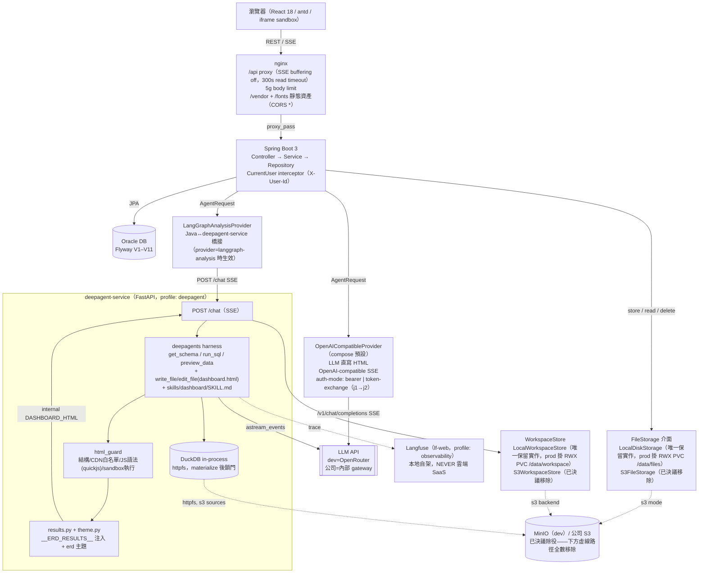
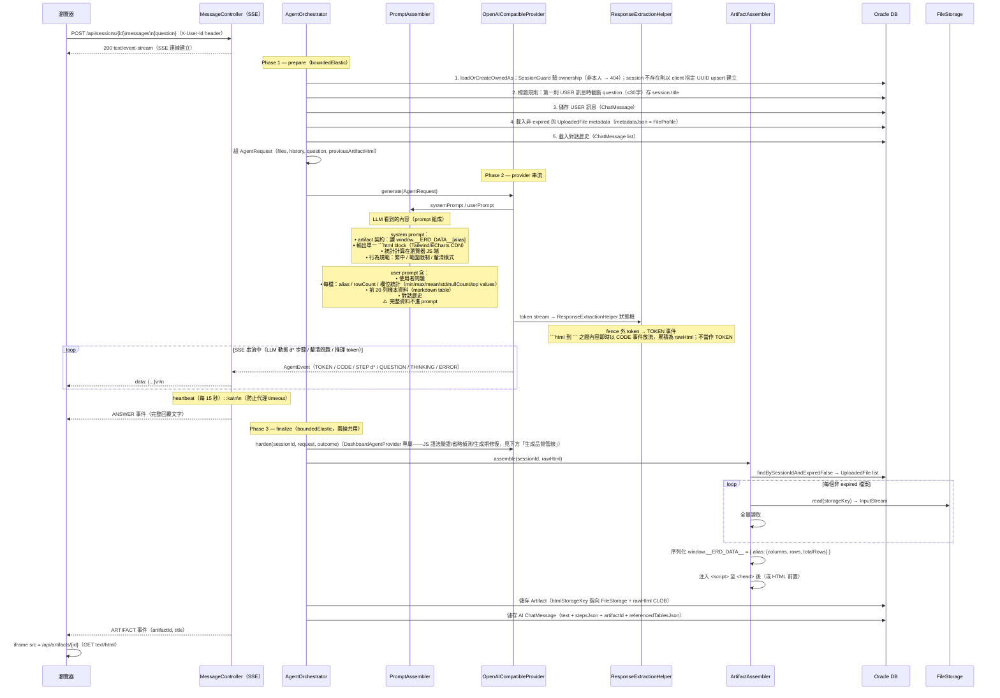
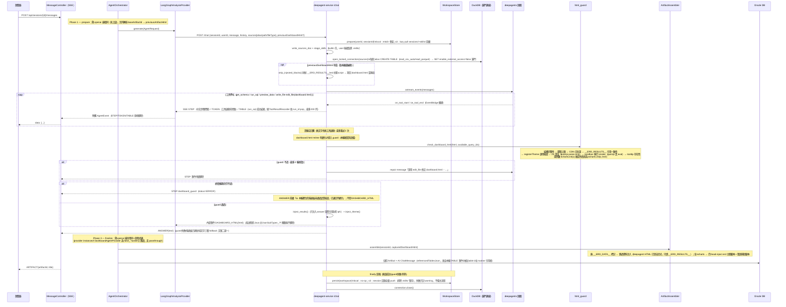
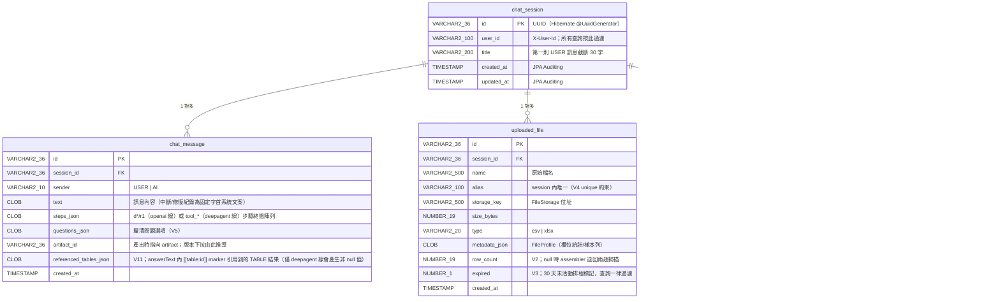

# Cowork · Data Studio — 架構說明

> 兩條 provider 線：`openai-compatible`（LLM 直寫 HTML，compose 預設）與
> `langgraph-analysis`（LLM 用 DuckDB 工具查資料、直寫 dashboard.html，經
> `deepagent-service`——FastAPI + deepagents harness + skills + DuckDB，analysis 主線）。

---

## 系統對外連線總覽

**邊界定義**：「本系統」＝ docker compose 內的自家容器群（backend / deepagent-service /
frontend nginx / oracle / minio / cloudbeaver / dozzle / lf-*）。下表列出每一條**跨出**這個邊界的連線。

| # | 發起方 → 目的地 | 協定 | 用途 | 何時發生 | dev / 公司環境差異 |
|---|---|---|---|---|---|
| 1 | 瀏覽器 → frontend nginx | HTTPS/HTTP | **唯一使用者入口**：`/api` reverse proxy（含 SSE）、`/vendor`/`/fonts` 靜態資產、SPA shell | 每次頁面載入與操作 | dev：`localhost:3001` 或本機 cloudflared quick tunnel；公司：內部網域／gateway |
| 2 | **deepagent-service → LLM API** | HTTPS | `astream_events` 驅動的每輪對話（工具呼叫＋文字生成），`OPENAI_BASE_URL` | `ERD_AGENT_PROVIDER=langgraph-analysis` 時，每次使用者送出訊息 | dev＝OpenRouter（`https://openrouter.ai/api/v1`）；公司＝內部 gateway。**這是常態運行時唯一的真正 internet egress** |
| 3 | backend → LLM API | HTTPS | `OpenAICompatibleProvider` 的 `/v1/chat/completions` SSE；公司環境另含 token-exchange j1→j2 交換端點 | 僅 `ERD_AGENT_PROVIDER=openai-compatible` 時啟用 | dev＝OpenRouter；公司＝內部 gateway＋token-exchange（j1→j2，TTL 快取，401 自動重試） |
| 4 | ~~backend/deepagent-service → minio / S3~~ **已決議除役** | HTTP(S) / S3 API | `S3FileStorage`（上傳檔＋artifact）、DuckDB httpfs 直讀資料來源、`S3WorkspaceStore`（boto3 lazy pull / turn-end push） | `ERD_STORAGE_TYPE=s3` 或 `AGENT_WORKSPACE_BACKEND=s3` 時 | **改走 PVC RWX，此連線將完全消失**（見「儲存後端決策」節）。移除前：dev＝本機 minio 容器（`--profile minio`，`:9100`/`:9101`）；公司＝內部 S3——**非 internet egress** |
| 5 | deepagent-service → Langfuse | HTTP | 每輪 trace 上報（`langfuse.langchain.CallbackHandler`），未設 `LANGFUSE_PUBLIC_KEY` 即完全 no-op | 每次 `/chat` 呼叫（`observability` profile 啟用且金鑰已設時） | dev＝本機 `lf-web`（`--profile observability`，`:3010`）；公司 **MUST** 指向內部位址，NEVER 雲端 Langfuse SaaS |
| 6 |（選配，現關）cloudflared tunnels → Cloudflare | HTTPS | `tunnel-frontend`/`tunnel-backend`/`tunnel-dozzle`/`tunnel-cloudbeaver`/`tunnel-langfuse` 對外曝露本機服務供臨時測試 | 手動 `docker compose up` 啟用時 | quick tunnel URL 每次重啟即換；`tunnel-langfuse` 僅在 `observability` profile 下存在 |
| 7 | dashboard HTML 內的 CDN 參照（瀏覽器發起） | — | 模型輸出的 HTML 字面上寫標準 CDN URL（`cdn.tailwindcss.com`、`cdn.jsdelivr.net/npm/echarts@5`） | 生成當下寫入 rawHtml；**serve 時**由 `ArtifactCdnRewriter` 依 asset profile 正則改寫為 `/vendor/...` 本地資產 | 瀏覽器實際載入的是同源 `/vendor/` 檔案，**不連外部 CDN**（因應公司內網封鎖 `cdn.tailwindcss.com`）。deepagent 線的 `html_guard.ALLOWED_SCRIPT_SRC_PREFIXES` 白名單逐字複製自同一份 system prompt 的 CDN 寫法規範，兩者只是「生成期允許寫什麼」與「serve 期改寫成什麼」的一體兩面，不衝突 |
| 8 | Oracle / CloudBeaver / dozzle | — | 純內部元件：DB、DB 管理 UI、log 檢視 | — | **無對外連線**（各自只在 docker 內部網路被存取；CloudBeaver/dozzle 有選配 cloudflared tunnel，見第 6 列） |

**結論**：常態運行時真正的 internet egress **只有 deepagent-service → LLM API**（第 2 列，
唯一「一定會發生」的一條）；backend → LLM API（第 3 列）只在切回 `openai-compatible` provider
時才啟用；其餘皆為容器間內網流量或選配的臨時 tunnel。

---

## 整體架構



設定切換方式：`ERD_AGENT_PROVIDER=openai-compatible|langgraph-analysis`（環境變數）。
compose 預設為 `openai-compatible`；本專案 dev `.env` 實際切至 `langgraph-analysis`。

token-exchange 流程（僅 `openai-compatible` 線、公司環境）：service account j1 → POST exchange
API → j2 token（快取 TTL 秒）→ 放入 env 指定的認證 header（header 名一律由環境變數提供，不寫死於
原始碼）；401 時自動 invalidate 並重試一次。

j1 service account key 來源：`service-account-key`（環境變數內聯）或 `service-account-key-file`（檔案路徑，K8s secret mount 用）——**檔案路徑優先**（兩者皆設時檔案值勝出）。每次 exchange 時才讀檔（非啟動時快取一次），因此檔案內容輪替（secret rotation）最慢在下一次 TTL 到期後的 exchange 即生效，不需重啟服務；本地測試與公司 K8s 環境共用同一套檔案路徑機制。讀檔在 `Mono.fromCallable(...).subscribeOn(Schedulers.boundedElastic())` 完成，不阻塞 reactive event loop。兩來源皆未設定時建構期即失敗（`TokenExchangeClient` constructor）；檔案路徑有設但檔案不存在則於實際 exchange 時失敗，錯誤訊息僅含檔案路徑、NEVER 含金鑰內容。

---

## Provider 檔案分類地圖

| 目錄 | 內容 | 說明 |
|---|---|---|
| `agent/model/` | `AgentRequest`、`AgentFileContext`、`HistoryMessage`、`ClarifyingQuestion` | orchestrator↔provider 共用的請求/上下文 model，全 record 無 Spring 註解 |
| `agent/provider/`（根） | `AgentProvider`（根 SPI，兩線 provider 皆實作）、`DashboardAgentProvider`（`extends AgentProvider`，只加 `harden()` 生成期修復 hook——只有「LLM 直寫 HTML」的模式才需要）、`ProviderResult`、`RepairResult`、`HardenedOutput` | 兩線共用的介面與結果型別；`OpenAICompatibleProvider` 實作 `DashboardAgentProvider`，`LangGraphAnalysisProvider` 只實作根介面 `AgentProvider`（renderer/deepagent 輸出不會有 JS-syntax/omission 這類 harden 要修的失敗） |
| `agent/provider/openai/` | `OpenAICompatibleProvider`、`PromptAssembler`、`TokenExchangeClient`、`GenerationRepairGuard`、`GenerationRepairer`、`JsSyntaxValidator`、`CodeOmissionValidator`、`RepairOutcome`、`JsSyntaxError`、`CodeOmissionFinding` | OpenAI-compatible SSE 路徑；所有生成品質工具（語法驗證、省略偵測、生成期修復）物理上全部集中於此目錄；template 在 `resources/templates/openai/system-prompt.vm` |
| `agent/provider/analysis/` | `LangGraphAnalysisProvider` | 橋接 deepagent-service 的 `POST /chat`（SSE）到 Java `AgentEvent` 流；`DASHBOARD_HTML`（內部訊號，未註冊進 `@JsonSubTypes`）與 `QUESTION` 皆被攔截、out-of-band 捕捉，不直接轉發——由 `AgentOrchestrator.finalize()` 統一重新發出，與 openai 線同一套收尾邏輯 |
| `agent/extraction/` | `ResponseExtractionHelper`、`BareHtmlUtils` | **openai 線專屬**——完整結構化模型回應抽取狀態機（fence 解析、`CodeEvent` 即時放流）；deepagent 線沒有對應物，因為模型從不把 HTML 直接吐進聊天串流，而是用 `write_file`/`edit_file` 工具寫進 workspace |
| `agent/repair/` | `ArtifactRepairer`、`BrowserRepairOutcome`、`BrowserJsError` | 瀏覽器確認制修復——**dashboard-only**：內部注入 `Optional<DashboardAgentProvider>`，`langgraph-analysis` 模式下該 bean 不存在，`isBrowserRepairSupported()` 回 `false`，呼叫 `repairWithBrowserErrors` 會拋 `BrowserRepairUnsupportedException`（見下方「瀏覽器錯誤修復」節） |

---

## Call LLM 序列圖 — openai-compatible 線（POST /sessions/{id}/messages）



---

## Call LLM 序列圖 — deepagent 線（provider=langgraph-analysis）



---

## SSE 事件契約

| type | 欄位 | 來源線 | 說明 |
|---|---|---|---|
| `STEP` | `stepKey`, `title`, `description`, `status`（pending/running/success/error） | 兩線 | ThoughtChain 即時進度。openai 線：`d*` 由 LLM 規劃動態產生，`r1` 為後端修復步驟；deepagent 線：`stepKey=tool_{name}_{runId}`，逐個工具呼叫（含 `dashboard_guard` 終敗 ERROR 步驟）；deepagent-service 未帶 `status` 時 `LangGraphAnalysisProvider` 正規化為 `RUNNING` |
| `TOKEN` | `delta` | 兩線 | 打字效果。openai 線：fence 外的說明文字；deepagent 線：工具啟動**前**的開場思路（工具開跑後的中段 chatter 不上 wire，終局由 ANSWER 承載） |
| `TABLE` | `tableId`, `intent`, `columns`, `rows`, `truncated` | **deepagent 線專屬** | `run_sql` 成功後的查詢結果小卡（「查詢意圖小卡」）；only-live（orchestrator 收到後累積在 `tableAccum`，若最終 `answerText` 含 `[[table:id]]` marker 才會以 `referencedTablesJson` 隨 AI ChatMessage 一併持久化，其餘丟棄） |
| `CODE` | `delta` | **openai 線專屬** | ```` ```html ```` fence 內容的即時 delta，供前端「產生中的 HTML」收合面板。deepagent 線模型從不把 HTML 直接吐進聊天串流（用 `write_file`/`edit_file` 寫進 workspace），沒有對應事件 |
| `THINKING` | `delta` | **openai 線專屬** | 模型內部推理串流（gpt-oss `delta.reasoning`）；前端可展開的思考面板；不持久化 |
| `QUESTION` | `questions`（`{ key, label }[]`） | 契約兩線通用，**目前僅 openai 線實際產出** | 模型釐清問題選項卡；`AgentOrchestrator.finalize()` 是唯一發送端（兩線 provider 各自把捕捉到的 questions 放進 `AgentOutcome`，由 finalize 統一重新 emit）。openai 線來自 ```` ```questions ```` fence；deepagent-service 目前的 `/chat` 從不送 `type=QUESTION`，`LangGraphAnalysisProvider` 已備好捕捉轉發邏輯但尚無實際觸發路徑 |
| `ANSWER` | `text` | 兩線 | 完整回覆文字定稿 |
| `ARTIFACT` | `artifactId`, `title` | 兩線 | 右欄載入 dashboard |
| `ERROR` | `code`, `message` | 兩線 | 錯誤氣泡。deepagent 線額外碼：`ANALYSIS_TIMEOUT`（`erd.agent.analysis.request-timeout-seconds`，預設 180s，事件間閒置逾時）、`ANALYSIS_STREAM_FAILURE`、`ANALYSIS_EVENT_PARSE`（不可解析的 payload） |
| `:ka` | —（SSE 註解行） | 兩線 | heartbeat，防代理逾時（見下節） |

（`DASHBOARD_HTML` 不是對前端的 wire type——它是 deepagent-service → `LangGraphAnalysisProvider` 之間的內部訊號，刻意未註冊進 `AgentEvent` 的 `@JsonSubTypes`，被攔截後轉為 `ArtifactEvent` 走正常 finalize 流程。）

### Heartbeat（`:ka`）

`MessageController` 以 `Flux.interval(15s)` 產生 SSE 註解行 `:ka`，與資料事件 `Flux.merge` 後輸出：

- **開始／結束**：串流被訂閱即起算；`takeUntilOther(done)` 讓 agent 事件流完成的瞬間停止，連線正常關閉
- **固定節奏**：因為是 merge 而非「閒置才發」，即使 TOKEN 正在串流，每 15 秒仍照發——實作簡單且行為可預期
- **對前端不可見**：SSE 協定規定 `:` 開頭的行必須被 client 忽略，事件 parser 不受影響；唯一作用是讓 TCP 連線持續有位元組流動
- **防護對象**：nginx（`proxy_read_timeout` 300s）、公司 gateway、Cloudflare tunnel 等中間層的 idle timeout。需要覆蓋的天然長靜默期：deepagent-service 的 SQL 查詢／LLM 思考期間（該服務同樣以 15 秒 `HEARTBEAT_INTERVAL_SECONDS` 重發 active step 作內部 heartbeat，見 `_stream_agent_turn`）、生成期修復的 LLM 重呼叫（`harden()` 內約 30 秒，僅 openai 線）、模型長思考的首 token 前空窗
- **15 秒的理由**：保守小於常見 60 秒 idle 門檻，成本每次僅數 bytes

### 回覆持久化語意

- **provider/agent 錯誤**：捕捉到例外後，後端在 DB 儲存一筆 AI ChatMessage，text 為錯誤文字，stepsJson 為 `[]`。
- **客戶端斷線（SSE cancel）**：Flux 取消時後端偵測到下游 cancel，儲存一筆 AI ChatMessage，text 為「回應已中斷，請重新送出以繼續」；前端以灰色小字系統樣式渲染（`INTERRUPTED_TEXTS` 常數比對，相容舊資料的全形括號版本）。
- **修復紀錄**：瀏覽器錯誤修復完成後儲存一筆 AI ChatMessage（「已修復儀表板執行錯誤（N 個）：…」／「儀表板執行錯誤自動修復未成功…」固定字首），前端同樣渲染為灰字系統訊息（`REPAIR_RECORD_PREFIXES`）。
- 所有情形皆保證 USER 訊息有配對的 AI row，歷史紀錄不出現孤立 USER 訊息（finalize 的單一持久化點（HTML／無 HTML 兩出口）與 doOnCancel 以 `aiPersisted` CAS 互斥防 double-write；兩線共用同一套 `AgentOrchestrator`/`AgentConversationWriter`）。

---

## 資料量處理

### openai-compatible 線（四階段）

| 階段 | 作業 | 帶什麼資料 |
|---|---|---|
| **上傳** | multipart 串流直接落地 FileStorage | 原始檔案全量，不經記憶體累積 |
| **Profile** | 解析時單趟串流計算統計（commons-csv / excel-streaming-reader） | 全量單趟；輸出 FileProfile（rowCount / colCount / 欄位統計） |
| **Prompt** | PromptAssembler 組 user prompt | 僅 schema + 統計摘要 + **樣本列**（`erd.upload.sample-rows`，預設 20）；完整資料不進 LLM |
| **Artifact 注入** | ArtifactAssembler 全量讀取 | 全量注入（抽樣機制已移除——目前資料量級不需要）；entry 為 `{columns, rows, totalRows}` |

### deepagent 線：資料從不進 prompt，模型直接查

deepagent-service 不做「樣本列進 prompt」這一步——資料來源以路徑（`s3://bucket/key` 或本地掛載路徑，依 `erd.storage.type` 決定，`LangGraphAnalysisProvider.resolveSourcePath`）交給 DuckDB，模型透過 `get_schema`/`preview_data`/`run_sql` 工具自行探索與查詢：

1. **掛資料鎖門**：`open_locked_connection` 先對每個 `alias` `CREATE TABLE ... AS SELECT * FROM read_csv_auto/read_parquet(path)`（materialize），再 `SET enable_external_access = false` 鎖門——鎖門後連線上任何 SQL（含 httpfs）都碰不到檔案系統/網路
2. **查詢結果落檔**：`run_sql` 成功時把結果寫入 workspace 的 `queries/{qN}.sql` + `results/{qN}.json`（單一 `qN` 編號空間，跨 turn 遞增，`STORE_MAX_ROWS=5000` 截斷）；模型看到的 markdown 表格另截到 `LLM_VIEW_MAX_ROWS=200`
3. **HTML 引用、不內嵌**：dashboard.html 只讀 `window.__ERD_RESULTS__["qN"]`，不直接內嵌資料；送出前只注入 answer 實際引用到的 query 結果（`referenced_query_ids` 掃描 HTML）
4. **上傳限制**（config 可調，兩線共用，於上傳當下把關）：

| 項目 | 上限 |
|---|---|
| 每 session 檔數 | 5 |
| session 總量 | 5 GB |
| CSV 單檔 | 2 GB（串流解析） |
| xlsx 單檔 | 200 MB（SAX 串流讀取） |

### deepagent 線：查詢結果注入 dashboard 的機制（`__ERD_RESULTS__`）

模型寫的 HTML **不含任何資料值**，資料在出貨前由服務端確定性注入。整條鏈：

```
run_sql 成功
  → workspace 落檔 results/{qN}.json：{ intent, columns, rows(≤5000列,cell 已
    JSON-safe 正規化: Decimal→float、date/datetime→ISO 字串), truncated }
  → 模型寫 dashboard.html,圖表/KPI/洞察一律讀 window.__ERD_RESULTS__["qN"]
    （rows 是陣列的陣列,用 getCol 解欄位 index;JS 只做笨渲染,NEVER 現算統計——
     文字結論與圖表數字因此同源,結構性消除抄錯）
  → guard 引用完整性：referenced_query_ids(html) ⊆ workspace 現有落檔,
    缺任何一個 qN 即退件;sandbox 執行檢查用「真實 shape 的假資料」驗 JS 可跑
  → 注入（發 DASHBOARD_HTML 前,app/engine/results.py + theme.py）：
    ① 只注入「被 HTML 引用到」的 qN（regex 掃描,未引用的不進 payload）
    ② build_results_script → <script id="erd-results-data">window.__ERD_RESULTS__={...}</script>
       （JSON 內 `</` 一律轉義 `<\/`,防 </script> 提前終結）
    ③ 插入位置：</head> 之前 → 無 head 則 <body> 開標籤後 → 都無則前置
    ④ inject_theme → <script id="erd-theme">（erd 8 色主題,冪等:已含 registerTheme('erd' 即跳過）
  → DASHBOARD_HTML {html} 交給 Java
  → ArtifactAssembler：偵測「無 __ERD_DATA__ 標記」→ 跳過全量資料注入
    （只補 head-inject 的錯誤捕捉/字型/主題,主題與 ② 冪等共存）
```

**兩個 script 帶 id 標記的原因**：迭代與「選版本繼續編輯」時，artifact 的 rawHtml 是
**注入後**版本——進場重建基底時 `strip_injected_blocks` 靠 `id="erd-results-data"`/
`id="erd-theme"` 確定性剝除舊注入，模型永遠編輯乾淨的骨架，每次出貨都重新注入當下的
最新結果。

**與 openai 線的對照**：

| | openai 線（`__ERD_DATA__`） | deepagent 線（`__ERD_RESULTS__`） |
|---|---|---|
| 注入內容 | 全量原始資料（columns/rows/totalRows,每檔全列） | 僅被引用的查詢結果（聚合後,每表 ≤5000 列） |
| 注入時機/位置 | Java `ArtifactAssembler.assemble`（serve 前組裝） | Python 發 DASHBOARD_HTML 前;Java 端跳過 |
| 統計計算 | 瀏覽器 JS 現算（模型寫聚合邏輯） | DuckDB SQL 算好,JS 笨渲染 |
| 數字一致性 | 文字與圖表各算各的,可能分歧 | 同一份 SQL 落檔,同源 |
| 資料量級上限 | 受原始檔大小制約 | 與原始檔大小無關（只跟查詢結果有關） |
| 重跑語意 | 重注入新原始資料,圖表自動重算 | 重跑凍結 SQL→新 results→重注入,零 LLM（M3 每日報表的基礎） |

---

## 檔案 alias 機制

每個上傳檔有兩層命名，分工明確：

| 層 | 規則 | 給誰看 |
|---|---|---|
| `name`（UI 顯示） | 檔名全小寫（`Locale.ROOT`）；撞名時在副檔名前插入與 alias 同號的 `_N` 後綴（例：`sales_2.csv`）；超過 400 UTF-8 bytes 時截主幹保副檔名 | 使用者（chips、附件列表） |
| `alias`（資料 key） | 檔名 slug 化 | openai 線：模型與產出 JS 的 `window.__ERD_DATA__[alias]`；deepagent 線：DuckDB `CREATE TABLE "{alias}"`（同一個 slug 兼作 SQL 識別字，`_SAFE_IDENTIFIER_PATTERN` 二次校驗） |

**Slug 規則**（`FileAliasUtils`，static utility class）：取檔名主幹 → 小寫（Locale.ROOT）→ 保留任何語系字母數字（`\p{L}\p{N}`，中文保留）、其餘轉 `_` → 連續 `_` 摺疊、去頭尾 → 截 **60 UTF-8 bytes**（byte-aware，不切斷多 byte 字元）→ 全符號檔名 fallback `file{n}`。

**撞名**：與 session 內**所有**歷史 alias 比對（含 expired，避免刪除重傳撞 V4 unique 約束）→ 依序 `{slug}_2`、`{slug}_3`；後綴後超限先按 byte 截主體。`(session_id, alias)` unique 約束為 DB 層保底。`generateAlias` 回傳 `AliasResolution(alias, suffixNumber)`，`suffixNumber` 同時決定 `name` 的 `_N` 後綴，保證兩者號碼一致。

**Oracle BYTE 語意說明**：Oracle `VARCHAR2(N)` 預設 BYTE 語意；全中文 alias 每字元佔 3 bytes，舊的 40 字元截斷會讓 40 個中文字 = 120 bytes，遠超 `alias VARCHAR2(100 BYTE)` 上限（ORA-12899）。H2 按字元計長所以舊測試抓不到此問題。現行實作統一以 UTF-8 byte 計長（alias ≤ 60 bytes、name ≤ 400 bytes），H2 與 Oracle 方言差異不再造成線上炸彈。

**為什麼用語意 alias 而非 file1/file2**：`__ERD_DATA__['wafer_lots']`／DuckDB `"wafer_lots"` 表名自我說明——弱模型在多檔情境少一層「file1＝哪個檔」的間接對照，拿錯檔機率下降；產出 JS/SQL 也更可讀。system prompt / deepagent sources.md 皆明令模型使用檔案脈絡列出的 exact alias、不得自創。

## 檔案 Retention 機制

`RetentionCleanupService`——排程清理長期未活動 session 的檔案：

- **排程**：cron `erd.storage.cleanup-cron`（預設每日 03:00）；cutoff = `now - retention-days`（預設 30 天，`erd.storage.retention-days`）
- **判定**：`chat_session.updated_at < cutoff` 的 session → 其所有未過期檔案
- **動作**：刪除 FileStorage 實體檔 → DB 列標 `expired = true`（**列保留**，UI 仍可見檔案存在過）；逐檔獨立小交易（單檔失敗不影響其他），storage 刪除失敗僅 log.warn
- **刻意不用 @Transactional**：排程進入點 self-invocation 不經 proxy，掛註解是誤導性 no-op（程式碼內有註解說明）

**過期後的行為邊界**：

- 舊 dashboard **不受影響**——注入版 HTML 在生成當下已凍結抽樣資料，本質是自包含快照
- 對話與修復被 guard 擋下（`FILES_EXPIRED`）：session 含任何過期檔案時，發送訊息與瀏覽器修復都會被拒絕，前端顯示說明橫幅引導使用者刪除過期檔案並重新上傳（產品決策：強制清理，不做靜默劣化）
- deepagent-service 的 workspace（`queries/`/`results/`/`dashboard.html`）不受此排程管理，是獨立生命週期（見下方 workspace 說明）

**⚠️ 已知缺陷：`chat_session.updated_at` 不隨對話更新**

`ChatSession` row 全專案只有兩個寫入點——`SessionGuard`（建立時）與 `AgentOrchestrator.prepare()`（**第一則** USER 訊息時設 title）。第二輪起 `hasUserMessage == true` 即不再 save，而 `@LastModifiedDate` 靠 `AuditingEntityListener` 的 `@PreUpdate`，只在 Hibernate 髒檢查判定有欄位變更、真的發出 UPDATE 時才觸發。

結果：**`updated_at` 實質等同 `created_at`**，上述「判定」的真實語意是「**建立後** N 天」而非「閒置 N 天」。連續使用三個月的 session 在第 31 天就會被清檔，下一輪對話撞上 `FILES_EXPIRED` guard。dev 階段未暴露僅因尚無 session 存活超過 30 天。修法見設計文件 `docs/superpowers/specs/2026-08-01-pvc-storage-and-retention-design.md` §6。

**分級保留（已決議，待實作）**

單一 `retention-days` 將拆為按資料類分別設定，動機是三類資料的價值與可重建性不同：

| 資料類 | 保留條件 | 現況 |
|---|---|---|
| artifact HTML | 建立後 **2 年** | 目前**無任何清理**，等於永久保留 |
| deepagent workspace | session 最後活動 **半年**內 | 目前**無任何清理**，只長不消（實際的磁碟洩漏） |
| 上傳原始檔 | session 最後活動 **半年**內 | 已有機制，`retention-days` 30 → 180 |

此政策成立的關鍵是 **deepagent 線的 artifact 為 self-contained**（`__ERD_RESULTS__` 生成時即注入，`ArtifactAssembler` 對其 `includeData=false`、完全不讀原始檔），因此半年後清掉原始檔，兩年內打開 artifact 仍可正常檢視；session 則降級為唯讀存檔（可看不可續問）。

實作前置：`StorageKeyUtils.buildKey()` 目前產出 `{sessionId}/{UUID}_{name}`，上傳檔與 artifact HTML **共用同一扁平 key 空間**、混在同一 session 目錄，無法按類型施加不同 cutoff，也無法只備份 artifact。需改為 `uploads/` 與 `artifacts/` 前綴。

## DB Schema（Flyway V1–V11）

### 為什麼選 relational DB

1. **資料天生是關聯形**：核心存取模式全是關聯查詢——按 `user_id` 撈 session 列表、按 `session_id` 依時序撈訊息／artifact 版本鏈、ownership 鏈（user→session→其餘資源）的過濾。這些用 RDB 的索引＋外鍵直接對應；用 document store 反而要自己維護反正規化與序關係。
2. **交易一致性是硬需求**：「USER 訊息永遠有配對的 AI row」（含中斷／錯誤路徑）、artifact＋AI 訊息同交易寫入（`AgentConversationWriter` 的 TransactionTemplate）、storage 寫檔失敗回滾整筆——沒有 ACID 這些保證得靠應用層補償邏輯，複雜且易錯。
3. **開發／測試工具鏈成熟度**：Spring Data JPA＋Flyway＋H2 Oracle mode 讓「本機零依賴測試、schema 版本化演進（本專案 V1–V11 的加欄／回填／砍欄即為例證）、與部署環境同方言」一氣呵成；document store 這邊的對應（Testcontainers 等）測試迴圈較重。
4. **document model 的賣點在此拿不到**（公司環境同樣可架 MongoDB，可用性不是差異點；差異在資料形狀）：
   - schema 彈性——本專案 schema 小而穩定，欄位演進靠 migration 管理反而是優點
   - 嵌入式讀取 locality——熱的大 payload（上傳檔、注入 HTML）在 `FileStorage` 不在 DB，DB 只剩 KB 級中繼資料
   - 水平擴展——對話中繼資料的量級用不到
   - 且若把對話 embed 進 session 文件，版本鏈的 `raw_html`（每版 10–200KB）會讓文件無上限成長（16MB 上限反模式）→ 實務上仍得拆 collection → 存取回到 join 形，locality 好處消失
5. **一致性不變量的表達成本**：Mongo 4.0+ 雖有 multi-document transaction，但「訊息↔artifact 跨實體一致」「按序推導版本鏈」這類不變量在 RDB 是外鍵＋索引＋交易的原生語意，在 document store 要靠應用層約定維護。

結論：這個規模下兩者都做得起來；選 RDB 是因為資料的不變量是關聯形的，而換取 document model 需要付出的成本沒有對應的回報。



**索引**：`chat_session(user_id, updated_at)`（側欄列表）、`chat_message(session_id, created_at)`（對話載入）、`uploaded_file(session_id)`、`artifact(session_id)`。

**設計慣例**：
- Schema 一律 Flyway migration 管理（`ddl-auto: none`）；ID 全為 String UUID；時間戳全走 JPA Auditing
- **Ownership 鏈**：`user_id` 只存在 `chat_session`——其餘表透過 `session_id` 間接歸屬；所有存取先過 `SessionGuard.loadOwned`（讀取路徑）（非本人一律 404）。例外：`artifact` 的 GET 為 capability URL（不驗 user，讀靠 UUID 不可猜；**寫入** `/repair` 仍驗 ownership，且僅 `openai-compatible` 線支援——見下方「瀏覽器錯誤修復」）
- `chat_message.artifact_id` 無 FK 約束（軟關聯）：訊息與 artifact 同交易寫入（`AgentConversationWriter` TransactionTemplate），版本清單由訊息序推導 v1..vN
- `artifact` 為 append-only 版本鏈，唯一的原地更新是瀏覽器錯誤修復（覆寫 storage 檔＋raw_html；舊 storage key 盡力刪除）——此路徑僅 openai 線可觸發
- **注入版 HTML 存放（V6）**：寫入時雙 save（先取 @UuidGenerator id → FileStorage 存檔 → 回寫 key，同交易，IOException 回滾）；serve 走 `StreamingResponseBody` 逐行 CDN 改寫，不整檔物化進 heap——大 payload（每檔可達 30MB 抽樣資料）不再隨版本鏈複製進 DB
- **資產世代（V7 asset profile）**：改寫規則 `@ConfigurationProperties`（`erd.artifact.rewrite`）按 profile 配置並於啟動預編譯（`ArtifactCdnRewriter`）；未來升版本／換圖表 library／公司 mirror 都是加一組 profile＋vendor 檔＋切 current-profile 的純加法，舊 artifact 永遠鎖在生成時的資產世代。兩線 provider 產出的 HTML 都經過同一套 `ArtifactAssembler`/`ArtifactCdnRewriter`，改寫規則不分 provider
- **V10 `spec_storage_key` 除役**：原為 renderer 版 agent-service 的 `previousDashboardSpec` 迭代回饋鏈設計；該鏈已於 deepagent-service 改為純 HTML 迭代（`previousDashboardHtml`）後全數移除，欄位保留在 schema（未寫新的 down-migration）但程式碼內無任何讀寫者
- 舊資料相容：V9 起 html CLOB 已移除——V6 前的列無 storage key → dashboard 回 404（使用者接受，比照舊 raw_html 前例）；V5 前的列 `raw_html` 為 null → HTML 檢視器與修復回 404/409

---

## 生成品質管線（openai-compatible 線專屬）

以下生成期檢查僅適用 `openai-compatible`（LLM 直寫 HTML）路徑；`langgraph-analysis` 線由 deepagent-service 自己的確定性 guard 把關品質（見下節），Java 端 `harden()` 整段跳過（`provider instanceof DashboardAgentProvider` 為 false，走 `RepairResult.passthrough`），僅保留瀏覽器確認制修復——且該修復本身也是 dashboard-only（見下方「瀏覽器錯誤修復」）。所有生成品質類別（`JsSyntaxValidator`、`CodeOmissionValidator`、`GenerationRepairer`、`GenerationRepairGuard`、相關 record）物理上集中於 `agent/provider/openai/` 目錄。

```
模型輸出 → 抽取（html/questions/[[step:]]/CODE 即時放流）
        → JsSyntaxValidator（GraalJS parse-only，抽 <script> 驗語法）
          有語法錯 → GenerationRepairer.repair（回餵壞 HTML + 精確錯誤清單修 1 輪）
        → CodeOmissionValidator（佔位註解偵測：只掃 JS/HTML 註解、
          僅在「迭代且產出 < 前版 70%」時啟動——防 lazy truncation，正常路徑零誤殺）
          偵測到省略 → GenerationRepairer.retryForOmission（重跑原請求 + 反省略強制指令；
          被省略的程式碼不在壞 HTML 裡，修補救不回、只能重新生成）
        → 兩種修復共用單次重試 + 雙驗證門檻（語法 clean 且無省略），r1 步驟即時呈現
        → ArtifactAssembler 注入（順序固定）：
          錯誤捕捉腳本（onerror/unhandledrejection → postMessage）
          → @font-face（Inter）
          → erd ECharts 主題（DOMContentLoaded guard——保證在 CDN 載入後、模型 init 前註冊）
          → window.__ERD_DATA__（全量注入，columns/rows/totalRows）
        → 存檔（html 注入版 + raw_html 原始版）
```

- **SSE 事件契約補充**：`CODE`（fence 內 HTML 的即時 delta，供前端「產生中的 HTML」收合面板）；`TOKEN` 維持只含說明文字（規範要求說明寫於 html fence 之後）
- **中斷語意**：使用者停止與斷線在後端同為 cancel（無法區分）——前端就地區分顯示（⏹ 已停止生成 / ⚠ 連線中斷請重試）；後端持久化中性文字「（回應已中斷，請重新送出以繼續）」保證 USER 訊息永有配對
- **端點補充**：`GET /api/artifacts/{id}/raw` → 注入前原始 HTML（text/plain，capability 語意同主端點）
- **公司認證**：`erd.agent.openai-compatible.auth-mode=token-exchange` 時走 j1→j2 交換（TTL 快取 + 401 單次重試），header 名可配置
- **黃金範本 v3**：設計基準 `docs/design/dashboard-golden-reference.html`（使用者核准）——slate-800 banner、Tabler 式 tab（線條 SVG icon、border-b-2 active）、KPI 語義色卡、NEVER emoji/漸層/@apply

### 瀏覽器錯誤修復（使用者確認制，dashboard-only）

生成時管線之外的第三道防線——真實執行環境的執行期錯誤（ReferenceError 等語法檢查抓不到的類型）。**僅 `openai-compatible` 線支援**：`ArtifactRepairer` 內部注入 `Optional<DashboardAgentProvider>`，`langgraph-analysis` 模式下該 bean 不存在（`LangGraphAnalysisProvider` 只實作根 `AgentProvider`），`isBrowserRepairSupported()` 回 `false`；deepagent 線的等價保護在生成當下就已由 `html_guard` 的 Level 1（quickjs parse-only）+ Level 2（quickjs sandbox 真執行）把關，理論上不需要瀏覽器事後修復這一層。

```
artifact <head> 注入錯誤捕捉腳本（onerror/unhandledrejection，debounce 1s、batch ≤10、忽略跨域 'Script error.'）
  → postMessage({type:'erd-artifact-error'}) 給父頁
  → ArtifactPanel 驗 event.source === iframe.contentWindow → onRuntimeErrors 上拋 CoworkPage
  → ChatPanel 對話串底部顯示 RepairOfferCard（錯誤數 + 第一條訊息 + [修復]/[忽略]）
  → 使用者按「修復」→ POST /api/artifacts/{id}/repair（ownership→404；無 rawHtml→409；非 dashboard-only provider → 不支援）
  → ArtifactRepairer.repairWithBrowserErrors（回餵 rawHtml + 真實錯誤清單，呼叫當下的 DashboardAgentProvider 修 1 輪；provider 回傳非空白 HTML 即視為成功，不再做 GraalJS 二次語法驗證）
  → 原地更新 raw_html/html + 持久化修復紀錄 ChatMessage → 前端 iframe ?r=N 強制 reload
```

- 防迴圈語意：使用者確認制（無自動上限）——修完 reload 後若再捕捉到錯誤，卡片會**再次出現**供再修；「忽略」後同一 artifact 不再彈卡（換版本或修復成功即重置）；修復失敗卡片顯示「修復未成功 + 再試一次」
- 已知限制：endpoint 尚無 rate limit（backlog）

---

## deepagent-service 品質關卡（html_guard 三級 + 修復迴路）

對應 openai 線的「生成品質管線」——deepagent 線的等價防線，但**確定性檢查在服務端完成**（不依賴模型自評），失敗即整份 dashboard 退回不顯示：

| 層級 | 檢查 | 失敗行為 |
|---|---|---|
| **結構/契約** | `<div>` 存在性、體積上限（2MB）、`<script src>` CDN 白名單（逐字複製自 openai system prompt 的 CDN 寫法規範）、`registerTheme(` 誤用偵測（主題由系統注入，模型不得自帶）、`__ERD_RESULTS__["qN"]` 引用一致性（引用不存在的 query id 即報錯） | 收集進 `errors` 列表，全部規則互不 fail-fast |
| **Level 1：JS 語法** | quickjs parse-only（每段 inline `<script>` 包進 `(function(){...})` 只解析不執行） | 語法錯即報錯，行號經 wrapper offset 校正 |
| **Level 2：sandbox 執行 smoke** | 只在 Level 1 乾淨時才跑——quickjs 真的 `eval`，在一個 absorb-all 假 DOM/ECharts Proxy sandbox（`window`/`document`/`echarts` 任意屬性存取與呼叫鏈皆被吸收，`DOMContentLoaded`/`load` 監聽同步觸發）裡跑，抓 Level 1 抓不到的 runtime `ReferenceError`/對 `undefined` 取屬性（真實案例：忘了先宣告變數就取 `.columns`，整頁圖表死光但語法完全合法） | 逾時（2 秒 CPU budget）與例外皆轉繁中錯誤訊息，截 150 字 |
| **Tooltip** | 有 `echarts.init(` 就整份 HTML 必須出現過 `tooltip` 字樣（粗粒度、只擋全缺情況） | 報錯 |
| **主題強制改寫** | 單參數 `echarts.init(X)` 確定性改寫為 `echarts.init(X, 'erd')`；已帶第二參數但非 `'erd'` 則報錯、不改寫 | 改寫或報錯二選一 |

quickjs 是選配依賴（import 失敗只記 warning、整條規則跳過，比照 Java 端 `JsSyntaxValidator` 的「驗證器掛掉不擋主流程」哲學）。

**修復迴路**：guard 不過 → 回餵錯誤清單給模型（`"儀表板檢查未通過,請用 edit_file 修正 dashboard.html:\n- ..."`）→ 最多 2 輪（`GUARD_REPAIR_MAX_RUNS`，實測：語法錯誤 1 輪常修不回來、2 輪才夠 catch 大部分情況）→ 仍不過則整份 dashboard **退回不顯示**（發 `dashboard_guard` ERROR STEP，ANSWER 前綴警示，不發 `DASHBOARD_HTML`，不讓模型的「已完成」文字誤導使用者）。

**注入順序**（guard 通過後，送出前）：`inject_results()`（只注入 answer 實際引用到的 `qN`，`<script id="erd-results-data">`）→ `inject_theme()`（`<script id="erd-theme">`，與 `head-inject.vm` 的 8 色 CVD 安全盤逐字同步，NEVER 重排色票順序）。兩者皆帶固定 `id`，讓 `strip_injected_blocks()` 能在「選定歷史版本繼續編輯」時確定性剝除、拿回乾淨基底重新注入（避免疊出兩份 `__ERD_RESULTS__`）。

**Workspace 生命週期**（獨立於 DB retention）：

| 面向 | Local（v1，**prod 亦走此路線**，掛 RWX PVC） | S3（**已決議除役**，見下方決策記錄） |
|---|---|---|
| 佈局 | `AGENT_WORKSPACE_ROOT/{userId}/sessions/{sessionId}/{queries,results,dashboard.html,.skills,sources.md}` | 同結構，`local_root` 退化為 cache |
| `prepare()` | mkdir 骨架，內容留在磁碟（前一輪殘留） | lazy pull：只拉這個 user/session 需要的物件（`workspace/{userId}/sessions/{sessionId}/` 前綴＋`workspace/{userId}/skills/`）覆蓋本地對應路徑；拉檔失敗直接讓例外往上冒（500，不帶半套資料開工） |
| `persist()` | no-op（本地目錄即持久層） | session 目錄全量 push（排除 `.skills/`——每輪由 `stage_skills()` 重新 staging 的暫存，不是要保存的產出）；失敗僅 log.warn，不擋主流程（本輪 SSE 結果已送出，下一輪同 pod 接手會重推，冪等） |
| Skills staging | 每輪 `stage_skills()` 清空 `.skills/` 重新複製（builtin 先、user 後，同名後者覆寫前者） | 同左；user skills 額外從 S3 `workspace/{userId}/skills/` pull 下來 |
| 已知限制 | — | persist 失敗 × 跨 pod 會讀到舊版 workspace——見下方「待討論」小節 |

### 已結案：S3 workspace 耐久性（persist 失敗 × 跨 pod stale read）

原問題：`persist()` 失敗只 `log.warn` 不擋主流程，最新 workspace 只存在於當前 pod 的本地 cache、S3 上是舊版；下一輪若被排到**另一個 pod**，lazy pull 會拉到舊版 workspace，模型基於過期狀態開工（症狀：上一輪的 dashboard 修改「消失」、`qN` 編號空間回退導致與舊 `results/{qN}.json` 衝突、dashboard 引用的結果檔缺漏）。原定緩解方案為 session affinity ＋ workspace 版本戳記，並列為「上 prod 多副本前 MUST 落地」。

**結案方式：改走 RWX PVC。** 共享檔案系統下 workspace 即單一 source of truth，沒有 pull/push、沒有本地 cache、沒有版本落後——**問題與其兩項前置工程一併消失**，不需 session affinity，也不需版本戳記。詳見下節與 `docs/superpowers/specs/2026-08-01-pvc-storage-and-retention-design.md`。

---

## 儲存後端決策：PVC RWX（為什麼不是 MinIO）

原設計選 S3 的唯一理由是「公司 k8s 無 RWX PV」。該前提已確認不成立，因此重新評估並改為 **PVC RWX 單一路線，S3/MinIO 全線移除**（`S3FileStorage`、`S3StorageConfig`、`S3WorkspaceStore`、`duck.py` 的 httpfs 路徑、compose 的 `minio`/`minio-init`；**`lf-minio` 屬 Langfuse self-host topology，不在此範圍**）。

### 判準：三個可量測的維度

物件儲存與共享檔案系統的取捨取決於下列三項，而非架構偏好：

| 判準 | 傾向物件儲存 | 本專案實測 | 判定 |
|---|---|---|---|
| **讀取扇出** | 大量無狀態 reader 同時併發拉取 | 一個 request 讀 1–5 檔，DuckDB 順序掃描 | 檔案系統 |
| **物件數量級** | 10⁶ 以上小物件 | 每 session 個位數至數十檔；8,000 sessions 約 2.4 × 10⁵ | 檔案系統 |
| **容量上界** | 無上界、不可預測 | 5 GB/session 硬上限 × 可估算的產生率 | 檔案系統 |

**對照組 Loki**：三項全部落在物件儲存側——單次 LogQL 查詢 fan-out 到數百 querier 各拉數千 chunk（單一 NFS server 是 throughput/IOPS 單點瓶頸）、chunk 數達 10⁶–10⁹（檔案系統 inode 與目錄 metadata 會崩）、日誌 append-forever 無法預先 size。但 Loki 官方**同時提供 `filesystem` backend** 供 single-binary 與小規模部署——連 Loki 的答案都是「看規模」，不是「物件儲存在原理上較優」。

本專案亦完全用不到物件儲存的專長：無 presigned URL 直連瀏覽器、無 CDN、無跨 region、不靠 S3 versioning 管版本（artifact 版本鏈在 DB 自管）、不靠 lifecycle policy 過期（已有 cron retention）。所有流量都經過後端行程。

### 三個具體收益

1. **叢集內 MinIO 不會變出磁碟** —— MinIO 自己也跑在 PVC 上，與 app 共用同一池 block storage，並額外付 erasure coding 的 1.5–2× 冗餘 overhead。在容量上不僅無優勢，放大係數更差。只有**外部託管的** object storage（獨立容量池、冷熱分層）才有真正的容量彈性。
2. **S3 路徑在此 workload 上更慢** —— `S3FileStorage.store()` 因 `putObject` 需要已知 content-length，先把 `InputStream` spool 到 temp file 再上傳；2 GB CSV 等於「寫本地 temp 2 GB → 再傳 2 GB」。`LocalDiskStorage` 串流一次落地，**少一份完整的磁碟 IO**。
3. **DuckDB 攻擊面縮小** —— 全 local 後 `duck.py` 永遠不會走 `INSTALL httpfs; LOAD httpfs;`，在既有的 `enable_external_access=false` 之上再少一個網路 extension。同時 6 個 S3 環境變數 × 三套 client（AWS SDK chain、boto3、duckdb httpfs）全部消失。

### 為什麼刪乾淨而不保留為退路

保留 S3 實作的真正成本不是 271 行的維護，而是**只要該路線還「活著」，上節那個耐久性缺陷就不能宣告消失**，session affinity 與版本戳記兩項工程就還掛在排程上。刪除才能誠實關閉這個問題。

可逆性亦足夠：`FileStorage` 是 14 行、3 個方法的介面，`WorkspaceStore` 是一個 Protocol，**介面保留、實作刪除、git history 仍在**。若未來環境改變，重新加回是貼回 271 行的工作，不是重新設計架構。

### PVC 規格

| PVC | 大小 | 存取模式 | 掛載 |
|---|---|---|---|
| `/data/files` | 2 TB | RWX | backend `rw`、deepagent-service `ro` |
| `/data/workspace` | 200 GB | RWX | deepagent-service `rw`、backend `rw`（清理用） |

workspace 拆成獨立小 PVC 是刻意的：**容量耗盡的後果不對稱**——應讓失敗發生在「新上傳被拒」，而非「artifact 寫不進去導致整輪分析白做」。

RWX 的附帶收益：workspace 清理需要 session 的 `updated_at`（在 backend DB）而檔案在 deepagent 側，**共享檔案系統讓 backend 直接掛載 workspace 自行清理，單一 `RetentionCleanupService` 涵蓋兩邊**；S3 方案下需跨服務開 cleanup API。

## 容量估算方法

保留期依資料類不同，**不能用「兩年累加」估算**，而須分別以各自的窗計算穩態值：

```
總容量 = artifact(2 年窗，全量累積)
       + workspace(半年活躍窗)
       + 上傳原始檔(半年活躍窗)

半年活躍窗 session 數 ≈ 半年新建量 ＋ 舊 session 回訪量
```

### 每 session 佔用（程式碼實證）

| 成分 | 大小 | 依據 |
|---|---|---|
| 上傳原始檔 | ≤5 GB | 5 檔/session 共 5 GB；xlsx 單檔 ≤200 MB，僅 CSV 可達 2 GB |
| `results/{qN}.json` | 每檔 ≤5000 列，約 ≤2–5 MB | `results.py` `STORE_MAX_ROWS = 5000`（硬上限） |
| workspace `dashboard.html` | ~100–500 KB | 模型產出 |
| `.skills` staging | 56 KB × 每 session 一份 | `deepagent-service/skills` 共 4 檔 |
| artifact HTML（每版） | ~1–5 MB | 本體 30–150 KB（Tailwind/ECharts 走 vendored 外部載入不內嵌）＋ 注入的 `__ERD_RESULTS__`（僅 answer 引用到的 `qN`） |

除上傳檔外每項都有硬上限；workspace 合計約 15 MB/session。

### 基準試算與敏感度

以 200 人 × 20 session/年 ＝ 4,000 sessions/年 為例：artifact ＝ 8,000 × 5 版 × 3 MB ≈ **120 GB**；workspace ＝ 2,400 × 15 MB ≈ **36 GB**；上傳原始檔 ＝ 2,400 × 平均上傳量。

| 平均上傳/session | 原始檔 | 總計 | PVC（＋40% headroom） |
|---|---|---|---|
| 100 MB | 240 GB | 0.4 TB | 0.6 TB |
| 300 MB | 720 GB | 0.9 TB | 1.3 TB |
| **500 MB** | 1.2 TB | **1.4 TB** | **2 TB** |
| 1 GB | 2.4 TB | 2.6 TB | 3.6 TB |
| 2 GB | 4.8 TB | 5.0 TB | 7 TB |

**平均上傳量是唯一無實測依據的參數，也是唯一的主導變數。** 故配套比初始數字更重要：CSI **MUST** 支援線上擴容、70% 用量告警、按 `uploads/`／`artifacts/` 前綴分別監控、上線 1–2 個月後以實測值重算。

**重新估算的觸發條件**：使用者數或 session 產生率變動 >50%、實測平均上傳量偏離 500 MB 假設 >2×、openai/dashboard 線決定上 prod、artifact 版本鏈平均長度 >10。

**條件式風險（openai/dashboard 線）**：`ArtifactAssembler.buildEntry()` 呼叫 `fileParsingService.readAll()` 取**全量列**注入 HTML，無列數上限。若該線上 prod 且 session 達 5 GB，單一 artifact 版本會膨脹至 7.5–15 GB（CSV→JSON 約 1.5–3× 膨脹），且 serve 該尺寸的 HTML 給瀏覽器本就不可行。此為**獨立於儲存選型**的設計問題（換 S3 同樣成立）。上表以「僅 deepagent 線上 prod」為前提。

### 備份：只有 artifact 是必要項

三類資料的可重建性不同，備份需求不應一致：

| 資料類 | 量 | 可重建？ | 備份 |
|---|---|---|---|
| **artifact HTML** | ~120 GB | **不可能**——模型有不確定性，同樣的 prompt 產不出同一份 dashboard | **必要** |
| workspace | ~36 GB | 部分可從 artifact 反推 | 選配 |
| 上傳原始檔 | ~1–2 TB | 可以——原檔在使用者本機 | 不備份 |

**真正需要備份的只有約 6% 的資料量**，使備份從「每天 2 TB」降為「每天 120 GB」。這也讓 `uploads/`／`artifacts/` key 前綴從「方便監控」升級為**備份策略的硬前置條件**。

備份不一致的後果亦被既有設計吸收：artifact 是 append-only 版本鏈，「檔案比 DB 新」只產生可清理的孤兒檔；反向的 dangling reference 已由 `ArtifactService.getHtml()` 回 404 處理。因此**還原順序訂為「先檔案、後 DB」，每日一次的粒度即足夠**。

具體機制依平台能力擇一（儲存陣列既有備份 ＞ CSI VolumeSnapshot ＞ Velero），並注意 **RWX（NFS/CephFS）的 VolumeSnapshot 支援度遠低於 RWO block storage**，許多 NFS provisioner 不提供 `VolumeSnapshotClass`——此為必須向平台具體確認、不可假設的事項。若平台完全無備份能力，則採混合方案（僅 `artifacts/` 放外部物件儲存，其餘留 PVC），詳見 spec §5。

---

## 靜態資產自帶（vendored assets）

公司內網封鎖外部 CDN（cdn.tailwindcss.com 403）的因應——dashboard 對外網依賴歸零：

- repo 內建 `tailwind-play-v3.js`（v3.4.17）與 `echarts-v5.min.js`（5.6.0），雙落點：`frontend/public/vendor/`（nginx，iframe/前端 origin）+ `backend resources/static/vendor/`（backend 直連/gateway）
- `ArtifactService.getHtml()` **serve 時**以 regex 將已知 CDN URL（含 `?plugins=`、`@5.x.y/dist/` 變體）改寫為 `/vendor/...`——DB 舊 artifact 免重生成即生效；`/raw` 不改寫（迭代回餵維持模型原輸出）；prompt 不動（模型續寫標準 CDN URL，出口統一攔截）。兩線 provider 產出的 HTML 皆經過同一套改寫，不分 provider
- **與 deepagent guard 白名單的關係**：`html_guard.ALLOWED_SCRIPT_SRC_PREFIXES` 是「生成當下允許模型寫什麼」的白名單（逐字複製自同一份 system prompt 的 CDN 寫法規範），`ArtifactCdnRewriter` 是「serve 當下把寫進去的東西改寫成什麼」——兩者管的是同一份契約的前後兩端，deepagent 線多了一道「生成期就先擋掉不在白名單內的 CDN」的關卡，openai 線沒有對應的生成期擋法（只在 serve 期統一改寫）
- 檔名帶主版本線（`tailwind-play-v3.js`／`echarts-v5.min.js`）；字型（Inter woff2）同模式於 `/fonts/`；公司 gateway 需轉發 `/api/**`、`/vendor/**`、`/fonts/**`

### Asset profile：版本／library 替換機制（V7）

每個 artifact 在生成時被蓋上 `asset_profile`（如 `tw3-ec5`），serve 改寫**按各自的 profile 套規則**——舊 artifact 永遠鎖在它生成時的資產世代，替換動作對既有資料零回溯破壞。

規則配置在 `application.yml`（`@ConfigurationProperties`，`ArtifactCdnRewriter` 啟動時預編譯所有 pattern）：

```yaml
erd:
  artifact:
    rewrite:
      current-profile: tw3-ec5        # 新 artifact 蓋這個章
      profiles:
        tw3-ec5:
          - pattern: "https://cdn\\.tailwindcss\\.com[^\"']*"
            replacement: /vendor/tailwind-play-v3.js
          - pattern: "https://cdn\\.jsdelivr\\.net/npm/echarts@5[^\"']*"
            replacement: /vendor/echarts-v5.min.js
```

**三種替換情境的 SOP（全部是純加法，不動舊資料）**：

| 情境 | 步驟 |
|---|---|
| **升版本**（如 Tailwind v4） | ① 放 `tailwind-play-v4.js` 進兩個 vendor 落點 ② yml 加 `tw4-ec5` profile（pattern 同、replacement 指 v4 檔）③ `current-profile` 切為 `tw4-ec5` ④（若 prompt/黃金範本/deepagent skill 有 v4 不相容的 class 用法需同步校訂） |
| **換圖表 library**（如 ECharts → Chart.js） | ① 改 prompt/skill 教模型寫 Chart.js CDN URL＋改黃金範本 ② vendor 放 `chartjs-v4.js` ③ yml 加 `tw3-cjs4` profile（pattern 對 Chart.js CDN）④ 切 current-profile；deepagent 線另需同步改 `html_guard.ALLOWED_SCRIPT_SRC_PREFIXES`。注意：erd ECharts 主題注入本來就以內容含 `echarts` 為條件，新舊 artifact 天然共存 |
| **公司內部 mirror** | 公司環境以 env/yml 覆蓋 replacement 指向內網路徑，code 與 vendor 檔零改動 |

**Fallback 語意**：artifact 的 profile 為 null（V7 前舊列）→ 視同 `tw3-ec5`；profile 查無對應規則（設定被拿掉）→ `log.warn` 並退回 current-profile 規則，不中斷 serve。

---

## 安全設計（Security）

系統的核心威脅模型：**模型生成的 HTML 會在使用者瀏覽器執行，而它的內容可被上傳資料（CSV/Excel cell）的 prompt injection 影響**。安全設計環繞這條主軸，分「已落地」與「規劃強化」兩塊誠實記錄。

### 威脅模型與信任邊界

| 資料來源 | 信任等級 | 處置 |
|---|---|---|
| 使用者上傳的檔案內容（cell 值、欄名、表名） | **不受信** | 進 DuckDB 前不做 SQL 拼接（參數化＋`^\w+$` 識別字驗證）；進 prompt 前經 `frame_data_content` 包裝；進 dashboard 前經注入 escape |
| 模型輸出的 HTML | **半受信**（受上傳資料影響） | html_guard 三級關卡＋（規劃）瀏覽器層 CSP 強制 |
| `X-User-Id` header | v1＝匿名命名空間（非憑證）；公司環境＝SSO/gateway 注入 | 所有 session 查詢按 userId 過濾，他人資源一律 404 |

### 已落地的防線（三側最終審查逐條驗證）

**多租戶隔離**——所有 session-addressed 路徑收斂到 `SessionGuard.loadOwned`/`loadOrCreateOwned`（外人資源 → 404）；session list 按 `CurrentUser` 過濾；file/message/artifact 一律經 ownership-checked session 存取。`@RequestScope` 的 `CurrentUser` 在 async/SSE 邊界前先值物件化（method 簽名傳 userId 值，不跨執行緒讀 request scope）。deepagent 端 workspace 按 `{userId}/sessions/{sessionId}` 隔離，S3 pull/push 有 key traversal 防護。

**注入防護（HTML script context）**——`ArtifactAssembler.inject` 與 deepagent `results.record`／`inject` 在把 JSON 資料嵌入 `<script>` 前，一律 `</` → `<\/` escape，杜絕 `</script>` 提前結束 script block 的 break-out（Velocity 不自動 escape，此手動 escape 為 load-bearing）。

**Path traversal**——`StorageKeyUtils.sanitize` 純字串取 basename＋剝控制字元（**不把不受信檔名餵給 `Paths.get`**，避免 `InvalidPathException` 與平台相依解析）；`LocalDiskStorage.resolve` 另獨立強制 `resolved.startsWith(root)`；sessionId 進 `buildKey` 前先過 UUID 格式驗證。

**Locale-safe 文字搜尋**——`TextSearchUtils.indexOfIgnoreCase` 用 `regionMatches` 在原字串上比對，索引對長度會變的大小寫折疊（如 `İ` U+0130）仍有效，杜絕在 lowercased 副本上算 index 造成的錯位插入。

**DuckDB 鎖門連線**——先 materialize 資料、後 `enable_external_access=false`＋`lock_configuration=true`（不可逆）；鎖後連線上任何 SQL 都碰不到檔案系統/網路。S3 憑證走 `connect(config=...)` dict，從不進 SQL 文字。

**Filesystem jail**——deepagent 的檔案工具 `virtual_mode=True`＋segment `^[\w-]+$` 驗證＋`resolve()` 後 parent 檢查，`../`/絕對路徑逃逸在 I/O 前即被拒。

**LLM API 認證**——公司環境 token-exchange（j1→j2）：j2 放自訂 header（raw，無 Bearer）、TTL 快取、401 invalidate 換新重試一次、j1 每次交換重讀 key file（k8s secret 輪替免重啟）；token 不落 log。

**iframe 沙箱**——前端 artifact 預覽 iframe `sandbox="allow-scripts"`（無 `allow-same-origin`）→ opaque origin，dashboard JS 碰不到 app 的 localStorage/cookie/API。錯誤回報靠 `parent.postMessage(..., '*')`＋`event.source` 比對，opaque origin 下照常運作。

**Secrets 管理**——一律 env vars，NEVER 進 `application.properties`；關鍵路徑 log 只記長度/計數/例外類別，NEVER 記 API key、完整 prompt/HTML、使用者資料內容。

### 規劃強化：artifact serve 層的 CSP（單一 header 根治兩個缺口）

現況 deepagent `html_guard` 的 CDN 白名單用字串 `startswith` 比對＋單一 quoted-src regex——這等於「用字串比對模擬瀏覽器 tokenizer」，本質是打不完的地鼠（lookalike host `cdn.tailwindcss.com.evil.example`、unquoted src、`<script/src=` 等畸形標籤都能繞過）。同理前端 artifact 的**全螢幕導出**用 `window.open` 開在第一方 origin、無 sandbox，繞過了 iframe 建好的隔離。

**前提事實**：`ArtifactService.getHtmlStream`（iframe 與導出實際載入的路徑）**一律**經 `ArtifactCdnRewriter` 把 CDN URL 改寫為自 serve 的 `/vendor/...`（不分環境、always-on，非公司環境專屬）。因此瀏覽器真正執行的 HTML **早已只指向 `/vendor/`**，外部 CDN URL 僅存活於 DB 原始碼、`/raw` 端點（迭代回餵、不改寫）、模型當下輸出三處。這讓 CSP 可以走「零外部 host」的最強姿態。

**根治方向＝把裁決權交還瀏覽器**：後端 serve `/api/artifacts/{id}` 時帶一個 CSP header，用 `script-src` 擋外部 host，配合 iframe 既有的 `sandbox="allow-scripts"`（opaque origin）隔離導出。

**⚠️ CSP 目前狀態＝未落地（2026-08-01 嘗試實作＋瀏覽器實測，驗證受阻於測試環境保真度，已回退）。** browser spike 確立了兩個子發現，但無法完成端到端驗證：

- **確立①**：CSP `sandbox` directive 會連 `'unsafe-inline'` 的 inline script 一起擋掉，整份 dashboard 無法渲染——**不可用**。（F-I1 的頂層導出隔離只能靠 iframe 屬性 sandbox，不能靠 CSP sandbox directive。）
- **確立②**：`script-src 'self'` 只在**正常 origin** 有效；artifact 在 opaque origin iframe 渲染時 `'self'` 解析成 opaque、比對不到自身 `/vendor/`。推論須改 explicit host-source（後端 `ServletUriComponentsBuilder` 讀 request origin，proxy 情境需 nginx `X-Forwarded-*` ＋ `server.forward-headers-strategy=framework` 才能取到含 port 的正確 origin——此鏈路已驗證可正確產出 `http://localhost:3001`）。
- **驗證受阻**：合成測試 harness（獨立 server ＋ sandboxed iframe）與**真實 app 的 iframe 渲染行為不一致**——真實 artifact 在 bare `sandbox="allow-scripts"` iframe 裡即使**完全無 CSP** 也空白，故無法用它判定「CSP 是否破壞渲染」。真正的驗證須在**真實 app 內**（前端跑一輪生成、看 dashboard 在其自身 iframe 渲染，比較有無 CSP 的差異），本次未完成。
- **殘餘限制（設計上）**：`'unsafe-inline'` 仍允許被注入的行內 script 執行，其危害靠 opaque origin 隔離（跑得起來也偷不到東西），非靠過濾。

**已落地（與 CSP 無關、獨立驗證通過）**：① 前端導出 `window.open(..., 'noopener,noreferrer')`（補 opener／referrer 方向，但**不**解決第一方執行——那仍待 CSP/wrapper）、② deepagent `html_guard` 白名單改 `urlsplit` host-boundary＋tokenizer-robust src 掃描（本身即修正三個繞過）、③ B-I4 log 洩漏修正。三側測試綠。

**未落地待續**：CSP header 本身——須在真實 app 內驗證 explicit-host script-src 是否在 opaque origin iframe 下正常渲染 dashboard，確認後才 ship。F-I1 的第一方執行隔離同樣待此（或改導出走 sandboxed-iframe wrapper route）。

### 已知延遲項（tracked risk，非疏漏）

- **artifact 讀取端點無 auth**（`ArtifactController.getArtifact`/`getRawHtml` 純按 id 查，不做 ownership 檢查）：capability-URL 設計，靠 v4 UUID 不可猜；但 URL 洩漏（瀏覽器歷史、Referer、截圖）＝洩漏整份資料集。加入 SSO 後 MUST 比照 `/repair` 走 `SessionGuard.loadOwned` 收斂。
- **`@Transactional` 內的長 IO**（browser-repair 的 30s–1min 遠端呼叫、generation persist 的全量檔案讀取）：連線池耗盡風險，`FileService` 已示範把 IO 移出交易的正確做法，待比照修正。

## 示範資料集

`GET /api/samples`（`SampleDatasetController`/`SampleDatasetService`）列出內建於 backend resources 的示範 CSV（如 SPC 製程量測資料）；`POST /api/sessions/{sessionId}/files/samples/{sampleName}` 把指定示範集的檔案載入該 session——複用既有上傳鏈（同一套 alias 產生、FileProfile 解析、上傳上限檢查），前端一鍵載入不需使用者自備檔案。兩條 provider 線都吃同一批 `UploadedFile`，示範資料集機制與 provider 選擇無關。

## 觀測（Langfuse）

`profile: observability` 起本地自架（vendored 自官方 self-host v3 compose topology：`lf-web`+`lf-worker`+`lf-postgres`+`lf-clickhouse`+`lf-redis`+`lf-minio`，全數 `lf-` 前綴容器與 volume，與既有 minio/oracle/cloudbeaver 完全隔離）。deepagent-service 每輪 `/chat` 呼叫透過 `langfuse.langchain.CallbackHandler` 送 trace；三個 `LANGFUSE_*` 環境變數都不設即完全 no-op（不建 handler）。**NEVER 指向雲端 Langfuse SaaS**——公司環境的 `LANGFUSE_HOST` 必須是內部位址。headless bootstrap（`LANGFUSE_INIT_*`）讓 org/project/API key 開機即建好，免手動點 UI（僅供本機 dev，皆為寫死值）。
