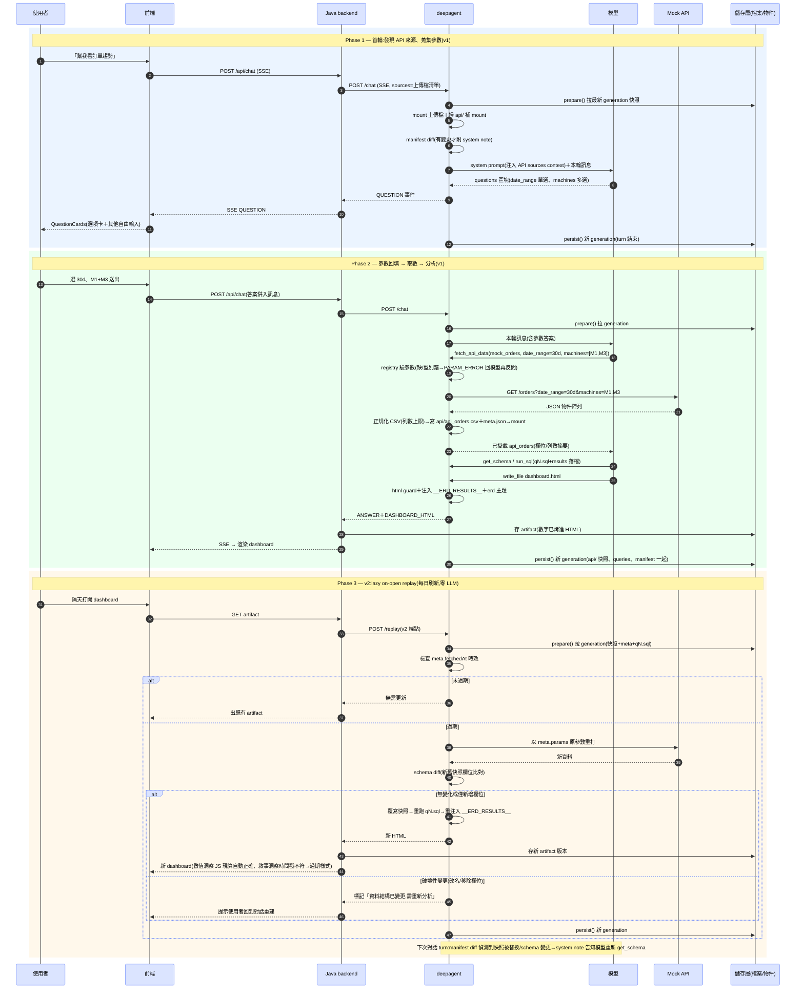

# API Datasource — 設計文件

- **日期**：2026-08-08
- **狀態**：設計已與使用者逐段確認（brainstorming 對話定案）；**實作交接文件**——實作將在未來的全新 session 進行，本文件必須自足（實作者無本次對話記憶，靠本文件＋codebase 即可動工）
- **前置**：sources manifest diff（已於同分支實作完成，見 §8；沒有它，快照替換上線即重演「模型不知道資料變了」的事故）

## 0. 實作起點——本分支現況與關鍵約束（實作前必讀）

實作依賴的基礎全部已在本分支（`exp/remove-get-schema`，將改名）完成：

| 已存在的基礎 | 位置 | 與本設計的關係 |
|---|---|---|
| WorkspaceStore 統一（local/s3 同一條 generation 快照 code path；local 用 `FilesystemObjectClient` 把 `AGENT_WORKSPACE_ROOT` 當 bucket） | `app/engine/workspace_store.py`、`app/engine/object_store_fs.py` | `api/` 目錄隨 generation persist/prepare 免費搬運，不用寫任何儲存程式 |
| sources manifest diff（世界變更通知） | `app/engine/source_manifest.py`（`build_manifest`/`load_manifest`/`save_manifest`/`diff_manifests`）＋ `app/agent/prompts.py` 的 `build_sources_manifest_note` ＋ `chat_turn.py` 接線 | API 快照替換/schema drift 的模型通知直接掛上這套；只需讓 API 快照進 manifest（versionId=`fetchedAt`） |
| QUESTION 鏈路（端到端已存在，**deepagent 與 Java/前端都不需要新事件型別**） | 模型在回覆文字放 ` ```questions ` fenced block（JSON array of `{text, options, multiSelect}`）→ Java `ResponseExtractionHelper` 解析 → `QuestionEvent` → `chat_message.questions_json` → 前端 `QuestionCards`（radio/checkbox＋「其他」自由輸入） | 參數蒐集唯一要做的事＝system prompt 教模型輸出 questions block（格式與時機） |
| 工具慣例 | `app/agent/tools/data.py` | never-raise（錯誤回 `SQL_ERROR:` 字串）、`frame_data_content` 包裝一切不可信內容、`@tool("bare_name")`、`LLM_VIEW_MAX_ROWS=200` |
| STEP 標題對映 | `app/agent/events.py` `step_title_for` | 新工具要補一行標題 |

**關鍵約束（違反即改壞安全設計）**：

1. **DuckDB connection 先掛後鎖**（`app/engine/duck.py` `open_locked_connection`）：mount 全部完成後執行 `SET enable_external_access=false` + `SET lock_configuration=true`，之後該 connection 永遠不能再讀檔案/網路。因此 API 快照的兩種 mount 時機機制不同——**輪初重建**走 Source 清單（鎖門前）、**輪中追加**只能從記憶體 `CREATE TABLE`＋`INSERT`（見 §5.1），NEVER 為此解鎖或重開 connection。
2. **engine 純度**：`app/engine/**` 只准 stdlib＋boto3＋duckdb（ruff TID251）；httpx 呼叫 API 的程式放 `app/agent/tools/`（該層已豁免）。
3. **API 回應是不可信內容**：值來自 upstream 系統、可能含使用者可控文字——進 LLM 視野的一切輸出照 `frame_data_content` 慣例包裝（同 `run_sql` 對 cell 值的處理）。
4. Java backend 與前端在 v1 **零改動**（QUESTION 鏈已存在；快照不回流 `uploaded_file`）。

## 1. 背景與目的

現有資料來源僅上傳檔案（CSV/Excel）。新增 **API datasource**：session 可掛上預先註冊的 internal API 作為資料來源，取數所需參數在對話過程中向使用者蒐集，取回的資料進入既有 DuckDB 分析管線。

設計的核心張力與解法：

- **參數是對話蒐集的** → 取數執行必須貼近對話層（deepagent），不能由 backend 僵硬判斷「參數齊了沒」
- **每個 user 對同一支 API 的參數（因此資料）都不同** → 不做任何全域預滾/排程物化；一切取數都是「單一使用者的單一 dashboard、用自己的參數」on-demand
- **API 資料會更新（每日刷新需求）** → 快照版本鏈＋lazy replay，而非 dashboard 瀏覽器端直接打 API（那會破壞 self-contained artifact 契約：CORS、瀏覽器端認證、歷史版本數字漂移）
- **儲存量擔憂** → 快照「替換不堆積」：每個 (session, alias) 只留最新一份；歷史 dashboard 可回看不靠舊快照，因為數字已注入在 artifact HTML 內

## 2. 決策記錄（與使用者確認）

| 決策點 | 結論 | 理由摘要 |
|---|---|---|
| API 定義來源 | 系統預先註冊的目錄；v1 先內建兩支、跳過選擇 UI | 參數 schema 確定、可控；目錄選擇 UI 留 v2 |
| 使用定位 | 像檔案一樣是 session 的資料來源 | 與上傳檔共用同一套 sources 概念與管線 |
| 參數蒐集機制 | QUESTION 結構化事件（既有 ```questions 協定＋前端 QuestionCards） | 型別可控；`multiSelect` 天生支援陣列參數 |
| list 參數 | v1 支援多選陣列（既有 multiSelect）；「動態候選值」（先查清單再問）留 v2，目錄 schema 預留候選值來源欄位 | 分期降風險 |
| 快照語意 | call 一次落成不可變快照；更新需明確「重新取數」＝新快照新版本 | 對齊 write-once；數字可重現可追溯 |
| 快照落地位置 | workspace `api/`（與 queries/results 同類的分析層狀態），**不**回流 backend `uploaded_file` | 所有權歸一：目錄/參數/取數都在 deepagent，快照冒充使用者上傳檔是所有權矛盾；零跨服務呼叫、backend 零改動 |
| 快照保留與版本 | workspace 現行版即唯一現行快照；隨 generation 快照自動版本化（只留兩代） | 版本控管免費繼承；「只留最新」自動成立；儲存常數化 |
| 快照大小 | v1 設列數上限（比照 `STORE_MAX_ROWS` 哲學）；未來量大再做 content-hash 跳過未變更檔的 push 最佳化 | workspace persist 是全量推送，快照大會放大每輪 turn 成本 |
| 每日刷新 | v2：lazy on-open replay（開 dashboard 時觸發 deepagent replay 端點：檢查快照時效→過期以原參數重取→重跑 qN.sql→重注入），無 scheduler、無預滾 | 每人參數不同，排程預滾不可行；replay 零 LLM；參數/SQL/注入邏輯都在 deepagent |
| 誰執行 call | deepagent（新 tool `fetch_api_data`），快照直接寫入 workspace | 參數蒐集在對話層；v2 動態候選值只有此架構做得到 |
| v1 API 性質 | mock/測試端點，無認證 | 先驗證整條流程；認證留接真 API 時設計 |
| 洞察與刷新 | 洞察分級：數值型 MUST 由 JS 從注入資料現算；敘事型綁快照時間戳、刷新後顯示過期樣式 | replay 後洞察不說謊；順帶結構性消滅「模型抄錯數字進洞察」 |
| schema drift | 快照 metadata 存 schema，新舊 diff 分級：無變化/僅新增→照跑；改名/移除→停自動 replay、標記需重新分析、走 agent 重建 | 確定性偵測；不端出半壞 dashboard |
| sources.md | **退役**（於本功能實作時一併移除 `write_sources_doc`） | 被動檔案 affordance 經 get_schema 實驗證實無效（模型不會主動讀）；diff 基準已由 `.sources-manifest.json` 承擔；模型需知的資訊改確定性注入 prompt（同 manifest note 哲學：要模型知道的事推到它面前） |

## 3. API 目錄（registry）

v1 定義在 deepagent 設定（`one.properties` 指向的 JSON/TOML 或直接常數模組），兩支 mock API。每筆定義：

```
{
  "id": "mock_orders",              // 目錄唯一 id
  "alias": "api_orders",            // 掛進 session 後的表名（與上傳檔 alias 同空間，需避撞）
  "name": "訂單查詢 API",            // 顯示用
  "endpoint_path": "/orders",       // base-url 走 settings（API_MOCK_BASE_URL），registry 只存路徑段
  "method": "GET",
  "parameters": [
    {
      "name": "date_range",
      "type": "string",             // string | number | date | enum
      "required": true,
      "multi": false,
      "prompt": "要查詢的日期區間",   // 反問使用者時的問題文案素材
      "options": ["7d", "30d", "90d"],   // 有值→QUESTION 直接列選項
      "optionsSource": null         // v2 預留：動態候選值端點
    },
    { "name": "machines", "type": "enum", "required": true, "multi": true, ... }
  ],
  "response": { "format": "json-array" }   // v1：回應為物件陣列，鍵→欄名；其他格式留 per-API adapter
}
```

- v1 兩支 API 對每個 session 隱含可用（無選擇 UI）；backend 不需要知道目錄內容
- alias 與上傳檔 alias 同一命名空間（`uq_uploaded_file_alias` 天然防撞）
- **模型如何得知未取數的 API**：**確定性注入 system prompt**（不走 sources.md——被動檔案經實驗證實模型不會讀，見 §2 sources.md 退役決策）。每輪 `build_agent` 時把「API sources context」區塊附加在 `SYSTEM_PROMPT` 之後：未取數 API（alias＋名稱＋參數 schema 摘要）與已取數 API（alias＋fetchedAt＋現行參數）。格式見 §12.5

### 3.1 Registry 實作形式（v1）

- **Python 常數模組** `app/engine/api_registry.py`（stdlib only）：`ApiParameter`/`ApiDefinition` frozen dataclass ＋ `API_REGISTRY: dict[str, ApiDefinition]`（兩支 mock）＋ `validate_params(definition, params) -> list[str]`（回傳錯誤訊息清單，空＝合法；驗必填/型別/enum 值域/multi 形狀）
- endpoint 的 base-url NEVER hardcode——走 settings（`one.properties`/env，如 `API_MOCK_BASE_URL`），registry 只存路徑段
- 不做外部設定檔（JSON/TOML）：兩支 API 用不到；目錄選擇 UI（v2）落地時再抽
- **Swagger/OpenAPI 定位（已討論定案）**：NEVER 當 runtime registry 格式——registry 一大半是 OpenAPI 沒有的產品語意（alias、繁中反問文案、multi、optionsSource、回應對映、列數上限），硬塞要發明 `x-` 方言；runtime 直接吃 OpenAPI 則引入 `$ref`/`oneOf` 大解析面，違反確定性哲學。正確分工：registry 自訂精簡格式當唯一真相；v2 可寫小匯入器從 upstream swagger 抽 endpoint/參數名/型別/必填生成 registry 草稿（人補產品欄位），並可在 CI 對 upstream swagger diff 當 schema drift 早期警報

## 4. 對話流程（v1 主線）

```
使用者：「幫我看訂單趨勢」
→ 模型從 system prompt 注入的 API sources context 得知 api_orders 可用但尚未取數、缺哪些參數
→ 發 QUESTION（```questions 協定）：date_range 選項卡（單選）、machines 選項卡（多選）
→ turn 結束，使用者在 QuestionCards 作答，答案隨下一輪訊息回來
→ 模型呼叫 fetch_api_data(source_id="mock_orders", params={...})
→ deepagent 打 API → 回應正規化成 CSV → 寫入 workspace `api/`（§5）
→ 本輪即掛載新表（DuckDB mount），get_schema/run_sql 照常分析 → dashboard
```

- 參數不足時 `fetch_api_data` 回傳結構化錯誤字串（`PARAM_ERROR: missing date_range`，never-raise 慣例同 `SQL_ERROR`），模型據以再反問
- **QUESTION 的觸發方式（不需要任何新機制）**：模型在回覆文字輸出 ` ```questions ` fenced block，內容為 JSON array，元素形狀 `{"text": "...", "options": ["7d","30d","90d"], "multiSelect": false}`——Java `ResponseExtractionHelper` 已會解析並轉 `QuestionEvent`，前端 `QuestionCards` 已會渲染（含「其他」自由輸入）。deepagent 要做的只有 system prompt 教學：何時發問（缺 required 參數且對話推不出來）、格式、一次把缺的參數問齊（一個參數一題）
- **重新取數/換參數語意（已討論定案）**：入口只有對話。使用者說「改看 90 天」「重新抓最新的」→ 模型做**部分更新**（未提及的參數沿用 `meta.json` 現值——注入的 API sources context 已列出現行參數）→ 再次 `fetch_api_data` → 覆寫快照。工具語意＝**呼叫即取數**：不做「參數相同就跳過」的去重——「重新抓最新的」正是參數不變、資料要新；要不要呼叫由模型判斷，工具忠實執行

### 4.1 完整 sequence diagram（Phase 1-2＝v1 主線；Phase 3＝§6 的 v2 replay）



「換參數重新取數」即 Phase 2 的重演：模型從 meta.json 沿用未變的參數做部分更新，不需獨立分支。

## 5. 快照落地（workspace 常駐，backend 零改動）

快照是**分析層狀態**，與 `queries/`、`results/`、`notes.md` 同類，住在 workspace：

```
workspace root/
  api/
    api_orders.csv          # 快照本體（正規化後）
    api_orders.meta.json    # {apiId, params, fetchedAt, schema, rowCount, truncated}
  queries/  results/  notes.md  dashboard.html  .sources-manifest.json
  （sources.md 於本功能實作時退役，見 §2 決策）
```

- `fetch_api_data` 打完 API 直接寫這兩個檔並 mount；**無跨服務呼叫、backend 與 `uploaded_file` 完全不動**
- 跨 turn：`api/` 隨 generation 快照 persist；下一輪 `prepare()` 拉回後，deepagent 掃 `api/` 目錄把快照補 mount（與 `request.sources` 的上傳檔並列，見 §5.1）

### 5.1 輪初 mount 組裝（「mount 上傳檔＋掃 api/ 補 mount」的展開）

本輪 DuckDB 的資料表來自兩個**所有權不同**的來源，聯集後進同一個 connection：

| | 上傳檔 | API 快照 |
|---|---|---|
| 真相位置 | backend DB（隨 `request.sources` 傳來） | deepagent workspace `api/`（generation 拉回） |
| 進 mount 清單的方式 | 逐條 `resolve_source_path`（`.sources-cache`）| 掃 `api/` 目錄，每組 `{alias}.csv`＋`meta.json` 補一筆 `Source(alias, csv 路徑, "csv")` |
| manifest versionId | request path（含上傳 uuid） | `meta.fetchedAt` |

```
mount 清單 = request.sources ∪ scan(workspace api/)
→ 一次 open_locked_connection，全部進同一個 connection
→ get_schema/run_sql 看到聯集（spc_data 與 api_orders 並列）
→ manifest 對聯集建；API sources context（§12.5）注入 system prompt
```

- **alias 防撞**：registry alias 慣例帶 `api_` 前綴；fetch 時驗證與現有表不同名（兩來源共用同一表名空間）
- **輪初重建 vs 輪中追加（機制不同，因 connection 先掛後鎖，見 §0 約束 1）**：
  - 輪初重建：掃 `api/` 得到的快照併入 Source 清單，在 `open_locked_connection` **鎖門前**與上傳檔一起 mount（`api/*.csv` 走既有 csv reader）
  - 輪中追加：`fetch_api_data` 拿到的資料已在 Python 記憶體——在**已鎖定**的 connection 上 `CREATE TABLE "alias" (...)` ＋ `executemany` INSERT（純記憶體 SQL，不觸發 external access），NEVER 解鎖、NEVER 重開 connection。欄位型別由 JSON 值推斷（number→DOUBLE/BIGINT、bool→BOOLEAN、其餘 VARCHAR）
  - 已知 caveat：輪中（JSON 推型）與下一輪（csv sniff 推型）對同一份資料的型別推斷可能有出入（如全整數欄）——v1 接受；若實測造成查詢差異，改存 parquet（`_READERS` 加 read_parquet）即可消除
- 版本控管＝generation 鏈本身：workspace 現行版是唯一現行快照，「重新取數」覆寫檔案＝新 generation 新版本；舊 generation 照既有規則只留兩代
- manifest diff（§8）對 API 快照的 versionId 取 `meta.json` 的 `fetchedAt`（上傳檔取 request path），變更/漂移通知同一套機制
- pod 重啟／generation 遺失：快照可用 `meta.json` 存的參數重取（可重建資料），無資料遺失風險
- 檔案清單 UI 不顯示 API 快照——它不是使用者上傳的檔案；將來的「connected datasources」顯示是獨立 UI 概念（非目標）

**對現有版本控管的影響＝零新概念**：快照搭 generation 版本化，變更通知交給 sources manifest diff（§8）。

## 6. v2：lazy on-open replay（每日刷新）

```
使用者開 dashboard（或未來排程觸發）
→ backend 打 deepagent 的 replay 端點（v2 新增；staleness 判斷在 deepagent——fetchedAt 在它的 meta.json 裡）
→ 未過期：無事，直接出既有 artifact
→ 過期：以 meta.json 的原參數重取 → 覆寫快照 → 重跑該 dashboard 的 qN.sql → 重注入 __ERD_RESULTS__ → 回新 HTML，backend 存新 artifact 版本
```

- 零 LLM；延遲＝API call＋秒級 SQL replay（前端 loading 態）
- schema drift 分級（§2 表）在 replay 入口把關：破壞性變更即停，標記「需重新分析」
- 併發開啟去重（per-alias in-flight lock）屬 v2 實作細節

## 7. 洞察卡規則（dashboard skill 修改，v1 就做）

落點：`deepagent-service/skills/dashboard/SKILL.md`（staged 進 workspace `.skills/builtin/` 的內建 skill）。新增兩條產出規則：

- 數值型洞察（最大/最小/成長率/超標計數…）：MUST 以 JS 從 `__ERD_RESULTS__` 現算進模板字串（如 `` `最高為 ${maxName}（${maxValue} 件）` ``）；NEVER 把模型看到的數值寫死在 HTML 文字——順帶結構性消滅「模型抄錯數字進洞察」整類 bug
- 敘事型洞察：卡片標注資料基準時間（來自注入資料的 fetchedAt/上傳時間）；replay 後 JS 比對時間戳不符即套過期樣式
- 洞察重生（refresh 時小成本 LLM call 重寫敘事）：v2 選配，唯一破「零 LLM replay」的點，依需求強度再決定

## 8. 前置：sources manifest diff（已實作完成，直接沿用）

已在本分支落地（`app/engine/source_manifest.py`＋`chat_turn.py` 接線＋`build_sources_manifest_note`）：每輪 turn 開始、mount 完成後，對 `information_schema.columns` 一次查詢組出 manifest（alias → versionId＋欄位 schema），與前一輪（隨 generation persist 的 `.sources-manifest.json`）分型 diff（added/removed/version_changed/schema_changed），有差異即在本輪訊息附 system note 指示模型重新 `get_schema`。統一涵蓋：上傳、同名重傳、API 快照替換、schema drift。

**本設計需要的唯一擴充**：API 快照不在 request 裡，chat_turn 掃 `api/` 時把 `(alias, versionId, kind="api")` 一併餵進 manifest 組裝（`SourceRecord.kind` 欄位已存在，JSON 讀取已容忍未知欄位，不需 migration）。

**versionId 一律經 `opaque_version_id()` 壓成不可逆摘要**（上傳檔以 raw path 為 token、API 快照以 `meta.fetchedAt` 為 token）：`.sources-manifest.json` 在模型可讀的 workspace root 內（檔案工具 jail root 即 workspace root），NEVER 存原始路徑/檔名/uuid——diff 只需等值比較，摘要語意不變。模型即使讀到 manifest 也拿不到 infra 佈局；而 jail（`..` 拒絕＋絕對路徑重錨定）與鎖定的 DuckDB connection（`enable_external_access=false`）本來就擋住任何路徑實際存取，摘要化是第二層防禦。

## 9. 錯誤處理

- API timeout/非 2xx/回應格式不符：`fetch_api_data` 回 `API_ERROR: ...` 字串（never-raise），模型轉述並決定重試或告知使用者
- 快照寫檔失敗：同上；寫入採先落 temp 再 rename（同 source_cache 慣例），`api/` 內永遠只有完整檔案，舊快照（若有）不受影響
- 參數驗證：型別/必填在 tool 內先驗（`PARAM_ERROR`），不打無效請求

## 10. 測試策略

- registry 解析與參數驗證單元測試
- `fetch_api_data`：mock httpx——成功正規化、各錯誤分支、多選參數序列化、列數上限截斷
- 快照落地：`api/` 寫檔＋meta、跨 turn persist/prepare 後補 mount、覆寫＝新版本、manifest diff 以 fetchedAt 偵測替換
- 端到端（deepagent 測試層）：QUESTION 反問 → 參數回填 → fetch → mount → run_sql 兩輪劇本
- 洞察規則進 dashboard skill 後，以 html_guard/現有 skill 測試慣例驗證產出

## 11. 非目標（明確排除）

- 目錄選擇 UI、使用者自帶 endpoint/OpenAPI
- 「connected datasources」清單 UI（API 快照不進上傳檔案清單，顯示是獨立概念）
- 認證設計（接真 internal API 時另案）
- scheduler/全域預物化
- 動態候選值（optionsSource）——schema 已預留
- 洞察敘事自動重生

## 12. 實作藍圖（檔案級，v1）

依賴順序排列；全部位於 `deepagent-service/`，Java/前端零改動。

### 12.1 `app/engine/api_registry.py`（新，stdlib only）

- `ApiParameter`（frozen dataclass）：`name/type/required/multi/prompt/options/options_source`（`options_source` v1 恆 None，欄位先留）
- `ApiDefinition`：`id/alias/name/endpoint_path/method/parameters/response_format/max_rows`
- `API_REGISTRY: dict[str, ApiDefinition]`——兩支 mock（如 `mock_orders`→`api_orders`、`mock_machines`→`api_machines`）；base-url 由 settings 提供（`API_MOCK_BASE_URL`，加進 `app/config.py` Settings＋`one.properties` 範本）
- `validate_params(definition, params: dict) -> list[str]`：必填缺漏、型別、enum 值域、multi 必須是 list、非 multi 不得是 list；回錯誤訊息清單（供 `PARAM_ERROR:` 組字串）
- 測試 `tests/test_api_registry.py`：每種驗證分支

### 12.2 `app/engine/api_snapshot.py`（新，stdlib only）

- `API_SNAPSHOT_DIRNAME = "api"`、`API_SNAPSHOT_MAX_ROWS = 5000`（對齊 `STORE_MAX_ROWS` 哲學）
- `SnapshotMeta`（dataclass）：`api_id/alias/params/fetched_at/schema/row_count/truncated`（schema＝[(欄名, 推斷型別)]）
- `write_snapshot(workspace, meta, columns, rows)`：寫 `api/{alias}.csv`＋`api/{alias}.meta.json`，兩檔都先落 `.part-*` 再 rename（同 `source_cache` 慣例）；csv 用 stdlib `csv` 模組
- `scan_snapshots(workspace) -> list[SnapshotMeta]`：列 `api/*.meta.json`（meta 是權威，csv 缺失＝壞快照，略過並 log warning）
- `SessionWorkspace` 加 `api_dir` property（`app/engine/workspace.py`）
- 測試 `tests/test_api_snapshot.py`：寫/掃 roundtrip、truncation、壞快照略過

### 12.3 `app/agent/tools/api_data.py`（新，可用 httpx——agent 層 TID251 豁免）

`build_api_tools(connection, workspace, registry) -> list[BaseTool]`，含單一工具（不接 `ToolResultRecorder`——快照不是查詢結果，不發 TABLE 事件；模型後續的 `run_sql` 才會）：

```
@tool("fetch_api_data")
def fetch_api_data_tool(source_id: str, params: dict) -> str
```

執行順序（全程 never-raise，錯誤回結構化字串）：
1. `source_id` 不在 registry → `PARAM_ERROR: unknown source_id ...`（列出可用 id）
2. `validate_params` 失敗 → `PARAM_ERROR: <joined messages>`
3. alias 撞名檢查（information_schema 現有表）→ `PARAM_ERROR`
4. httpx 呼叫（timeout 30s；multi 參數序列化成逗號串或重複 query key——registry 決定，v1 用逗號串）；非 2xx/超時/連線錯 → `API_ERROR: ...`
5. 回應解析：`json-array`（物件陣列，鍵→欄名；空陣列合法→空表）；格式不符 → `API_ERROR: unexpected response shape`
6. 截斷至 `API_SNAPSHOT_MAX_ROWS`、型別推斷（number→DOUBLE/BIGINT、bool→BOOLEAN、其餘 VARCHAR）
7. `write_snapshot`（覆寫舊份）
8. 鎖定 connection 上 `CREATE OR REPLACE TABLE "alias" (...)`＋`executemany` INSERT（§5.1；識別字只允許 `_SAFE_TABLE_NAME_PATTERN` 同款白名單）
9. 回傳摘要：alias、列數、truncated 與否、欄位清單——**經 `frame_data_content` 包裝**（欄名與統計源自 upstream 回應，不可信）

測試 `tests/test_api_tools.py`：mock httpx（`httpx.MockTransport`）——成功掛表後 run_sql 可查、PARAM_ERROR 各分支、API_ERROR 各分支、多選序列化、截斷、覆寫舊快照、frame 包裝

### 12.4 `app/agent/chat_turn.py` 接線（修改）

- mount 清單組裝（§5.1）：`open_locked_connection` 前，`scan_snapshots` 的結果以 `Source(meta.alias, str(workspace.api_dir / f"{alias}.csv"), "csv")` 併入
- manifest：把 api 快照的 `(alias, versionId=fetched_at, kind="api")` 餵進 `build_manifest`（§8 擴充）
- `build_agent` 的 tools 加上 `build_api_tools(...)` 回傳的工具
- system prompt：`build_agent` 改傳 `SYSTEM_PROMPT + build_api_sources_context(...)`（§12.5）；`write_sources_doc` 呼叫與 `sources.md` 一併移除

### 12.5 API sources context 注入＋sources.md 退役

**新增** `build_api_sources_context(registry, snapshots) -> str`（放 `app/agent/prompts.py`，與其他 prompt 素材同居）：組出附加在 system prompt 之後的區塊，`chat_turn` 於 `build_agent` 時傳 `SYSTEM_PROMPT + build_api_sources_context(...)`。輸出格式（模型可讀，不含路徑/uuid；零 API 目錄時回空字串）：

```
Available API datasources (call fetch_api_data after collecting required params):
- `api_machines` — 機台清單 API; params: site (required)

Fetched API datasources (already mounted as tables; params shown for partial re-fetch):
- `api_orders` — fetched 2026-08-08T09:10Z; params: date_range=30d, machines=M1,M3
```

只列各自非空的段落。測試 `tests/test_prompts.py` 補：零目錄、全未取數、全取數、混合。

**退役** `sources.md`：移除 `app/engine/workspace.py` 的 `write_sources_doc`、`SessionWorkspace.sources_doc_path`、`chat_turn` 的呼叫點與 `tests/test_workspace.py` 對應測試（§2 決策：被動檔案 affordance 無效，diff 基準已在 `.sources-manifest.json`）。舊 session 的 workspace 裡殘留的 sources.md 無害（沒有程式再讀寫它），不需遷移

### 12.6 `app/agent/prompts.py` system prompt（修改）

新增兩段指引（保持 thin，細節不展開）：
- questions block：缺 required 參數且對話推不出來時，輸出 ` ```questions ` fenced block（JSON array `{text, options, multiSelect}`），一次問齊、一參數一題；有 options 就列出（QuestionCards 有「其他」自由輸入，不必自加）
- fetch_api_data：注入的 API sources context 列出可用/已取數者；參數齊了才呼叫；換參數＝部分更新（沿用 context 列的現行參數）；「重新抓最新」＝同參數再呼叫一次

### 12.7 `app/agent/events.py`（修改）

`step_title_for` 加 `fetch_api_data` → `"取得 API 資料"`；`tests/test_events.py` 補一行斷言

### 12.8 `skills/dashboard/SKILL.md`（修改）

洞察分級兩條規則（§7 原文照搬進 skill 的產出規則區）

### 12.9 Mock API（開發/測試）

- 測試一律 `httpx.MockTransport`（不起真 server）
- 本機手動驗證：`scripts/mock_api_server.py`（獨立小 FastAPI，兩個端點回固定 JSON 陣列；`uv run python scripts/mock_api_server.py` 起在 :9100，`one-local.properties` 設 `API_MOCK_BASE_URL=http://localhost:9100`）——選配，實作 session 視需要

### 12.10 明確不做（v1 實作邊界，對齊 §11）

replay 端點（§6 全部）、動態候選值、認證 header、parquet 格式、Java/前端任何改動

## 13. 驗收清單（實作完成的定義）

- [ ] `uv run pytest -q` 全綠（新增測試涵蓋 §12 各條）＋ `uv run ruff check .` clean
- [ ] 手動兩輪劇本（本機 mock server＋backend local profile）：
  - [ ] 首輪問「訂單趨勢」→ 前端出現 QuestionCards（單選＋多選）
  - [ ] 作答 → 模型 fetch → STEP 顯示「取得 API 資料」→ dashboard 產出，數字來自 mock 資料
  - [ ] 第三輪「換成 90 天」→ 模型部分更新參數重 fetch → 快照覆寫 → dashboard 更新
  - [ ] 重啟 deepagent 後同 session 再問 → 掃 `api/` 補 mount 成功，模型看得到 `api_orders`（不重問參數）
- [ ] 快照替換後下一輪（若跨過一次外部變更）manifest note 出現於模型訊息（測試層驗證即可）
- [ ] API sources context 注入內容正確（未取數/已取數兩段、參數摘要）；`sources.md`／`write_sources_doc` 已移除且全測試綠
- [ ] 洞察規則進 skill；抽查一輪產出的洞察卡數字是 JS 現算（HTML 內無 hardcode 數值）
