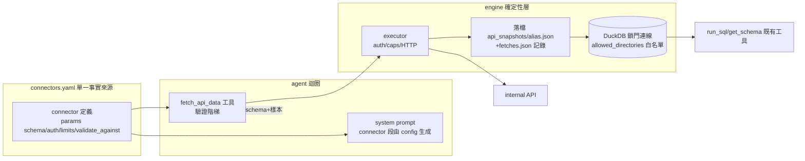

# API Connector（Phase 1）設計——對話驅動的 API 資料源＋敘事綁定

> 狀態：**as-built**（依 PR #62 實作現況整理，含逐 task review 修正後的行為）。實作計畫：`docs/superpowers/plans/2026-08-20-api-connector.md`。後續：Phase 2 replay/分享見 `2026-08-23-artifact-replay-share-design.md`。

## 1. 動機與範圍

使用者的資料不只在上傳檔——agent 需能依**對話意圖**從內部 API 取數進既有分析管線（DuckDB → run_sql → dashboard）。設計約束：模型是弱模型（qwen/deepseek 級），品質策略走確定性結構——**ETL 與協定機制全部確定性化，模型只負責意圖判斷與參數決策**；不用 jq／不讓模型寫轉換（DuckDB 原生讀 JSON，轉換留在 SQL）。

同期納入**敘事綁定**：dashboard 敘事數字改為資料綁定，殺「模型抄數字」類 bug 的根，並為 Phase 2 重繪鋪路。

## 2. 架構總覽



**功能關閉不變式**：`AGENT_CONNECTORS_FILE` 未設或檔不存在 → 工具不註冊、prompt 零變化、連線行為 byte-identical（e2e 釘住）——上線零風險。

## 3. Connector config（`connectors.yaml`）

```yaml
connectors:
  - name: line_list
    kind: lookup                # lookup=選項/對照表;data=分析用資料
    description: 產線清單
    endpoint: ${MES_API_BASE}/lines     # env 展開;缺 env 啟動即炸 NEVER 靜默
    method: GET
    auth: bearer:MES_API_TOKEN  # 一期 bearer;Phase 2 起 user-token 為預設(見 Phase 2 spec §8)
    params: {}
  - name: mes_yield
    kind: data
    endpoint: ${MES_API_BASE}/yield
    method: POST
    auth: bearer:MES_API_TOKEN
    params:
      line_id:
        type: str               # str|int|float|date
        required: true
        validate_against: {connector: line_list, column: line_id}   # ★依賴宣告
      start_date: {type: date, required: true}
    limits: {timeout_s: 30, max_bytes: 50MB, max_rows: 500k}
```

- **依賴宣告＝`validate_against`**：「要先打哪幾隻 lookup」不靠模型發現——config 宣告、雙保險執行（prompt 生成事前引導＋驗證退貨事後矯正，同一份 config 推導）
- Pydantic `extra="forbid"`；重複名／未知引用／缺 env 一律載入即炸
- 協定機制（token、未來的分頁）全在 executor，模型不可見

## 4. `fetch_api_data` 工具（唯一新模型面工具）

`fetch_api_data(connector, params, alias)`——一次呼叫五步，全確定性：驗證 → 執行 → 落檔 → 掛載 → 回報（sentinel 包裹 schema＋列數＋3 列樣本；0 列明講）。

**驗證階梯（never-raise，每則退貨訊息帶下一步——弱模型自癒模式）**：

| 檢查 | 退貨內容 |
|---|---|
| connector 存在 | 列出全部可用名 |
| alias 合法（`^\w+$`）且不撞既有表 | 指引換名 |
| params 必填/型別 | 指名參數＋格式範例 |
| `validate_against`：lookup 未掛載 | 指路「先 fetch_api_data({lookup})」（stale／被 DROP 同樣指路） |
| `validate_against`：值不存在 | **最近似候選 top 5**（levenshtein）——退貨訊息裡有答案 |
| 每 turn 上限 6 次 | 引導先分析既有資料 |
| 回應非法 JSON／超 max_rows | 訊息＋**回滾**（DROP 表＋刪 snapshot，無孤兒） |

錯誤訊息 NEVER 含 endpoint URL／token。

## 5. 意圖驅動的參數解析（prompt 規則，由 config 生成）

```
每個缺的參數按序:能推斷不問 → 有線索先窄化再問殘差 → 零線索開放式問(驗證兜底)
選項三帶:≤10 列舉;11–200 run_sql 發表格(TableEvent 呈現)+開放式問;>200 先要關鍵字
lookup 一律用 connector 名作 alias;connector 從意圖選,兩個都像才反問
級聯自動穿行:意圖覆蓋到的層自動解析,只有模糊層浮上來變問題
```

反問走既有 questions_extract → QuestionEvent 鏈路（動態表單語意）；深級聯的前端 fallback 表單列 roadmap。

## 6. 儲存與安全模型

- **落檔**：`workspace/api_snapshots/{alias}.json`（原子寫 tmp＋replace）＋`fetches.json`（每筆 `{connector, params, alias}`——**Phase 2 recipe 原料**；損壞自癒：改名 `.corrupt` 重新開始）
- **鎖門連線白名單**：`open_locked_connection` 維持 `enable_external_access=false`＋`lock_configuration=true`，僅以 `allowed_directories` 放行 `api_snapshots/` 一個目錄——mid-turn `read_json_auto` 掛載可行；`../` 穿越、symlink 逃逸、目錄外 glob 皆擋（duckdb canonicalize 後比對，**有釘測試**防升版回歸）
- **SSRF 面**：模型只給 connector 名，URL 在 config；憑證 env → executor，永不進 context
- **注入面**：工具回報一律 `frame_data_content` sentinel 包裹（同 run_sql）

## 7. 跨 turn 語意

- 連線開啟時掃 `api_snapshots/*.json` 以檔名為 alias 掛回（排除 `fetches.json`）；**alias 與上傳檔撞名 → 上傳優先、跳過 snapshot＋warning**；損壞 snapshot 掛載前 probe 隔離（`.corrupt`），不癱瘓 session
- snapshot 進 source manifest（**content-hash** version token）——同 alias 重抓觸發既有「來源已變」提示，模型被明講重新 get_schema
- snapshot 隨 workspace persist（180 天保留）；跨 turn 重抓同 alias 受「不撞既有表」限制——Phase 2 replay 對 fetches 記錄採 last-wins 化解

## 8. 敘事綁定（dashboard skill 三層規範＋resolver）

**原則：值不得經過模型 token**——與圖表（runtime 讀 `__ERD_RESULTS__`）、custom_chart（佔位符綁定）同一準則的敘事版實作：

| 層 | 規範 | 機制 |
|---|---|---|
| 事實（數字/排名/**主詞**） | MUST 綁定，先寫支撐查詢 | `<span data-bind="qN.col">`；resolver 從 `__ERD_RESULTS__` 填，無效一律「—」（含越界/非數字 row 索引） |
| 判斷（嚴重不足/尚可/良好） | 資料驅動分級，照 skill 內建分級表 | 模型抄範本寫條件式 JS |
| 自由洞察（模式推測） | 可寫但 MUST 標記 | `data-erd-narrative`（Phase 2 重繪時剝除） |

- resolver 由 finalize **與 repair 兩路**確定性注入（與 theme/inject_results 同層，strip 往返乾淨、冪等）；`referenced_query_ids` 聯集 data-bind 引用（純綁定 qN 也會被 embed）
- SKILL.md 既有範例（ironclad rules、KPI/insight 模板、worked example）**全數遷移**至此契約——弱模型抄範例重於讀規則
- 收益：敘事「抄寫」動作被消滅（數字落地核對的主戰場縮小為 ANSWER 文字）；重繪時事實/判斷句自動跟資料活

## 9. 護欄互動（PR #58）

契約護欄延伸兩條可驗證檢查（本 spec 的散文規則升級版）：**R4** 圖表 `data:` 字面數字陣列偵測（含巢狀座標 pair，排除清單明文化）；**R5** data-bind 路徑驗證（qN 存在／欄位存在／row 索引格式）＋R3 認綁定引用。與 PR #62 standalone，互不阻塞。

## 10. 部署

- 啟用：`AGENT_CONNECTORS_FILE` 指向掛載的 connectors.yaml＋各 connector 的 token env；不設＝功能整體關閉
- 已知邊緣：config 移除後殘留 snapshot 仍會 remount（佈署文件註記）
- 事件面：fetch 以 STEP「取得 API 資料」承載，wire 契約零新增（Java/前端零改動）

---

## 11. Planned extension：per-session 資料源選擇（多選）

> **狀態：設計，未實作。** 以下皆為規劃，不在 PR #62 的 as-built 範圍。與 §1–§10 的現況區分清楚。此擴充與 replay/分享（Phase 2）正交，可獨立排期。

### 11.1 動機與現況 gap

現況（§3）connector 是**扁平且全域啟用**：`AGENT_CONNECTORS_FILE` 一設，所有 connector 就進**每個** session 的 prompt，模型全看得到、都能打。缺一個產品需求：**使用者在上傳區（與選 CSV 同位置）跳 modal 選「資料源」，per-session 圈定範圍**——之後模型只在選定範圍內、依對話意圖選該打哪隻 API。

兩段選擇，職責不搬移：**使用者選「哪些系統」（圈範圍）→ 模型選「系統內哪隻 API」（意圖判斷，§5 規則不變）**。使用者只是縮小模型的可選集，不取代模型判斷。

### 11.2 兩個粒度落差（相對現況）

1. **分組層**：現況一個 connector＝一隻 API endpoint；擴充引入 **connector group**（＝資料源系統，如 MES），底下掛多個 endpoint 成員。
2. **範圍傳遞**：現況全域注入；擴充改為 per-session 選定的 group **隨 `/chat` request 傳到 deepagent**（與上傳檔清單、`X-User-Id` 同一條路），只注入選定 group 的 connector 進該 turn 的 prompt／工具。

### 11.3 Config 分組 schema（草案）

```yaml
connector_groups:
  - name: mes
    display: "MES 製造執行系統"      # modal 上給使用者看的人話（非技術名）
    description: 產線良率、缺陷、產能
    members:                          # 成員即現況的 ConnectorDefinition,多一個 group 歸屬
      - name: line_list
        kind: lookup
        endpoint: ${MES_API_BASE}/lines
        auth: user-token              # Phase 2b 拍板:只收個人 token(無 bearer)
        params: {}
      - name: yield
        kind: data
        ...
```

- **命名空間**：alias／`validate_against` 一律帶 group 前綴（`mes.line_list`）消衝突——現況扁平 alias 的升級，確定性、一勞永逸。跨組同名（兩組各有 `line_list`）由前綴天然分隔。

### 11.4 三側改動

| 層 | 改動 |
|---|---|
| **deepagent** | config 加 group 層＋前綴命名空間；`/chat` 收 `selectedGroups: [str]`；prompt 只注入選定 group 的 connector（§5 意圖規則不變，只是可選集變小）；registry 按 group 過濾 |
| **Java** | `GET /api/connectors` 回 group 清單（name/display/description）供 modal；`AgentRequest` 加 `selectedGroups`（與 files 同載體）傳給 deepagent；wire additive |
| **前端** | 上傳區加「選擇資料源」按鈕＋多選 modal；選定狀態顯示；送 `/chat` 時帶 selectedGroups |

### 11.5 多選的成本與護欄（拍板：多選）

多選產品上真實（跨 MES＋ERP 分析），但把幾個成本從線性推到相乘——**技術面 DuckDB 全罩、權限面因個人 token 乾淨；真正的痛在弱模型**：

| 風險 | 嚴重度 | 護欄 |
|---|---|---|
| **Prompt 預算相乘**：N 組×每組 M 隻 API 全進 prompt → context 壓力＋弱模型選擇困難 | 高 | **只注入選定 group**（本擴充核心，比現況全域還省）；modal 對選太多組給上限/提示 |
| **跨組 join 錯誤**：MES `line_id` vs ERP `production_line` key 對不上 → join 失敗或笛卡兒積量級爆炸 | 高 | prompt 規則：跨 group 關聯**必須模型顯式寫 join key**，不自動跨 join；量級護欄（cf. `series_column pivot 盲區` 待辦）盯笛卡兒積 |
| **命名衝突**：跨組同名 alias／lookup | 中 | group 前綴命名空間（§11.3） |
| **replay 部分失敗**：跨組 dashboard，viewer 對 MES 有權限、ERP 無 → 部分 403 | 中 | recipe per-source 錯誤獨立回報；2b 補「部分成功」狀態頁（MES 圖出來、ERP 區塊無權限） |

**不放大的面**：權限（個人 token，該擋自然 403，無額外洩漏）、DuckDB 多表共存（本行）、每 turn fetch cap（既有，多組不失控）。

**UX 折衷**：modal 多選但預設引導單選；多選時提示「跨系統分析可能需明確指定關聯欄位」——多選是進階能力而非預設塞滿。

### 11.6 待拍板

- 檔案＋connector 混用：選 MES 又上傳 CSV，模型能否 join？（DuckDB 可，但含上傳檔的 artifact 已定為不可分享重繪——UX 與 replay 語意要一致）
- group 選定的 mid-session 變更：對話中途改選資料源的語意（比照 source manifest diff 的「來源已變」提示？）
