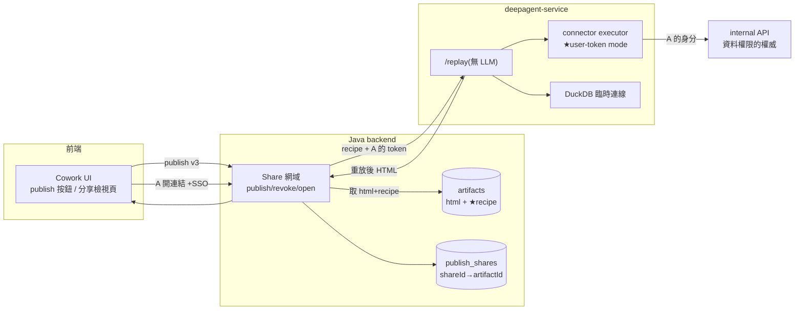
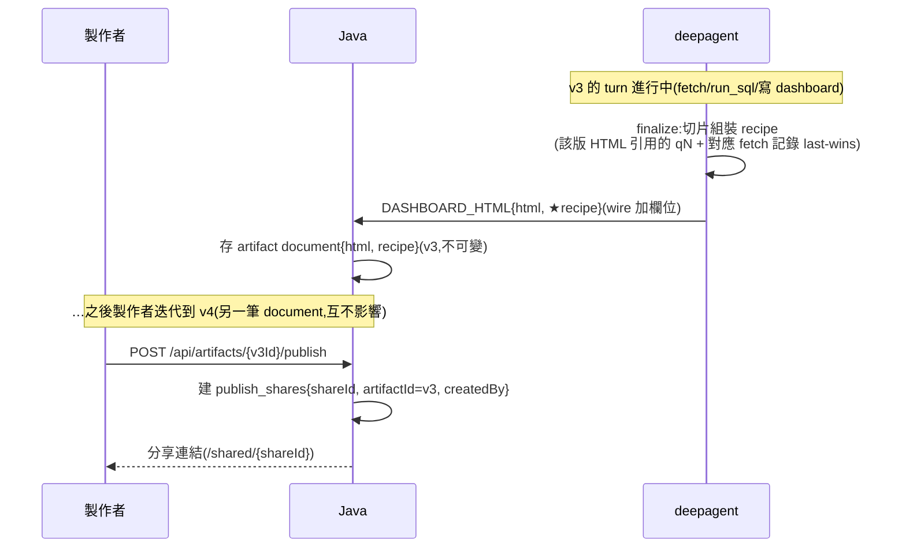
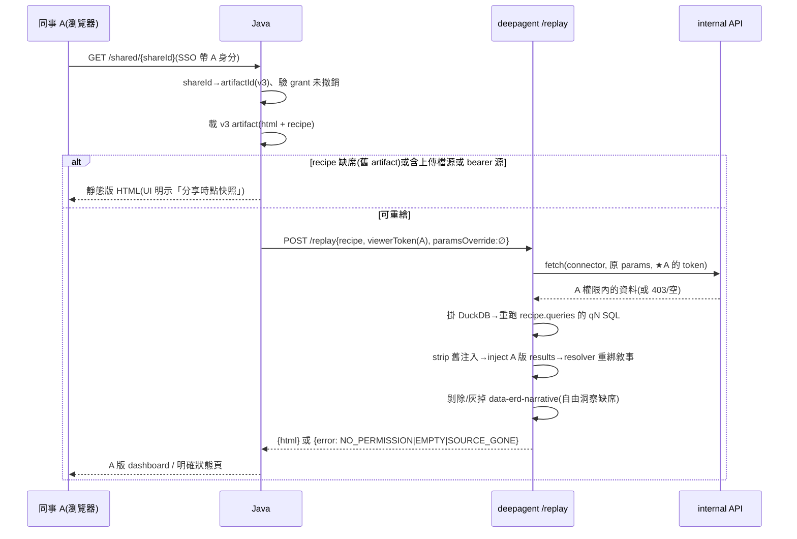

# Artifact 發佈與 Replay（Phase 2）設計

> 狀態：設計定稿待開工。前置＝PR #62（API connector Phase 1）已備齊 recipe 原料（fetches.json、qN SQL 落檔、data-bind 敘事綁定、data-erd-narrative 標記）。

## 1. 目標與核心語意

- **分享重繪**：製作者 publish 某一版 dashboard、分享連結給同事 A；A 開啟時系統以 **A 的身分**重新取數——「**recipe 固定問題、token 決定答案**」。製作者的資料不會被重新展示。
- **釘死版本**：share 連結指向特定 artifactId（v3 就是 v3，之後迭代到 v7 不影響已分享連結）。
- **零 LLM**：replay 是純確定性重放（fetch → SQL → 注入 → 綁定重算），秒級、便宜、viewer token 永不經過模型。
- **兩層授權**：share grant 管「能不能開這個 artifact」（視覺層，我們管）；viewer token 管「開了看到什麼資料」（資料層，API 管）。replay 不做任何資料權限判斷。

## 2. 架構圖



## 3. Sequence Diagrams

### 3.1 製作與發佈（recipe 逐版封存）



### 3.2 A 開啟連結（replay 主流程）



### 3.3 失敗路徑（全部大聲、帶語意）

| 情況 | 行為 |
|---|---|
| A 對該 API 403 | 狀態頁「無此資料存取權限」 |
| A 權限內 0 列 | dashboard 空狀態（圖表 empty state） |
| expectedColumns 子集檢查不過（schema 漂移） | 狀態頁「資料源結構已變更，需重新製作」＋指名缺欄（`SOURCE_SCHEMA_CHANGED`） |
| recipe 的 connector 已從 config 移除/改名 | 狀態頁「資料源已停用」（recipe 存名、config replay 時解析，接受漂移但大聲） |
| share 已撤銷 | 404（比照現行非 owner 語意） |

## 4. Recipe Schema（存放：artifact document 內）

```json
{
  "schemaVersion": 1,
  "sources": [
    { "connector": "mes_yield",
      "params": { "line_id": "AX-03", "start_date": "2026-08-10", "end_date": "2026-08-16" },
      "alias": "yield_data",
      "expectedColumns": ["lot_id", "tool", "thickness", "target", "usl", "lsl", "measured_at"] }
  ],
  "queries": {
    "q1": { "sql": "SELECT …", "intent": "各機台平均" },
    "q4": { "sql": "SELECT …cp,cpk…", "intent": "製程能力" }
  }
}
```

**切片組裝規則**（v3 finalize 當下、workspace 尚未被 v4 污染時執行）：
1. `queries`＝該版 HTML 實際引用的 qN（`referenced_query_ids`，已含 data-bind 聯集）
2. `sources`＝這些 qN 觸及的表對應的 fetch 記錄；同 alias 取 **last-wins**（fetches.json 累積多筆時）
3. `expectedColumns`＝**fetch 當下**記錄的欄名清單（fetches.json 每筆已含 columns——fetch 時工具本就查 schema，就地取材；finalize 時不需活連線做 DESCRIBE）——replay 的 schema 漂移防線
4. 上傳檔源不入 recipe（存在即標記 `hasUploadSources`，觸發靜態分享 gate）

**expectedColumns 比對規則（replay 掛載後、跑 SQL 前）**：**子集檢查**——`expectedColumns ⊆ 現時回應欄位` 即通過（additive 升版不斷舊 dashboard）；缺欄 → `SOURCE_SCHEMA_CHANGED`（狀態頁指名缺哪些欄）。它與升版策略互補不互代：策略降低違約發生率（組織約定），此檢查偵測違約發生（含「偷偷改」、ops 誤判相容、`SELECT *` 型 SQL 靜默放行三種策略罩不到的情境）。語意變（欄名不動、單位/編碼變）兩者皆偵測不了——唯一防線是升版紀律本身。

三個存放地的角色：workspace 的 fetches.json＋queries/＝**原料**（180 天、累積可變）→ artifact.recipe＝**成品**（2 年、逐版不可變）→ publish_shares＝**指標**（釘死指向）。

## 5. Wire 契約變動（Java Jackson 同步，additive）

`DASHBOARD_HTML` 事件加兩個欄位：

```json
{ "type": "DASHBOARD_HTML", "html": "…",
  "recipe": { …上述 schema… } | null,
  "hasUploadSources": true|false }
```

`recipe: null`＝該版無 API 源（純上傳檔分析）→ Java 存 document 時 recipe 欄位缺席 → 分享走靜態。

## 6. Java 儲存變動

**artifacts collection（既有，加欄位）**：

| 欄位 | 型別 | 說明 |
|---|---|---|
| `recipe` | subdocument（可缺席） | 上述 schema，幾 KB，與 html 同生命週期（2 年） |
| `hasUploadSources` | boolean | 靜態分享 gate 判斷用 |

**publish_shares collection（新）**：

| 欄位 | 型別 | 說明 |
|---|---|---|
| `_id`(shareId) | String UUID | 連結中的不可猜識別子 |
| `artifactId` | String | 釘死指向的版本 |
| `sessionId` / `createdBy` | String | 歸屬與稽核 |
| `grantees` | `List<String>` (userId) | **空＝純連結制**（連結＋SSO 即可開）；**非空＝指定人制**（另驗身分在名單內） |
| `revoked` | boolean | 撤銷即 404 |
| `createdAt` | Instant | Auditing |

索引：`artifactId`、`createdBy`。存取控制：`GET /shared/{shareId}` 是現行「非 owner 一律 404」的**唯一例外通道**——經 shareId 解析＋未撤銷 → 若 `grantees` 非空再驗 viewer SSO 身分在名單內 → 放行；其餘查詢路徑語意不變。

### 6.1 shareId 的必要性——取決於分享模型（open question #2 的展開）

**為什麼不能直接用 artifactId 當連結**（連結制下的死結劇本）：

```
Day 1   分享給 A:連結 = /shared/art-123(artifactId)
Day 30  連結外流 → 撤銷(關分享旗標)→ 連結死 ✓
Day 31  想再分享給 B → 重開旗標 → /shared/art-123 復活
        → A 與外流群組手上的舊連結【同時復活】←無解:artifactId 不可換,URL 即永遠不變
```

連結一旦發出即收不回，唯一可控的是「這串字還算不算數」——這要求識別子本身**可作廢、可重鑄**。artifactId 是資源的永久身分，做不到；shareId 是生命週期獨立的授權憑證：撤銷＝該 shareId 永久死，再分享＝鑄新的，流出的舊連結不復活。

**但此論證只在連結制下成立**——兩種分享模型：

| 模型 | 授權載體 | shareId | 取捨 |
|---|---|---|---|
| **連結制（capability）**：拿到連結＋SSO 即可開 | URL 本身 | **必要**（上述劇本） | 分享零摩擦（貼群組即可）；連結外流風險由撤銷機制兜 |
| **指定人制（ACL）**：開啟時驗 SSO 身分在名單 | grantees 名單 | 可選（發佈記錄的 `_id` 順手即是，非安全必需） | 權限精確；分享有摩擦，名單外的人開不了 |
| 混合（連結制起步、後加名單） | 兩者 | **建議直接用**——起步即連結制語意，後加名單不改 URL 結構 | |

本 spec 預設**連結制**（shareId 為一等公民）。若拍板指定人制：`publish_shares` 加 `grantees: [userId]` 欄位、`GET /shared/{shareId}` 加名單檢查，其餘設計不變。artifactId 另有一個不當連結的理由與模型無關：它已在系統內部非秘密流通（API 回應、事件、前端 state），事後把它升格為存取憑證，等於讓每個曾出現過它的地方都變成洩漏面；shareId 生而為祕密、按祕密處理。

## 7. Endpoint 契約

**Java**：
- `POST /api/artifacts/{artifactId}/publish` → 201 `{shareId, url}`（owner only）
- `DELETE /api/shares/{shareId}` → 204（owner only，revoke）
- `GET /shared/{shareId}` → 200 HTML（任何 SSO 使用者；內部 orchestrate replay）

**deepagent**：
- `POST /replay` `{recipe, viewerToken, paramsOverride?}` → `{html}` | `{error: {code, message}}`
  - `paramsOverride` 第一天就在簽名（分享不用；未來日期/參數互動用同一端點）
  - 無 agent 迴圈、無 checkpointer、無 workspace 持久化——臨時目錄落 snapshot、臨時 DuckDB 連線、用完即棄

### 7.1 `GET /shared/{shareId}` 的靜態 vs 重放分流（Phase 2b 實作細節）

CSV dashboard 分享時 MUST 走靜態版（CSV 是靜態檔，無「用 viewer token 重抓」語意）。gate 機制**Phase 2a 已埋好**：`hasUploadSources` flag（finalize 時 `bool(request.sources)` 算出、存進 artifact document）。因**檔案與 connector 不能混用**（現況限制），此判斷非黑即白，一行搞定——不需 per-source 灰色地帶分析。

`GET /shared/{shareId}` 授權通過後（shareId 有效未撤銷＋grantees 檢查）的分流：

```
if artifact.hasUploadSources == true OR artifact.recipeJson == null:
    → 回存好的【靜態 assembled HTML】(getHtmlStream，含既有 CDN→vendor 改寫)
    → 不呼叫 /replay
else:  # 純 connector 源
    → 帶 viewer token 呼 /replay → 回重放後 HTML
```

- **判斷式與 owner refresh 同源**：`ArtifactController.refresh` 已在用 `recipeJson == null || hasUploadSources == true` 這條（Phase 2a 回 409）。分享端只是把「回 409」換成「回靜態 HTML」——同一 flag、同一判斷、不同分支。復用不重造。
- **靜態版來源**：既有 `getHtmlStream`（已含 CDN→vendor 改寫），不是 raw HTML。與正常 serve 路徑一致。
- **UI 明示（前端 MUST）**：靜態分享時，分享檢視頁 MUST 顯示「**你分享的是這份資料本身**」——因為 CSV dashboard 的語意是「viewer 看到製作者當時的資料」（資料跟著連結出去），與 connector 版「viewer 看自己的資料」相反。這是資料授權的知情同意，不可省略。publish 端點在 owner 發布 CSV artifact 時也 SHOULD 提示同一句（發布即等於把資料本身交出去）。
- **舊 artifact（Phase 2 前、無 recipeJson）**：同一分支自然涵蓋（`recipeJson == null`）→ 靜態，無需額外處理。

## 8. Connector auth（user-token 為預設、bearer 為明示例外）＋升版策略

```yaml
auth: user-token            # 唯一模式:對話 turn 用發話者 token、replay 用 viewer token
replay_only: true           # 退役 connector:不出現在模型 prompt 清單,僅供既有 recipe 的
                            # replay 解析——breaking 升版的優雅棄用窗口
```

- **只收個人 token（2026-08-23 拍板）**：無 service 帳號模式。理由——bearer(service)模式下帳號視野可能大於發話者本人，使用者在**對話中**就能看到自己無權看的資料；只收個人 token 讓資料權限在對話與分享兩場景天然正確，且**「bearer 源不可分享」的安全 gate 整條消失**（沒有 service 源可洩）。
- token 透傳鏈：發話者/viewer 的個人 SSO token → Java → deepagent（`/chat`、`/replay`）→ executor 帶進 API 呼叫。j1→j2 交換與否由 internal API 收受形式決定——若需交換，在 Java 側做、對 deepagent 透明；dev 環境以 env 假 token fallback。

**升版策略（v1→v2）**——recipe 只存 connector 名、config 於 replay 當下解析（間接層讓版本/位址/憑證決策權留在 ops 的 config，不凍進 2 年壽命的 artifact）：

| 策略 | 適用 | 舊 dashboard 的 replay |
|---|---|---|
| 同名就地切換 endpoint | 相容升版（欄位子集成立） | 無感繼續，直接吃 v2 資料；誤判相容時由 expectedColumns 攔下 |
| 並行新名＋舊名標 `replay_only` | breaking 升版 | 續打 v1 直到該 endpoint 真下線；新對話只見 v2 |

## 9. Tool call 設計（重點：零新 LLM 工具）

Replay 全程不經模型——**沒有任何新的模型面工具**。與 LLM 相關的只有 Phase 1 已上線的部分：

| 既有機制 | 在 replay 中的角色 |
|---|---|
| `fetch_api_data`（對話 turn 用） | 產 recipe 原料（fetches.json）；replay 本身不呼叫它，executor 直接吃 recipe |
| data-bind＋resolver | replay 注入新 results 後敘事自動重算（事實句/判斷句活、自由洞察剝除） |
| `referenced_query_ids` | recipe 切片的 qN 依據 |

## 10. 邊界規則總表

| 條件 | 分享行為 |
|---|---|
| user-token API 源＋有 recipe（唯一 API 源型態） | ✅ 重繪（viewer 資料） |
| 含上傳檔源 | 靜態（UI 明示「你分享的是資料本身」） |
| Phase 2 前的舊 artifact（無 recipe） | 靜態 |
| 敘事 | data-bind/判斷句重算；`data-erd-narrative` 剝除或灰掉＋附註 |
| 快取 | `(shareId, viewer)` 短 TTL（如 5 分鐘），防連續開啟打爆 API |

## 11. 分期與 open questions

**Phase 2a（deepagent 為主＋Java wire/schema）**：recipe 切片組裝＋wire 欄位＋artifact schema＋`/replay`＋owner「重新整理」按鈕（用自己 token 驗通整條管線，不碰授權網域）
**Phase 2b（Java 為主＋前端）**：publish_shares 網域＋三個 endpoint（含 §7.1 的靜態/重放分流 gate）＋user-token 透傳＋分享檢視頁（含 CSV 靜態分享的「你分享的是資料本身」明示）

**Decisions（2026-08-23 拍板）**：
1. **只收個人 token**（無 service 帳號）。連帶：connector auth 移除 `bearer:ENV` 模式（§8 的 bearer 明示例外、§10 的「bearer 源→靜態」安全 gate 皆移除，因為不存在 service 源）；token 透傳鏈定案＝發話者/viewer 個人 SSO token → Java →（`/chat`、`/replay`）→ executor 帶進 API；dev 用 env 假 token fallback。j1→j2 交換與否仍待 internal API 收受形式確認（若 API 要 j2，交換在 Java 側做，對 deepagent 透明）。
2. **連結制＋指定人制並存**（§6.1 的混合模型）。shareId 為一等公民；`publish_shares` 加 `grantees: [userId]`——**空名單＝純連結制**（連結＋SSO 即可開）、**非空＝指定人制**（另驗 SSO 身分在名單內）。publish 端點讓使用者二選一：公開連結 or 指定對象。

**剩餘 open question（Phase 2b 開工前）**：
- `GET /shared/{shareId}` 回整頁 HTML vs 前端殼＋API 取內容（影響前端路由設計）
