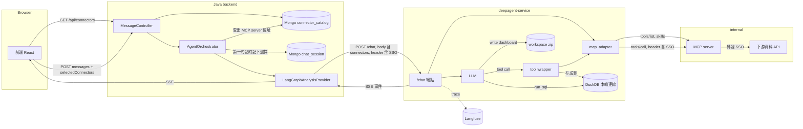
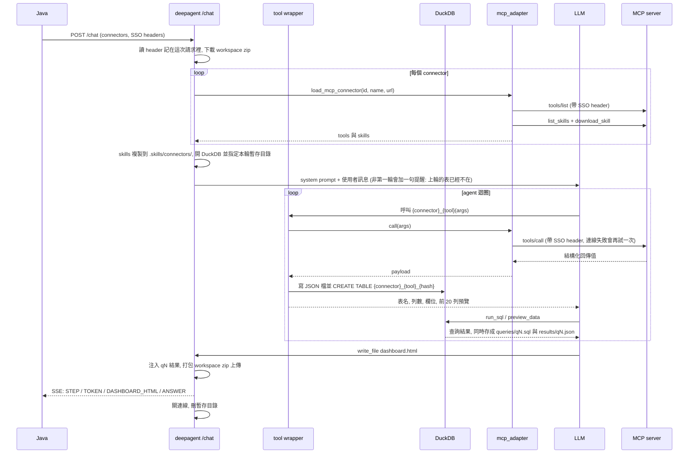

# MCP Datasource: 用 API 當資料源的設計 (白話版)

> 狀態: 2026-08-30 定案, 2026-09-06 依 PR #78 的後續調整全面改寫. 本文描述現在的實作長什麼樣, 以及接下來要往哪裡走. 給 MCP server 作者的操作手冊另見 `2026-09-02-mcp-server-howto.md`; 分享頁互動的兩個候選方案見 `2026-09-02-replay-interactive-options.md`.

## 1. 這是在做什麼

Cowork 原本只能分析使用者上傳的 csv/xlsx. 這個功能讓使用者改成「選一個或多個 API 資料源」, 然後用對話叫 agent 去 API 拉資料, 分析, 產出 dashboard.

API 資料源以 MCP server 的形式接進來. 每一台 MCP server 由 internal 團隊自己撰寫與維護, Cowork 這邊只負責把它接上, 把回來的資料存成表, 把使用者的身分憑證帶過去, 以及管理「這個對話用哪些資料源」.

## 2. 名詞

| 名詞 | 意思 |
|---|---|
| connector | 一個可選的 API 資料源. 在畫面上是選單裡的一個項目, 在後端對應一台 MCP server. |
| catalog | connector 的清單, 存在 Java 的 Mongo `connector_catalog` collection. 目前只能用 mongosh 手動新增. |
| MCP server | 依 MCP 協定提供 tools 與 skills 的 HTTP 服務. 用 FastMCP 包既有的 OpenAPI 就能做出來. |
| tool | MCP server 上的一個可呼叫函式, 對應一支 API. 例如 `list_fabs`, `get_quality`. |
| skill | MCP server 附帶的使用說明書 (SKILL.md), 告訴模型有哪些 tool, 先呼叫誰, 參數從哪來. |
| SSO token | 使用者的身分憑證. 從前端一路帶到 MCP server, 最後由下游 API 決定這個人能看什麼資料. |
| DuckDB 表 | tool 回來的 JSON 資料會寫成 DuckDB 的表, 模型用 SQL 查它. |
| qN | 模型每跑一次 `run_sql`, 結果會編號存檔 (q1, q2, ...), dashboard 用這些編號取數字. |

## 3. 使用者看到的流程

1. 開新對話, 在輸入框旁邊的選單選一個或多個 connector. 選了 connector 就不能上傳檔案; 已經有檔案就不能選 connector. 兩者只能選一種.
2. 送出第一句話. 後端把選擇記進這個對話, 之後選單變成唯讀提示「資料源已鎖定」. 要換資料源就開新對話.
3. 對話中 agent 會先用查詢型的 tool 看有哪些可選值, 必要時反問使用者 (ask_user), 再用資料型的 tool 拉資料, 存成表, 跑 SQL, 寫 dashboard.
4. dashboard 產出後和 csv 線一樣顯示在右側.

## 4. 整體資料流

重點:

- connector 清單和「這個對話用哪些 connector」都由 Java 管. deepagent 沒有清單, 每次 `/chat` 都由 Java 送完整的 MCP server 位址進來.
- SSO token 只放在 HTTP header 裡傳, 從來不放進 JSON body, 不寫進 log, 不放進 prompt.
- DuckDB 連線是每一輪新開的. 從 connector 拉回來存的表只活在這一輪.
- `run_sql` 的結果 (qN) 會寫進 workspace, 跨輪保留, dashboard 靠它注入數字.

## 5. 一輪 /chat 內部發生什麼

## 6. 三側各自負責什麼

### 前端

- `GET /api/connectors` 拿清單, 清單是空的就整個隱藏選單.
- 第一句話的 body 帶 `selectedConnectors`. session 回傳的 `selectedConnectors` 非空就顯示鎖定提示.
- 互斥: 選了 connector 就停用上傳按鈕, 有檔案就停用選單.

### Java

- `connector_catalog` 每筆: `connectorId`, `displayName`, `mcpUrl`, `bearerTokenKey` (選填).
- 第一句話時把選擇寫進 session 的 `selectedConnectors`. 寫進去之後就以它為準, 之後的請求帶什麼都忽略. 有檔案時拒絕 (409); 已經選了 connector 時拒絕上傳 (409); 選單裡沒有的 id 拒絕 (409).
- 每一輪把 session 存的 id 清單查成 `connectors: [{id, name, url, bearerTokenKey?}]` 放進 `/chat` 的 body. 查不到回 404「資料源已下架」.
- 把 SSO token 與 url 從這次請求的身分資訊取出, 用 `X-SSO-Token` / `X-SSO-Url` 兩個 header 送給 deepagent (header 名稱可用 `erd.agent.analysis.sso-*-header` 改). 本機開發沒有 SSO 時填固定假值, 讓整條鏈在本機也能走.
- `AgentRequest` 與 `CoworkContext` 印成字串時把 token 與 url 遮罩.

### deepagent

- `/chat` 從 header 讀 SSO, 記在這次請求裡. 用 connector 時兩者缺任何一個就直接以 `CHAT_INIT_FAILED` 結束.
- `mcp_adapter.load_mcp_connector`: 每次操作都開一個新的 fastmcp Client, server 不需要記 session. 每個請求帶 SSO header, 有設 service token 的再帶 `Authorization: Bearer`. 先取 tools 清單, 再用 `list_skills` / `download_skill` 把每份 skill 的 `.md` 檔整包拿回來 (單一 skill 最多 20 檔或 20 萬字).
- skill 複製到 `.skills/connectors/{SKILL.md 開頭宣告的 name}/`, 沿用既有的 skills 機制, 模型需要時才讀.
- tool wrapper: 每個 tool 包成 LangChain tool, 名稱前面加 `{connector id}_`. 每次呼叫成功就自動存成表 (第 7 節). 每一輪最多 12 次呼叫.
- prompt: system prompt 加一段 connector 規則 (英文). 非第一輪再加一句「上一輪的表已經不在, qN 結果還在, 純改版面不要重新拉資料」.
- 失敗處理: 任何失敗 (連不上, 逾時, 4xx, 協定錯誤) 都立即再試一次 (次數可設), 所以 catalog 收錄的 tool 一定要唯讀且重複呼叫無副作用. 錯誤訊息寫明是哪個 connector 與哪個 url; MCP server 自己回報的 tool 錯誤原樣轉給模型, 前面註明這是 server 那邊的錯. 兩種都會寫 log, log 帶完整的例外原因鏈, 不帶 header.

## 7. 資料怎麼存成表

- tool 回來的是 list 就整包存; 是 dict 且有 `data` 這個 list 就只存 `data`, 其他頂層欄位 (例如 `errorCode`) 附在回給模型的文字裡; 其他形狀整包存成一列.
- 表名是 `{connector}_{tool}_{參數的 sha256 前 8 碼}`. 同樣參數就是同一張表 (後寫的蓋掉前面的), 不同參數各自一張, 同時打好幾次也不會查錯表. 沒有參數的 tool 只有前綴不接 hash.
- 回來 0 列就不存, 回一句話請模型換參數.
- JSON 檔寫在這一輪的暫存目錄, DuckDB 只允許讀寫這個目錄. 這一輪結束整個刪掉, workspace zip 裡不留任何原始資料.
- 回給模型的是摘要: 表名, tool 與參數, 列數, 欄位, 前 20 列 markdown 預覽. 原始資料不進對話, 分析走 `run_sql`.
- 下一輪要同一份資料就重新呼叫. 這是刻意的取捨 (第 10 節).

## 8. 給 MCP server 作者的規矩 (摘要)

完整寫法看 howto. 這裡只列會影響 Cowork 端行為的規矩:

1. 用 streamable HTTP, 每個請求各自獨立, server 不記 session. 每個請求自己帶認證.
2. tool 回傳 dict 或 list (FastMCP 會自動包成結構化回傳值). 只回純文字會被拒收.
3. tool 只讀資料, 重複呼叫結果相同也沒有副作用. Cowork 端連線失敗會重試.
4. 錯誤訊息要說清楚該怎麼改: 缺哪個參數, 合法值有哪些. 這段文字會原樣給模型看.
5. 回傳資料的上限 (列數或 bytes) 由 server 端控制, 超過就報錯. Cowork 端不會自己截短.
6. 至少一份 skill, 用 FastMCP 的 `SkillsDirectoryProvider` 且設 `supporting_files="resources"`. SKILL.md 開頭要有 `name` 欄位 (小寫字母數字連字號, 不能跟別人重複), 內容分四段: tools 清單與語意, 呼叫順序, 參數來源, 範例.
7. 收到 SSO header 後每個請求都轉發給下游 API. 資料權限由下游決定.

## 9. 設定與安全

| 設定 | 位置 | 說明 |
|---|---|---|
| `CONNECTOR_CALL_BUDGET` | deepagent one.properties | 每一輪 connector 呼叫上限, 預設 12 |
| `CONNECTOR_REQUEST_TIMEOUT_SECONDS` | deepagent | 每次 MCP 請求逾時秒數, 預設 30 |
| `CONNECTOR_CALL_RETRIES` | deepagent | 任何失敗後再試幾次 (不分連線或 4xx), 預設 1, 立刻重試不等待 |
| `CONNECTOR_BEARER_TOKENS` | deepagent | JSON dict, key 是 catalog 裡宣告的 `bearerTokenKey`, 值是 service token. 留空代表都不需要 |
| `SSO_TOKEN_HEADER` / `SSO_URL_HEADER` | deepagent | 收進來與送出去共用的 header 名, 預設 `X-SSO-Token` / `X-SSO-Url` |
| `erd.agent.analysis.sso-token-header` 等 | Java | 送出去的 header 名, 要與 deepagent 一致 |

安全邊界:

- token 只存在 Java 的請求身分資訊, Java 到 deepagent 的 header, deepagent 這次請求的記憶, MCP request header. 不進 body, log, prompt, 檔案.
- DuckDB 開連線後關掉檔案與網路存取, 唯一例外是這一輪的暫存目錄. 模型的 SQL 就算寫進那個目錄, 這一輪結束也一起刪掉.
- skill 檔案寫入前檢查路徑不能跑出 skill 目錄之外.
- deepagent 的設定裡, 空的 env 或 properties 值一律視為沒設定, 走欄位預設. 特別注意 `STORAGE_BACKEND` 留空會靜默變成 `local`, 部署 S3 時不要把它清空.
- `CONNECTOR_BEARER_TOKENS` 格式錯誤時, 例外的文字訊息不含原始值 (`hide_input_in_errors`), 但 pydantic 的 `.errors()` 結構仍帶原始輸入. 不要把這個例外的 `.errors()` 寫進 log.
- MCP server 是 internal 自己的, 沒有第三方 tool 說明注入的問題.

## 10. 幾個重要取捨

**表為什麼只活一輪.** 原設計把原始資料存進 workspace 並跨輪重新掛回, 還要用 sha256 驗證防模型竄改, 再記一份「當時打了哪些 API」的清單給分享頁重新抓資料用. 分享頁的做法改了 (第 11 節) 之後, DuckDB 對 connector 只剩「讓模型探索與驗證邏輯」的用途, 於是整套持久化拆掉, 換每一輪重新拉. 代價是修改 dashboard 的那幾輪可能多打幾次 API. 觀察指標: Langfuse 上修改輪的 connector 呼叫次數與單次耗時. 若明顯拖慢, 再加跨輪保留; 存檔目錄與表名這兩處已經留了擴充點.

**為什麼不只存前 N 筆.** 討論過只存樣本, 但樣本上算出來的總和平均是錯的, 類別也可能不全, 模型容易把錯數字寫進回覆. 現在整包存, 資料量交給 server 端的上限控制.

**為什麼表名用 hash 不用序號.** 實際跑真模型時看到模型同時打六次 tool, 之後把序號對錯表, 多花三次呼叫才修正. 用參數算 hash 當名字, 同參數同名, 模型不用自己對應.

**為什麼不發 TABLE 事件.** 原本 run_sql 的結果會即時推到前端顯示在對話裡 (ToolResultRecorder), 已移除. 結果仍存檔給 dashboard 用, 對話裡不再顯示中間表格.

## 11. 接下來的方向

**分享頁改成「HTML 自己去打 MCP」.** 原本的設計是 viewer 打開分享頁時, 由 server 端不經過模型重做一次 (用當初的參數重打 API, 重跑 SQL, 塞回 HTML). 現在改成: dashboard HTML 裡宣告它需要哪些 MCP 呼叫; 顯示它的宿主頁 (前端) 收到 iframe 傳來的 postMessage 後, 帶 viewer 自己的 SSO 去 Java, Java 轉到 deepagent 的一個不經過模型的 tool-call 端點去打 MCP, 結果再 postMessage 回 iframe, 由頁面自己算與畫. csv 線維持現在的 `__ERD_RESULTS__` 注入不變.

要蓋的東西: iframe 裡的一小段 runtime (Java 出貨前注入), 前端的 message 橋接, Java 的代理端點, deepagent 的 tool-call 端點, 每個 artifact 一份「允許呼叫哪些 tool」的清單, 固定的錯誤碼讓頁面分區塊降級. 做法對應 Claude artifact 的 `mcp` capability, 細節待另開 spec.

**待議事項.**

- 一份 skill 要用到好幾台 MCP server 的 tool: 建議在 SKILL.md 開頭宣告 `connectors: [a, b]`, 全部都有選到才啟用. 尚未實作.
- 給模型一個直譯器 (langchain-monty 的 Python 沙箱或 deepagents 的 QuickJS): 讓模型用一段程式串起多次呼叫, 中間資料不進對話. Monty 版不需要升級 deepagents. 待驗證.
- 對話期的資料量: MCP 回應沒有串流, 整包進記憶體. 目前靠 server 端上限; 若出現很大的回應再考慮 Parquet 或按內容 hash 儲存.

## 12. 決策紀錄

| 日期 | 決定 | 理由 |
|---|---|---|
| 08-30 | 取數協定用 MCP, server 由 internal 自己寫 | 契約清楚, 憑證與資料整形留在資料擁有者那邊 |
| 08-30 | 分析引擎維持 DuckDB | 沙箱執行器是獨立的平台工作 |
| 08-30 | csv 與 connector 同一個對話只能選一種, 第一句話後固定 | 避免資料來源混用, 分享頁重抓時語意不清 |
| 09-01 | connector 清單搬到 Java Mongo, deepagent 不存清單 | 只有一個地方管, deepagent 保持無狀態 |
| 09-02 | SSO 兩個 header 都必須, 缺一個就直接報錯結束 | 不送出沒有認證的請求 |
| 09-06 | 拆掉 land_as 與重抓清單, 改每次呼叫自動存表, 表只活一輪 | 分享頁改走 HTML 直接打 MCP, 持久化失去用途 |
| 09-06 | 回應是 dict 時固定只取 `data` | 避開 DuckDB 單一物件 16MB 限制與難查的巢狀表 |
| 09-06 | 表名用參數 hash | 同時打好幾次也不會查錯表 |
| 09-06 | 移除 TABLE 事件與 ToolResultRecorder | 對話內嵌表格不再需要 |
| 09-06 | 給模型看的文字統一英文 | 與 system prompt 一致 |
| 09-06 | MCP 逾時可設, 連線失敗立刻重試一次 | tool 只讀且無副作用, 重試安全 |
| 09-06 | `CONNECTOR_BEARER_TOKENS` 改 dict, 格式錯誤啟動就失敗 | 設定錯誤越早浮現越好 |
